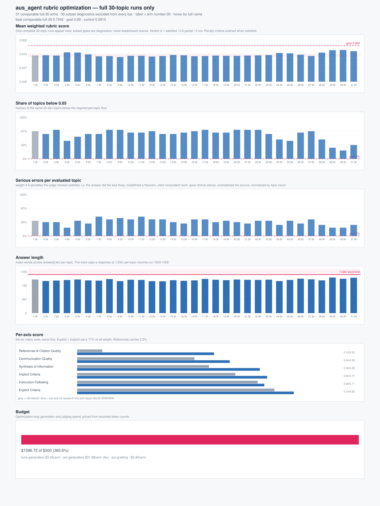

# aus_agent prompt optimization — protocol and progress



An autonomous loop that writes a prompt variant, runs it on a frozen topic
split, judges it head-to-head against the organizer's strongest baseline, and
logs one row. Driven by Claude Code's built-in `/goal`, which installs a Stop
hook and re-prompts until its condition is met.

Everything here is measurement discipline around one number — the both-order
arena win rate against `base-agentic-bm25` — and most of this document exists
because that number is easy to move for the wrong reasons.

---

## The target, corrected

The obvious goal is "win ratio 1.0 — every answer better than the baseline."
That target is unreachable, and setting it as the `/goal` condition produces a
loop that never terminates and spends its whole budget overfitting a judge.
Three measurements say so, all from judgments already on disk.

**1. The judge disagrees with itself on a fifth of topics.** Every pair is
judged in both presentation orders. On `ours-keyword` vs `base-agentic-bm25`,
order consistency is **0.782** — 22% of topics flip verdict from presentation
order alone, with the answers unchanged. A topic that flips carries no
preference signal and scores 0.5 here, so it is arithmetically impossible to
reach 1.0 while the judge behaves that way.

**2. The most lopsided pair we have ever measured scores 0.853, not 1.0.**
`base-agentic-bm25` vs `base-singlepass` is a 3.4× gap in arena preference
(0.654 vs 0.195) — by far the largest separation in the whole comparison set.
Its both-order rate is **0.853**: it wins both orders on 94 of 119 topics,
splits on 15, and *loses both orders on 10*. A system that dominant still loses
8% of topics outright. 1.0 is above the ceiling of the instrument, not merely a
stretch.

**3. On 20 topics, almost nothing is significant** — under luna. A judge with
no stake resolves the same 20 topics decisively (see below), which is a further
reason not to score against our own generator. Smallest win rate whose 95%
bootstrap CI clears parity, holding splits at the observed 22% flip rate:

| split | n | win rate needed to certify a win |
|---|---|---|
| dev20 | 20 | 0.700 (12W-4S-4L) |
| confirm40 | 40 | 0.662 (22W-9S-9L) |
| holdout59 | 59 | 0.619 (30W-13S-16L) |
| full test | 119 | 0.580 (56W-26S-37L) |

So on the arena, dev20 is a **kill filter**, not a promote filter. A variant
scoring 0.55 there has learned nothing.

---

## Why weighted citation support is the primary measure

**The two organizer baselines prove the arena and support are not measuring the
same property.** On the arena they are 3.4× apart (`base-agentic-bm25` 0.654,
`base-singlepass` 0.195). On weighted citation support they are **tied**:
wR_first 0.6353 vs 0.6342, wP_first 0.6353 vs 0.6342. Two measures that rank
the same pair of systems that differently cannot proxy for one another — if you
care about both, you have to run both.

**The deficit is unambiguous on support, and needed a disinterested judge to
appear on the arena.** Against `base-agentic-bm25`: support wR_first 0.528/0.517
vs 0.635, paired comparison lost 79–39 over 119 topics. The arena read 0.485 —
"a dead heat" — but that was luna scoring its own output; under `gpt-5.6-terra`
the same answers score 0.250/0.300 with intervals excluding parity. Support said
we were behind before any of that was known, from a completely independent
direction. It was right and the luna arena was not.

**And support resolves at n=20 where a same-family arena does not.** Identical
topics, identical answers, both judged by luna:

| measure | `ours-keyword` on dev20 | resolves? |
|---|---|---|
| arena both-order (luna) | 0.450 [0.250, 0.650] | no — straddles parity |
| support wR_first (paired Δ) | −0.073 [−0.134, −0.020], worse on 14/20 | **yes** |
| arena both-order (terra) | 0.250 [0.125, 0.400] | yes — but see the judge section |

A paired continuous per-topic difference carries far more information than a
three-valued preference vote, which is why support stays primary even now that
a neutral arena also resolves: support cannot be moved by swapping the judge's
family, and the arena demonstrably can.

**Recall, not precision.** Both baselines have wP == wR *exactly*, because both
cite every answer object; ours have wR < wP by exactly the uncited-object
penalty. Weighted precision alone therefore rewards saying less and citing more
cautiously — the mirror image of the arena's reward for saying more. `wR_first`
charges for both halves, so it is the headline and `wp_first` is diagnostic.

**The goal (agreed 2026-08-05).** Five conditions, all of which must hold. The
thresholds in (1) and (2) are placeholders until the 30-topic baseline is
scored; they will be set to something reachable inside a 24-hour optimization
run, not to a round number chosen in advance.

1. **Mean weighted rubric score ≥ 0.80** over the 30 dev topics — scorable
   criteria only, sign-aware.
2. **No single topic below 0.65** — blocks averaging up on the easy topics.
3. **Zero satisfied penalties at |w| ≥ 4.** Never seriously wrong: no
   misdefined theorem, no fabricated finding, no misrepresented source. A
   safety gate, not tradeable against breadth.
4. **Holds under two judge models.** Judge identity moved the arena by 0.275 on
   identical answers; a single-judge number is not a result.
5. **Zero `validate_rag_output` violations and ≤1,024 words** — actually
   submittable.

(1) and (2) say "good everywhere", (3) says "never badly wrong", (4) says "not
a judge artifact", (5) says "conformant". Unlike a win rate against an opponent,
the rubric score is absolute, so nothing caps it below 1.0 except the answer.

**What 24 hours buys.** One arm = 30 agent topics (~25-30 min, ~$3 at luna
rates) + one grading call per topic per judge (~30 calls, minutes, cents). Call
it ~35 minutes and ~$3-4 per arm sequentially, so a day is roughly 30-40 arms:
the 10 single-factor screens, several combination rounds, and two-judge
confirmation on the finalists, with headroom. The binding constraint is agent
generation time, not judging and not money — which is an argument for screening
patches on the full 30 topics rather than sub-sampling, since the sample size
is nearly free.

---

## The reward-hacking risk, and the guard

Result 7 of `worklogs/2026-08-04-test119-vs-official-baselines.md` found the
arena verdict tracks **relative answer length** (r = −0.429 on the opponent's
word count, +0.416 on the word gap) and is indifferent to fact density once
length is controlled — the 2×2 rows separate by ~0.35, the columns not at all.

An optimizer maximizing arena win rate will therefore find *"write longer"* as
its cheapest gradient. Every row logs `words_ours`, `words_base`, and
`word_ratio` for exactly this reason, panel 2 of the chart plots it, and
`optimize_score.py` prints a CAUTION when a win arrives alongside a length
ratio above 1.15.

One thing already known, and it is encouraging: **we are already 1.16–1.18×
the baseline's length and still losing.** The easy length gradient has been
climbed and did not work, which means a future win is unlikely to be bought
that way — and it makes the `compressed` variant, which moves the *other* way,
a real experiment rather than a sacrifice.

### The other confound, now measured: the judge is one of us

This was a caveat until it was tested. It is now the largest measured effect in
the project. Identical answers, identical topics, identical prompt — only the
judge changes:

| judge | wrote what | ours-keyword | ours-semantic | verdict |
|---|---|---|---|---|
| `gpt-5.6-luna` | **our** answers | 0.450 [0.250, 0.650] | 0.425 [0.250, 0.600] | INCONCLUSIVE |
| `gpt-5.6-terra` | neither side | 0.250 [0.125, 0.400] | 0.300 [0.150, 0.450] | KILL |
| `gpt-5.6-sol` | **both baselines** | 0.175 [0.025, 0.350] | 0.250 [0.100, 0.425] | KILL |

The ordering is monotone in affiliation, on both runs independently, and spans
0.275 — wider than any prompt change ever measured here. That is the signature
of self-preference, not of noise: a judge rates the family it belongs to higher,
and the neutral judge sits between the two interested ones exactly where a
neutral judge should.

**Three consequences.**

1. **The published 0.485 "dead heat" over 119 topics is a luna number**, and
   luna is the interested party. Treat it as an upper bound on our standing,
   not an estimate of it. Under a disinterested judge we are behind, and the
   interval says so rather than straddling parity.
2. **This corroborates weighted support**, which said the same thing from a
   completely different direction (−0.073 paired, worse on 14 of 20). Two
   independent instruments agree we are behind; only luna dissented.
3. **`gpt-5.6-terra` is the promotion gate.** Not sol — sol has luna's conflict
   pointed the other way, and optimizing against it would tune our prompt toward
   the scorer that wrote the opponent. Sol earns its place as the *floor* of a
   bracket, not as the target.

**Read all three as a bracket**: luna is the ceiling, sol the floor, terra the
estimate. Sol says we win → strong, it survived a hostile judge. Terra says we
win and sol does not → real but not robust, report both. Terra says we lose →
believe it, whatever luna says. At 40 battles per judge per variant on dev20 the
whole bracket is cheap, so run it.

---

## The ladder

Three frozen, disjoint, stratified splits, built once by
`make_optimize_splits.py` and never regenerated:

| split | n | current both-order rate | role |
|---|---|---|---|
| `topics-dev20` | 20 | 0.438 | screen everything; kill the losers |
| `topics-confirm40` | 40 | 0.450 | anything not killed on dev20 |
| `topics-holdout59` | 59 | 0.449 | touched at most twice, at the very end |

Stratified on the outcome being moved — each topic's difficulty score is the
mean both-order outcome of the two published runs against `base-agentic-bm25`,
and topics are assigned by position in that sorted order. The three splits
therefore carry the same win/split/loss mix as the full 119 (0.447). This
matters: 2026-08-05 showed `topics10` (`rag2026-0..9`) is *not* representative
— `base-agentic-bm25` scores 9.6 figures/1k words there against 15.6 over all
119, so a 10-topic result on density was measuring the topics, not the prompt.

**Promotion rule**, read off `support_verdict` (the arena's verdict is advisory
at these sample sizes). dev20 `KILL` — the paired support CI entirely below 0 —
drops the variant. `INCONCLUSIVE` or `PROMOTE` goes to confirm40; confirm40
`PROMOTE` goes to holdout59 with a second judge. Never re-screen a killed
variant on a later split; that is how a hill-climb launders noise into a
result.

Both published runs are `KILL` on dev20 — support −0.073 and −0.083, and arena
0.250/0.300 under terra, every interval excluding parity. That is the point of
the anchors: the loop starts from a position known to be behind, on two
independent measures sharp enough to say so at n=20. The gap to close is
therefore larger than the luna-only numbers implied.

---

## Running it

```bash
# once, already done — do not re-run without --force
uv run --no-project python tasks/task-comparison/scripts/make_optimize_splits.py

# author variants (never hand-edit prompts/system/*.md)
uv run --no-project python tasks/task-comparison/scripts/build_prompt_variants.py --write
uv run --no-project python tasks/task-comparison/scripts/build_prompt_variants.py --check

# run one variant over a split
TOPICS=data/task-comparison/topics-dev20.tsv TAG=opt \
  bash tasks/task-comparison/scripts/run_prompt_variants.sh evidence-paired

# arena + structure -> creates the row (--dry-run first to see the battle count)
PYTHONPATH=src uv run --group aus-agent python \
  tasks/task-comparison/scripts/optimize_score.py \
  --run-id opt-evidence-paired --stage dev20 --variant evidence-paired

# weighted citation support -> fills the same row; this is the deciding measure
PYTHONPATH=src uv run --group aus-agent python \
  tasks/task-comparison/scripts/optimize_support.py \
  --run-id opt-evidence-paired --stage dev20 --variant evidence-paired

# refresh the chart and the table below
uv run --no-project python tasks/task-comparison/scripts/optimize_plot.py
```

Order matters: `optimize_score.py` creates the row and `optimize_support.py`
updates it, so one variant is one line rather than two half-filled ones.

Cost per dev20 variant: 20 agent runs, 40 arena battles, ~400 support pairs.
Everything is cached — arena by `(judge, variant, topic, orientation)`, support
by `(judge, variant, topic, sentence, citation)`, cited documents by docid in
the shared `doc-cache/` — so re-scoring is free, the baseline's support half is
paid once ever, and a killed run resumes with `--skip-existing`.

### The `/goal` condition

`/goal` is built into Claude Code (v2.1.221); it installs a session Stop hook
that re-prompts with a reason until the condition holds, and `/goal clear`
cancels it. Give it a condition that is checkable from `results.tsv`, so the
hook can decide rather than guess:

```
/goal docs/auto-optimize/results.tsv contains a row meeting all five
goal conditions in this document — mean rubric score and per-topic
floor at or above the calibrated thresholds, zero satisfied |w|>=4
penalties, confirmed under a second judge model, and zero validation
violations — OR every one of the 10 single-factor patches in
patches.md has been screened and none banked, in which case stop and
report that prompt wording is not the binding constraint.
```

**The second clause is not optional.** A goal condition with no exhaustion
branch is an infinite loop, and the standing evidence is that it may well fire:
the search shape (~2.3 rounds, ~9 searches, ~2.3 commits) has been invariant
across every run, every prompt, both engines, and both topic sets, and the
4-way spread in the published comparison was driven by *architecture* — the two
organizer baselines share a generator and differ 3.4× on retrieval strategy
alone. If twelve variants cannot move the number, the answer is that the lever
is not in the prompt, and the loop should say so rather than keep pulling it.

---

## Leaderboard

<!-- LEADERBOARD:BEGIN -->
| stage | variant | n | wR | wR &Delta; | lo | hi | support | arena | lo | hi | arena verdict | len x base | uncited | cites/obj | digits/1k |
|---|---|---|---|---|---|---|---|---|---|---|---|---|---|---|---|
| dev20 | ours-keyword | 20 |  | **** |  |  |  | 0.25 | 0.125 | 0.4 | KILL | 1.162 | 0.1867 | 1.33 | 6.4 |
| dev20 | ours-semantic | 20 |  | **** |  |  |  | 0.3 | 0.15 | 0.45 | KILL | 1.176 | 0.1384 | 1.46 | 5.8 |
<!-- LEADERBOARD:END -->

Rows are appended by `optimize_score.py`; this block and `progress.svg` are
regenerated by `optimize_plot.py`. `verdict` is `PROMOTE` when the CI clears
0.5, `KILL` when it is entirely below, `INCONCLUSIVE` otherwise — which at
n=20 is the expected outcome for anything short of a large effect.

The two `dev20` anchor rows cost nothing: `optimize_score.py` adopts the
existing 119-topic judgments for `ours-semantic` / `ours-keyword`, which came
from the same judge, prompt, and answers.

---

## Variant registry

All generated by `build_prompt_variants.py` from `default.md` by anchored
patch. `--check` fails if any file on disk stops matching its patch list, so
the six files cannot drift apart.

| variant | = | targets | evidence |
|---|---|---|---|
| `default` | — | control | published test-119 runs |
| `paired-lead` | +1 patch | a lead is ready to judge only once both engines answered it | dense/sparse share 3.6% of retrieved docs; only 4% of rounds ever paired a lead |
| `evidence-dense` | +7 patches | cite-or-cut, carry the specific across, no volunteered locale | 13.5% uncited objects vs 0% for both baselines; 42–47% of missed figures were in documents we cited |
| `evidence-paired` | dense + paired | the two arms that each moved their structural target, composed | uncited 20.3%→1.9%; same-lead rounds 4%→72% |
| `decision-first` | paired + 1 | lead on the finding that decides the question | 3 of 12 hand-read losses: the baseline volunteers the decision-relevant fact |
| `compressed` | paired + 1 | cut to ~600 words; one pass removing sentences the reader would not miss | we are 1.16–1.18× baseline length and losing; tests the arena's length confound in the untested direction |

`paired-lead` and `evidence-dense` are marked FROZEN in the builder — they back
published numbers, so `--write` refuses to touch them without `--force`.

`evidence-paired` also corrects one sentence `paired-lead` gets wrong: it claims
the pairing is "the same number of searches in a round", and the 2026-08-05 run
falsified that (+31% searches, +29% commits). Shipping an instruction the model
demonstrably does not follow teaches it the neighbouring sentences are
aspirational too.

---

## What this loop cannot decide

- **Source credibility** is unscored by anything in the comparison — neither
  measure asks whether a supporting document is worth believing, only whether
  it says what the sentence claims.
- **What the arena is actually rewarding.** It ranks the two baselines 3.4×
  apart where support ranks them level, and it tracks answer length. Something
  real may sit inside that residual — organization, readability, whether the
  answer reads as written for the asker — but nothing here identifies it, so
  the arena stays a guard rather than a target.
- **Nuggets and rubric scoring**, which the organizers will also run, are not
  approximated by either measure here.
- **Whether the prompt is the right lever at all.** The exhaustion clause in
  the goal condition exists because the honest prior is that it is not.
