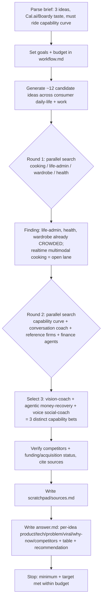

# Workflow — AI startup idea brainstorm

## Original question
"Act as a creative technical founder and brainstorm an innovative AI startup idea" meeting 4 criteria
(meaningful/technically-interesting AI, API integration, real+cool problem, viral/PMF potential), in the taste
of Cal.ai / Boardy.ai / AI scheduling. Deliver **3 ideas** with: product + technical description (stack, APIs,
models), problem solved + why people want it, ambitious-but-buildable, and **named competitors** for each.
Hard constraint from the user: the startup must lean on a **technical advantage from AI features only newly
possible now that will keep improving as foundational models/services improve**.

## Interpretation / assumptions
- Treated as a creative-research brief: ideas must be original *and* competitor-checked against the real 2026
  market, not invented in a vacuum. So competitor + capability claims are grounded in cited sources.
- Picked 3 ideas spanning **three different new capability bets** (realtime multimodal vision+voice; agentic
  execution/computer-use+voice calls; realtime social/voice) so the set is broad rather than three variants of
  one idea. Favoured lanes that are *less saturated* and have a clear "rides the capability curve" story.

## Goals & success requirements
1. **End goal:** 3 buildable, original, competitor-checked AI startup ideas, each with a clear technical
   architecture and a why-now/capability-curve thesis.
2. **Minimum requirements:** each idea has (a) product description, (b) concrete tech stack + named APIs +
   model types, (c) problem + demand rationale, (d) >=1 named real competitor with a cited source, (e) an
   explicit "improves as models improve" argument.
3. **Target requirements:** competitors verified against current (2026) sources incl. funding/acquisition
   status; capability claims cited to primary/vendor docs; a comparison table + a founder recommendation;
   honest call-out of which spaces are already crowded.
4. **Budget:** ~8–10 rounds (moderate; 3 idea-spaces to verify + capability grounding + reference firms).

## Budget usage
- Used **2 rounds** of parallel web search (8 searches total). Minimum + most target requirements met within
  budget; no extension needed (brainstorm, not exhaustive survey).

## Process

## Sources
See `scratchpad/sources.md` for the full grounded source list (Cal AI/MyFitnessPal, Boardy, Gemini 3.1 Flash
Live, Pine AI, Vibrato, Rocket Money, Plaid, Yoodli, Posha, Superpower/Function Health, OpenAI+Plaid/Claude+Era).

## Synthesis
Down-selected from ~12 candidates by removing saturated spaces (health, wardrobe, generic scheduling) and
choosing one idea per distinct new-capability bet so the founder sees breadth. Each idea is written so its moat
is explicitly tied to a curve that improves with the next model release.
