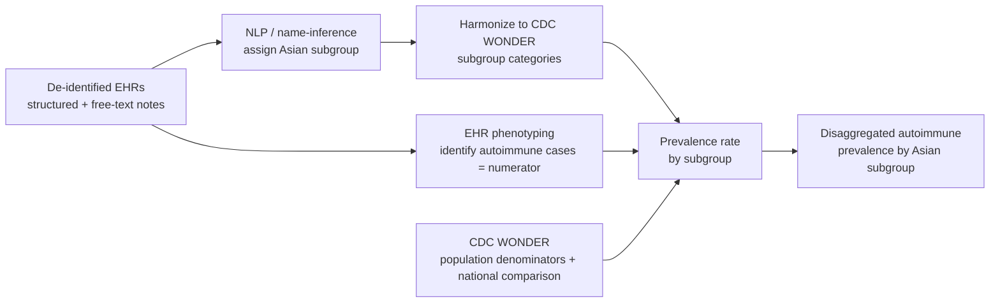
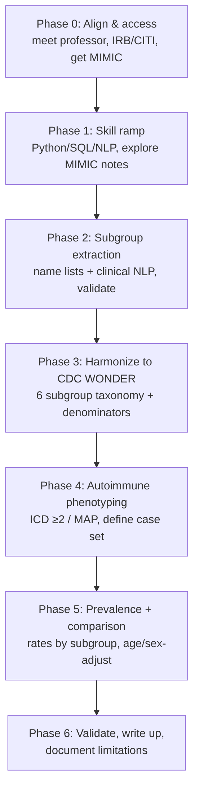

# Decoding your professor's brief: NLP on EHRs → Asian subgroups → CDC WONDER → autoimmune prevalence

This is a plain-language guide to what your professor is asking, why it's a real and well-trodden research idea (there are studies doing almost exactly this), and a concrete plan to get going. Don't worry that it sounded cryptic — it's a compact description of a five-part pipeline, and each part is learnable.

---

## 1. The big picture — what she means, in one paragraph

Asian Americans are usually lumped into a single "Asian" box in health statistics, which hides huge differences between, say, Filipino, Vietnamese, and Japanese populations. Your professor wants you to take **real patient records (de-identified EHRs)**, use **NLP** to figure out which Asian *subgroup* each patient belongs to (because that detail is often missing or buried in free text), and sort patients into **the same subgroup categories that CDC WONDER uses** — so your hospital data and national data "speak the same language." Then, using those subgroups, you'll **count how common autoimmune diseases are in each one (prevalence rates)** and compare. The payoff: showing that "Asian" is not a monolith for autoimmune disease — a finding others have already started to confirm for rheumatoid arthritis and lupus ([ACR abstract](https://acrabstracts.org/abstract/more-than-a-monolith-disaggregating-rheumatoid-arthritis-prevalence-among-asian-american-subgroups/), [AJMC](https://www.ajmc.com/view/racial-ethnic-differences-in-autoimmune-disease-prevalence-in-us-claims-ehr-data)).

Here is the whole pipeline at a glance:

---

## 2. What do de-identified EHRs actually look like?

An **Electronic Health Record** is everything a hospital stores about a patient's care. It comes in two flavors, and you'll use both ([MIMIC-IV, *Scientific Data*](https://www.nature.com/articles/s41597-022-01899-x); [The Story of MIMIC](https://www.ncbi.nlm.nih.gov/books/NBK543645/)):

- **Structured data** — neat tables: demographics, diagnoses as **ICD codes**, lab results, medications, procedures. Machine-readable already.
- **Unstructured data** — free text written by clinicians: discharge summaries, progress notes, radiology reports. This is where NLP earns its keep.

**"De-identified"** means protected health information (names, dates, addresses — "PHI" under HIPAA) has been removed or masked. In the most-used public dataset, **MIMIC**, PHI in free text is replaced with `___` (three underscores) ([MIMIC-IV](https://www.nature.com/articles/s41597-022-01899-x)).

A made-up (illustrative, not real) example of what a row + a note look like:

**Structured table:**

| patient_id | age | sex | race (coarse) | ICD-10 | encounter_date |
|---|---|---|---|---|---|
| 10472 | 44 | F | Asian | M05.79 (rheumatoid arthritis) | ___ |

**Unstructured discharge note (de-identified):**
> "44 y/o ___ female, originally from ___, presents with bilateral wrist swelling and morning stiffness > 1 hr. Family history notable for SLE in mother. Anti-CCP positive. Plan: start methotrexate..."

Notice two things: the coarse `race = Asian` field has **no subgroup**, and any subgroup hint that *was* in the text (country of origin, language) may be masked by de-identification. That tension is the heart of your project — and it's why **patient name lists** are often used instead of (or alongside) the notes (more in §4).

The standard public EHR datasets you'll likely learn on: **MIMIC-III / MIMIC-IV** (ICU data from Beth Israel Deaconess; free with a credentialing course), and you may later work with your institution's own de-identified extract.

---

## 3. What is CDC WONDER, and which Asian subgroups?

**CDC WONDER** is the CDC's public query system for national health datasets — births (Natality) and deaths (Mortality / Multiple & Underlying Cause of Death), with **population estimates** you can use as denominators ([Multiple Cause of Death docs](https://wonder.cdc.gov/wonder/help/mcd-expanded.html); [Underlying Cause of Death docs](https://wonder.cdc.gov/wonder/help/ucd-expanded.html)).

Crucially for you, recent CDC WONDER datasets break "Asian" into **detailed subgroups**. The six standard, widely-used Asian-American subgroups — and the exact set you should "abstract" your EHR patients into — are:

> **Asian Indian · Chinese · Filipino · Japanese · Korean · Vietnamese**

These six are the de-facto standard in disaggregation research ([CDC WONDER drug-overdose disaggregation study](https://www.ncbi.nlm.nih.gov/pmc/articles/PMC12069421/); [ACC cardiovascular subgroup mortality](https://www.acc.org/Latest-in-Cardiology/Articles/2023/05/18/18/43/Cardiovascular-and-Cerebrovascular-Disease-Mortality-in-Asian-American-Subgroups)), and CDC WONDER's expanded race categories now list **Asian Indian, Chinese, Filipino**, etc. separately (e.g., in expanded Natality 2016–2024) ([Natality docs](https://wonder.cdc.gov/wonder/help/natality-expanded.html)). Older CDC WONDER files use only four "bridged-race" buckets (White; Black; American Indian/Alaska Native; Asian or Pacific Islander), so which subgroups are available depends on the dataset and years ([Bridged-race methods](https://wonder.cdc.gov/wonder/help/populations/bridged-race/estimates2000-09.html)).

**"Abstract the same subgroups as are in CDC WONDER"** = label every EHR patient with one of these standardized categories, so your hospital cohort lines up with CDC WONDER's. That alignment is what lets you (a) borrow CDC WONDER **population counts as denominators** for prevalence, and (b) **compare** your local rates to national patterns.

---

## 4. The core NLP task: extracting Asian subgroups

You have two complementary families of technique. For *subgroup* assignment specifically, **name-list inference** is the workhorse; **clinical NLP** handles the disease side and any subgroup clues in text.

### 4a. Name-list / surname inference (the most likely intended method)
EHRs usually record a **name** even when they lack a self-reported subgroup. Researchers exploit this: curated lists map surnames and given names to Asian subgroups.

- The foundational healthcare study matched **Lauderdale & Kestenbaum** name lists (built from ~1.8M Social Security records of foreign-born individuals) against EHR patient names for the **same six subgroups**. Performance vs. self-reported race: **specificity 0.99–1.00**, **sensitivity ~0.45–0.79** (best for Vietnamese/Japanese, weakest for Filipino/Asian Indian), with PPV depending heavily on how common the group is locally ([Wei et al., *J Immigr Minor Health*, PMC3249427](https://pmc.ncbi.nlm.nih.gov/articles/PMC3249427/)).
- Newer resources have expanded this: a **Wikidata-derived name frequency dataset** (300k+ people, ~25,876 first names + 18,703 surnames) for six Asian subgroups ([*Scientific Data* 2025](https://www.nature.com/articles/s41597-025-04753-y)), and a **surname methodology validated in ovarian-cancer cohorts** ([*Gynecologic Oncology* 2026](https://www.sciencedirect.com/science/article/pii/S235257892600086X)).
- A related, well-known technique is **Bayesian Improved Surname Geocoding (BISG)**, which combines surname + address to estimate race/ethnicity ([Elliott et al., PMC1797082](https://pmc.ncbi.nlm.nih.gov/articles/PMC1797082/)).

**Watch-outs your professor will expect you to know:** surname inference is biased — accuracy drops for women (surname changes after marriage), for Korean names that overlap Chinese origins, and for the linguistically diverse South Asian (Asian Indian) names ([PMC3249427](https://pmc.ncbi.nlm.nih.gov/articles/PMC3249427/)). De-identification may also strip the names you'd need — so confirm what your dataset actually retains.

### 4b. Clinical NLP on the free text
For pulling structured meaning out of notes — both subgroup clues (country of origin, language, ethnicity mentions) and disease evidence:

- **Concept-extraction / NER toolkits:** **cTAKES** and **MetaMap** map text spans to standardized **UMLS** medical concepts (rule-based + dictionary lookup) ([cTAKES vs MetaMap comparison](https://www.ncbi.nlm.nih.gov/pmc/articles/PMC6157281/)); cloud option: **AWS Comprehend Medical** ([arXiv](https://arxiv.org/pdf/1910.07419)).
- **Transformer models:** **ClinicalBERT / BioBERT** (BERT pre-trained on clinical/biomedical text) outperform general models on clinical concept recognition ([Frontiers, neuro NER](https://www.frontiersin.org/journals/digital-health/articles/10.3389/fdgth.2022.1065581/full)); large EHR language models are an active frontier ([*npj Digital Medicine*](https://www.nature.com/articles/s41746-022-00742-2)).
- **Race/ethnicity from notes specifically:** the **C-REACT** dataset provides race/ethnicity annotations over MIMIC-III sentences so you can train/evaluate models that recover this from text ([*Scientific Data* 2024](https://www.nature.com/articles/s41597-024-04183-2)).

The classic NLP building blocks under all of this: tokenization, **named-entity recognition (NER)**, **negation/assertion detection** ("family history of," "no evidence of"), section parsing, and concept normalization. A good orientation review is Percha's *Modern Clinical Text Mining* ([preprint](https://www.preprints.org/manuscript/202010.0649/v1/download)).

---

## 5. Finding autoimmune cases & computing prevalence

Two steps: **define who has the disease** (phenotyping → the numerator), then **divide by the right population** (→ the rate).

### 5a. Phenotyping (identifying cases)
- **Simple, common baseline:** rule on **ICD codes** — e.g., require **≥2 diagnosis codes ≥30 days apart**, the rule used in the large JCI EHR study of autoimmune prevalence ([JCI 2024, view/178722](https://www.jci.org/articles/view/178722)).
- **Better: ICD + NLP phenotyping.** Algorithms like **MAP (Multimodal Automated Phenotyping)** combine ICD-code counts, NLP concept counts, and healthcare-utilization into an ensemble model, and beat ICD-only approaches ([MAP](https://celehs.github.io/MAP/)). Disease-specific validated algorithms exist too ([5 autoimmune diseases, EHR validation](https://www.ncbi.nlm.nih.gov/pmc/articles/PMC12018398/)).

**Diseases to consider** (autoimmune, EHR-friendly, with known Asian-subgroup signal): **systemic lupus erythematosus (SLE)**, **rheumatoid arthritis (RA)**, **autoimmune thyroid disease (Hashimoto's, Graves')**, **type 1 diabetes**, **psoriasis**, **IBD**. The JCI study found **~4.6% of the US population** has ≥1 autoimmune disease (5.8% of women vs 3.5% of men), with RA, psoriasis, T1D, Graves', and autoimmune thyroiditis the five most common ([JCI](https://www.jci.org/articles/view/178722)).

### 5b. Prevalence rate = cases ÷ population
$$\text{Prevalence}_{\text{subgroup}} = \frac{\text{# patients in subgroup with the disease (numerator)}}{\text{# people in that subgroup (denominator)}}$$

- **Numerator:** from your EHR (phenotyped cases assigned to a subgroup).
- **Denominator:** either your EHR's own subgroup counts (gives *clinic* prevalence), or **CDC WONDER population estimates by subgroup** (lets you make population-level, nationally-comparable rates). This denominator harmonization is exactly *why* the subgroups must match CDC WONDER.
- Then **age-/sex-adjust** and compare subgroups. Expected story, echoing prior work: aggregated "Asian" hides that, e.g., **RA is ~1.6× higher in Japanese/Korean women and >2× in South Asian women vs White women** ([ACR abstract](https://acrabstracts.org/abstract/more-than-a-monolith-disaggregating-rheumatoid-arthritis-prevalence-among-asian-american-subgroups/)), and **Asians experience SLE earlier and more severely** ([SLE multiethnic cohort, PMC8211905](https://pmc.ncbi.nlm.nih.gov/articles/PMC8211905/)).

> One important caveat to raise with her: CDC WONDER's cause-of-death files give **deaths**, not living disease counts, so for *prevalence* you typically use CDC WONDER mainly for **population denominators** and as a **comparison/benchmark** — the actual disease cases come from your EHR. Clarify whether she wants EHR-vs-CDC comparison, or CDC denominators under EHR numerators.

---

## 6. Skills to brush up on

**Programming & data**
- **Python** (essential) — `pandas` for tables, `scikit-learn` for ML basics.
- **NLP libraries** — `spaCy` / `scispaCy`, Hugging Face `transformers` (for ClinicalBERT), and the clinical toolkits **cTAKES** / **MetaMap**.
- **SQL** — EHR data lives in relational tables (MIMIC ships as SQL).
- Basic **regex** and string matching (the bread-and-butter of name-list and rule-based extraction).

**Domain & methods**
- **EHR literacy** — structured vs. unstructured; **ICD-9/10** codes; **UMLS/SNOMED** concepts; the **OMOP** common data model (used by the JCI study).
- **Epidemiology basics** — prevalence vs. incidence, numerator/denominator thinking, **age/sex standardization**, confidence intervals.
- **Clinical NLP concepts** — NER, negation/assertion detection, phenotyping.
- **Evaluation metrics** — sensitivity, specificity, PPV/NPV, F1 (you'll report these for both subgroup inference and disease phenotyping).

**Access & ethics (start early — these gate everything)**
- Get **CITI / human-subjects training** and credentialed access to **PhysioNet/MIMIC** (free but requires a course) so you can practice before touching institutional data.
- Understand **HIPAA de-identification**, **IRB** requirements, and the documented **biases/limitations** of inferring race from names (an ethics point your professor will care about).

---

## 7. A concrete research plan

**Phase 0 — Align & get access (weeks 1–2).** Confirm the brief with your professor (use the questions in §8). Start CITI training and request MIMIC access *now* — credentialing takes time. Identify which dataset you'll really use (MIMIC vs. an institutional extract) and what fields it retains (names? notes? self-reported subgroup as a "gold standard"?).

**Phase 1 — Skill ramp + data exploration (weeks 2–4).** Stand up Python/SQL, load MIMIC, look at real structured tables and de-identified notes. Reproduce a tiny ICD-based cohort to learn the data shape.

**Phase 2 — Build subgroup extraction (weeks 4–8).** Implement **name-list inference** for the six subgroups (start from published lists / the Wikidata dataset). Add **clinical NLP** (scispaCy/cTAKES, or a ClinicalBERT model on C-REACT-style data) to recover subgroup clues from notes. **Validate against self-reported race/ethnicity** where available; report sensitivity/specificity/PPV per subgroup.

**Phase 3 — Harmonize to CDC WONDER (week 8–9).** Map your labels to CDC WONDER's exact categories; pull **population denominators** by subgroup (and, if relevant, comparison mortality) from CDC WONDER. Document the years/datasets and any subgroups WONDER doesn't break out.

**Phase 4 — Autoimmune phenotyping (weeks 9–12).** Pick 2–4 diseases (suggest SLE + RA + autoimmune thyroid). Apply an ICD-based rule (≥2 codes ≥30 days apart) as baseline, then optionally MAP/NLP. Validate phenotype quality.

**Phase 5 — Prevalence & comparison (weeks 12–15).** Compute subgroup prevalence (EHR numerator ÷ denominator), **age/sex-standardize**, add confidence intervals, and compare subgroups against each other and against the aggregated "Asian" rate to show what disaggregation reveals.

**Phase 6 — Validate & write up (weeks 15–18).** Sensitivity analyses, **explicit limitations** (name-inference bias, de-id loss, single-institution generalizability), and the manuscript/poster. Frame against the precedents in §1 and §5.

*(Adjust the timeline to your course length — the dependency order is the durable part: access → skills → subgroup extraction → harmonization → phenotyping → prevalence.)*

---

## 8. Questions to ask your professor (this will impress her)

1. **Which dataset?** MIMIC for prototyping, or a specific institutional/claims extract? Does it keep patient **names** (needed for name-inference) and a **self-reported subgroup** field to validate against?
2. **CDC WONDER's role:** population **denominators** for EHR prevalence, or a **mortality comparison**, or both? (They measure different things — deaths vs. living cases.)
3. **Which subgroups** beyond the standard six? Any Pacific Islander / Southeast Asian groups?
4. **Which autoimmune diseases**, and is **incidence** or **prevalence** the target?
5. **NLP emphasis:** is the novelty in **name-based inference**, in **clinical-text NLP**, or in combining both?
6. **IRB / data-use status** — is approval already in place, or do I need to start it?

---

## Sources
- Wei et al. — *Using Name Lists to Infer Asian Racial/Ethnic Subgroups in the Healthcare Setting* (six subgroups; sensitivity 0.45–0.79, specificity 0.99–1.00): https://pmc.ncbi.nlm.nih.gov/articles/PMC3249427/
- *Enabling disaggregation of Asian American subgroups: a Wikidata names dataset*, **Scientific Data** 2025: https://www.nature.com/articles/s41597-025-04753-y
- *Surname-based methodology to disaggregate Asian American subgroups (ovarian cancer)*, **Gynecologic Oncology** 2026: https://www.sciencedirect.com/science/article/pii/S235257892600086X
- Elliott et al. — *Geocoding & Surname Analysis to Estimate Race/Ethnicity (BISG)*: https://pmc.ncbi.nlm.nih.gov/articles/PMC1797082/
- *Contextualized Race and Ethnicity Annotations for Clinical Text (C-REACT, MIMIC-III)*, **Scientific Data** 2024: https://www.nature.com/articles/s41597-024-04183-2
- *MIMIC-IV, a freely accessible EHR dataset*, **Scientific Data** 2022: https://www.nature.com/articles/s41597-022-01899-x
- *The Story of MIMIC* (structured vs. unstructured; de-identification): https://www.ncbi.nlm.nih.gov/books/NBK543645/
- *Comparison of MetaMap and cTAKES for entity extraction in clinical notes*: https://www.ncbi.nlm.nih.gov/pmc/articles/PMC6157281/
- *Comprehend Medical: NER and Relationship Extraction web service*: https://arxiv.org/pdf/1910.07419
- *Enhanced neurologic concept recognition with transformer NER (ClinicalBERT/BioBERT context)*: https://www.frontiersin.org/journals/digital-health/articles/10.3389/fdgth.2022.1065581/full
- *A large language model for electronic health records*, **npj Digital Medicine**: https://www.nature.com/articles/s41746-022-00742-2
- Percha — *Modern Clinical Text Mining: A Guide and Review*: https://www.preprints.org/manuscript/202010.0649/v1/download
- MAP — *Multimodal Automated Phenotyping*: https://celehs.github.io/MAP/
- *Estimation of prevalence of autoimmune diseases in the US using EHR data*, **JCI** 2024 (≥2 codes ≥30 days; 4.6% prevalence): https://www.jci.org/articles/view/178722
- *Identification algorithms for five autoimmune diseases using EHRs* (China cohort): https://www.ncbi.nlm.nih.gov/pmc/articles/PMC12018398/
- *More Than a Monolith: Disaggregating RA Prevalence Among Asian American Subgroups*, **ACR** abstract: https://acrabstracts.org/abstract/more-than-a-monolith-disaggregating-rheumatoid-arthritis-prevalence-among-asian-american-subgroups/
- *Racial/Ethnic Differences in Autoimmune Disease Prevalence in US Claims/EHR Data*, **AJMC**: https://www.ajmc.com/view/racial-ethnic-differences-in-autoimmune-disease-prevalence-in-us-claims-ehr-data
- *High Disease Severity Among Asians in a US Multiethnic SLE Cohort*, **PMC8211905**: https://pmc.ncbi.nlm.nih.gov/articles/PMC8211905/
- CDC WONDER — *Multiple Cause of Death 2018–2024 by Single Race* (docs): https://wonder.cdc.gov/wonder/help/mcd-expanded.html
- CDC WONDER — *Underlying Cause of Death 2018–2024 by Single Race* (docs): https://wonder.cdc.gov/wonder/help/ucd-expanded.html
- CDC WONDER — *Natality (Expanded)* with Asian-subgroup race categories: https://wonder.cdc.gov/wonder/help/natality-expanded.html
- CDC WONDER — *Bridged-Race Population Estimates, Methods*: https://wonder.cdc.gov/wonder/help/populations/bridged-race/estimates2000-09.html
- *Cardiovascular & Cerebrovascular Mortality in Asian American Subgroups* (six subgroups via NCHS/CDC), **ACC**: https://www.acc.org/Latest-in-Cardiology/Articles/2023/05/18/18/43/Cardiovascular-and-Cerebrovascular-Disease-Mortality-in-Asian-American-Subgroups
- *Disaggregating Asian-American Mortality (drug overdoses), CDC WONDER*: https://www.ncbi.nlm.nih.gov/pmc/articles/PMC12069421/
