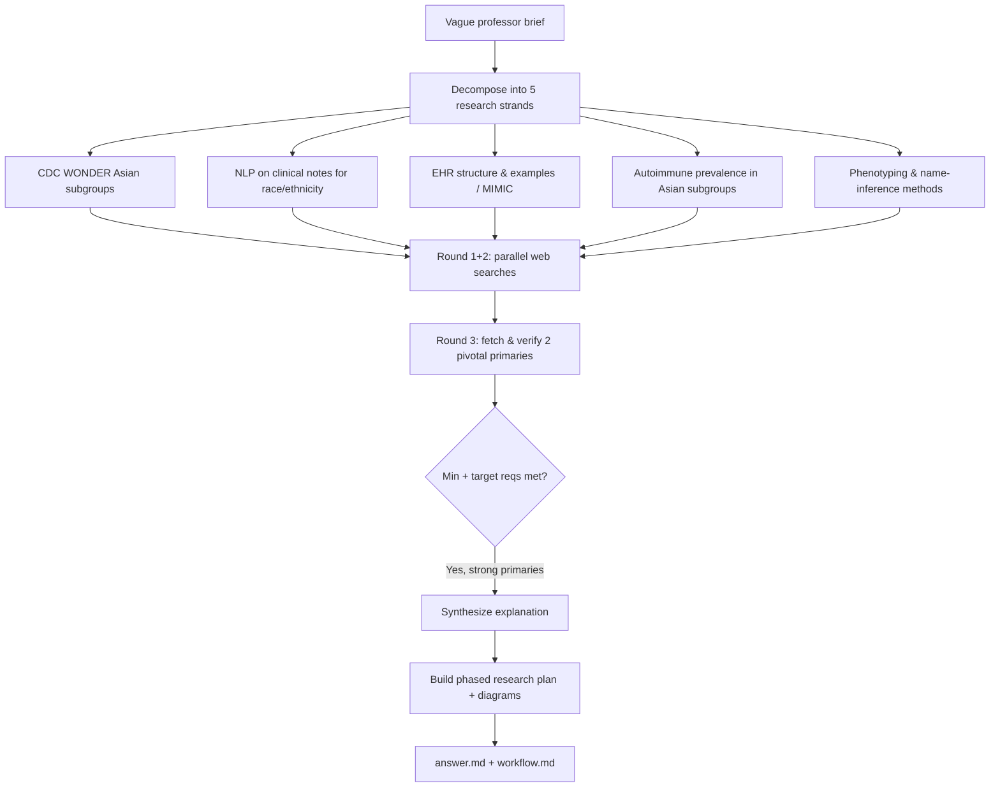

# Workflow — Explaining & planning the "NLP on EHRs → Asian subgroups → CDC WONDER → autoimmune prevalence" project

## Original question (verbatim intent)
A student's professor gave a vague brief: use NLP techniques on de-identified Electronic Health Records (EHRs) to extract Asian subgroups, "abstract the same subgroups as are in CDC WONDER data," then apply this to look at **prevalence rates of autoimmune diseases**. The student wants (1) an explanation of what the professor likely means, (2) examples of what EHRs look like, (3) which NLP techniques apply, (4) which CDC WONDER subgroups, (5) how this connects to autoimmune prevalence, (6) skills to brush up on, and (7) a research plan.

## Interpretation / scope
The light framing ("I have no clue," "help me understand") sits alongside a substantial, multi-part request that culminates in a concrete deliverable: a **research plan**. Per project scope rules, the concrete requirements define the ask. I treat this as a *moderate-complexity explainer + plan* grounded in real, citable precedent work (there are near-exact prior studies), rather than a quick chat answer. Deliverable = a plain-language explanation + phased research plan in `answer.md`, fully cited.

## Goals & success requirements
1. **End goal** — A beginner-readable explanation of the professor's brief plus a concrete, phased, cited research plan the student can act on.
2. **Minimum requirements** — Each of the 6 sub-questions answered; ≥1 credible source per major claim; a step-by-step plan; an example of EHR data; named NLP techniques; the actual CDC WONDER Asian subgroup categories.
3. **Target requirements** — Cite the *actual precedent papers* doing nearly this exact study (Asian-subgroup disaggregation + autoimmune prevalence from EHR/claims); use primary sources (Nature Sci Data, JCI, JAMIA-adjacent, CDC WONDER docs) over blogs; concrete performance numbers for the name-inference method; a process + concept diagram; an explicit list of questions to ask the professor.
4. **Budget** — Complex, multi-strand (5 strands). Budgeted ~20 rounds; spent 3 (2 parallel search batches of 4 + 1 fetch batch of 2). Stopped early: minimum and target requirements met with strong primary sources; further searching would not meaningfully improve the plan.

## Steps taken (parallelized)
- **Round 1 (4 parallel searches):** CDC WONDER Asian-subgroup mortality/disaggregation; NLP for race/ethnicity extraction from clinical notes; de-identified EHR structure / MIMIC; autoimmune prevalence among Asian-American subgroups.
- **Round 2 (4 parallel searches):** clinical NLP toolchain (cTAKES/MetaMap/ClinicalBERT); surname/name-list ethnicity inference for Asian subgroups; CDC WONDER race-category documentation; EHR phenotyping algorithms for prevalence.
- **Round 3 (2 parallel fetches, verification):** foundational name-list inference paper (PMC3249427) for subgroups + accuracy numbers; JCI autoimmune-prevalence-from-EHR paper (178722) for method + headline numbers.

## Process flowchart

## Synthesis notes
The brief maps cleanly onto an existing, active research pattern: **(1)** EHR clinical text + structured fields are the raw data; **(2)** NLP/name-inference assigns each patient to one of the six standard Asian subgroups (Asian Indian, Chinese, Filipino, Japanese, Korean, Vietnamese) — the *same* taxonomy CDC WONDER exposes — so the cohort is "abstracted" into comparable categories; **(3)** EHR phenotyping (ICD codes + NLP, e.g. MAP) identifies autoimmune-disease cases (numerator); **(4)** CDC WONDER supplies population denominators and a national comparison so subgroup **prevalence rates** can be computed and contrasted. Near-exact precedents found: ACR abstract disaggregating RA prevalence across Asian-American subgroups, AJMC claims/EHR autoimmune disparity study, and the JCI EHR-based autoimmune prevalence study.

## Sources consulted
See the Sources section of `answer.md` for the full annotated list with URLs.
