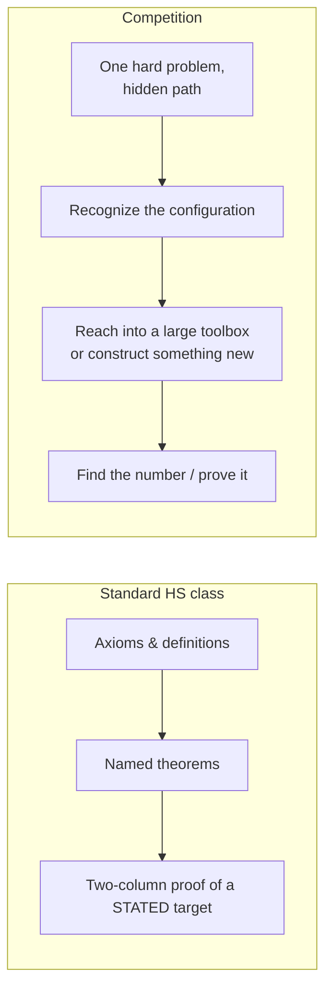

# Same Triangles, Different Sport: Competition Geometry vs. the Geometry You Took in High School

If you took a standard American high school geometry class, you learned a real and rigorous subject: points, lines, congruent triangles, the inscribed angle theorem, two-column proofs. Then you may have heard that some students do *geometry* in math competitions — the AMC, the AIME, the Olympiads — and you might reasonably assume it's just the same material, but harder.

It isn't, quite. Competition geometry uses the same objects (triangles, circles, angles) and never violates anything you learned. But it's a different *sport* played on the same field. The standard class is about **building and certifying** geometry — establishing why things are true from the ground up. Competition geometry is about **using** geometry as a toolkit to crack a single, deliberately hard problem whose solution path is hidden from you.

This post is for people who know high-school geometry but have never touched competition math. I'll lay out the contrast and then walk through four techniques — with worked examples you can follow — that are bread-and-butter in competition but almost never appear in a standard course.

---

## What the standard class is actually for

The modern US high-school geometry course is shaped by the Common Core State Standards, and its goals are explicit. You spend the year:

- Defining congruence through **rigid motions** (translations, rotations, reflections), and then *deriving* the triangle-congruence shortcuts SSS, SAS, and ASA from that definition.[^ccss-co]
- **Proving named theorems** — vertical angles are equal, alternate interior angles across parallel lines are equal, the angles of a triangle sum to 180°, the base angles of an isosceles triangle are equal.[^ccss-prove]
- Studying circles: central, inscribed, and circumscribed angles; the relationships among radii, chords, and tangents; inscribed quadrilaterals.[^ccss-circles]

Notice the verbs: *define, derive, prove*. The course's deepest aim is **rigor and vocabulary** — to show you that geometry is a deductive system where each fact rests on earlier facts, and to give you the two-column proof as a way to certify a known result. When a standard problem says "prove that the diagonals of a parallelogram bisect each other," it tells you the target *and* expects a path built from a short list of named tools you covered that week.

That is genuinely valuable. It's also a very particular slice of geometry: the **foundational** part.

## What a competition problem is actually for

Now compare the formats students are training for:[^maa][^aime-wiki]

| Contest | Problems / Time | Answer format |
|---|---|---|
| **AMC 10/12** | 25 problems / 75 min | Multiple choice (A–E) |
| **AIME** | 15 problems / 3 hours | An integer, 000–999 |
| **USAMO** | 6 problems / two 4.5-hr days | Full written proofs |

The thing these have in common is *not* "harder versions of textbook exercises." It's that **you are not told which tool to use, and often not even told the path exists.** On the AMC and AIME you get a number; you are not asked to prove anything, just to *find the answer*, by any means, fast. On the Olympiad you must prove it — but the configuration is unfamiliar, and the winning idea is usually a clever construction or a theorem the grader assumes you already know.

So competition geometry optimizes for a different skill set:

- **Recognizing configurations.** "Four points that look like they're on a circle" is a *prompt*, not a given.
- **A much bigger toolbox.** Power of a Point, Ptolemy, mass points, homothety, the radical axis, Stewart's, the extended Law of Sines, inversion — almost none of which the standard class names.[^egmo]
- **Aggressive computation as a strategy.** Setting up coordinates or trigonometry to *bash* a synthetic problem into algebra is a respected move, not a failure of elegance.
- **Speed and reverse-engineering.** On a multiple-choice or integer-answer contest, the goal is the number — estimate, plug in, exploit the answer format.

Here's the contrast in one diagram:



Let's make this concrete. Below are four tools a competitor reaches for reflexively that you almost certainly never saw in class.

---

## Technique 1: Angle chasing and the "is it cyclic?" reflex

Your class proved the **Inscribed Angle Theorem**: an inscribed angle is half its central angle, so all inscribed angles subtending the same arc are equal.[^ccss-circles] You probably used it to compute one or two angles.

Competitors run it *in reverse* and *in chains*. The reverse direction is the key unlock:

> **If two points see a segment at the same angle from the same side, all four points lie on one circle** (the converse of the inscribed-angle theorem). Equivalently, a quadrilateral is **cyclic** (its four vertices lie on a circle) exactly when its opposite angles sum to 180°.[^ccss-circles]

In class, "these four points are concyclic" is something you're *given*. In competition, *proving* four points are concyclic is a goal in itself, because the moment you have a circle, the whole inscribed-angle machine switches on and a pile of angles become equal for free.

**A quick worked angle-chase.** Suppose in triangle $ABC$ the altitudes from $B$ and $C$ hit the opposite sides at $E$ and $F$. Show that $\angle AEF = \angle ABC$.

- $\angle BFC = \angle BEC = 90^\circ$ (those are the feet of altitudes).
- So $F$ and $E$ both "see" segment $BC$ at a right angle, from the same side. By the converse above, **$B, C, E, F$ lie on one circle.**
- In that circle, $\angle FEB$ and $\angle FCB$ subtend the same arc $FB$, and quadrilateral $BFEC$ being cyclic gives $\angle AEF = \angle ABC$ (the external angle of a cyclic quadrilateral equals the opposite internal angle).

No lengths, no coordinates — just spotting a hidden circle and letting it talk. That "wait, are these concyclic?" instinct is maybe *the* defining habit of a competition geometer, and it's essentially absent from the standard curriculum, which only ever hands you circles pre-drawn.

---

## Technique 2: Power of a Point

Your textbook may have taught the **intersecting chords** fact: if two chords of a circle cross at $P$, the products of their pieces are equal. Competition treats that as one face of a single, more powerful idea introduced by Jakob Steiner in 1826:[^pop-wiki] the **Power of a Point**.

> For a fixed point $P$ and a circle, take *any* line through $P$ that meets the circle at points $X$ and $Y$. The product $PX \cdot PY$ is the **same for every such line** (counted with sign). This unifies three cases:[^pop-aops]
> - **Two chords** crossing inside at $P$: $\;PX\cdot PY = PZ\cdot PW$.
> - **Two secants** from an external $P$: $\;PX\cdot PY = PZ\cdot PW$.
> - **A tangent and a secant** from external $P$: $\;PT^2 = PX\cdot PY$ (the tangent length squared).

The tangent case is the one standard classes rarely connect to the chord case, and it's the one that wins problems. Here's the inside-the-circle picture:

```
            X
           /
   A------P----------B      chords AB and XY meet at P
         /
        Y
   Power of P:  PA · PB = PX · PY
```

**Why competitors love it:** it turns a circle into pure arithmetic on segment lengths, with no angles at all.

This shows up on the real exams. On the **1983 AIME, Problem 14**, two circles of radii 8 and 6 have centers 12 apart; through one intersection point $P$ a line is drawn so that the two chords $QP$ and $PR$ (one in each circle) are equal, and you must find $QP^2$. Power of a Point (together with a little law-of-cosines) cracks it; the answer is **130**.[^aime83] A standard class gives you the chord theorem and stops; a competitor sees "point, circle, line through it" and *immediately* writes down a product.

---

## Technique 3: Mass point geometry — physics as a shortcut

Here is a tool with no analog whatsoever in the standard curriculum. **Mass point geometry** solves problems about **cevians** (segments from a vertex to the opposite side) and the ratios in which they cut each other — by *pretending the triangle is a mobile* and hanging weights at the vertices.[^mass-wiki][^mass-rike]

The single rule is the seesaw / lever law: put a mass at each vertex so that, on every side, **mass × distance balances** like a seesaw. Then the intersection point of the cevians is just the balance point, and segment ratios are read off as inverse mass ratios.

**Worked example.** In triangle $ABC$, let $D$ lie on $BC$ with $BD : DC = 3 : 1$, and let $E$ lie on $CA$ with $AE : EC = 1 : 2$. The cevians $AD$ and $BE$ meet at $P$. Find $AP : PD$.

The standard-class route is to drop coordinates or chase similar triangles — doable but fiddly. With mass points:

1. **Balance side $BC$.** For $D$ to be the balance point of $B$ and $C$, masses must be inversely proportional to the segments: $\;\dfrac{m_B}{m_C} = \dfrac{DC}{BD} = \dfrac{1}{3}$. Take $m_B = 1,\; m_C = 3$.
2. **Balance side $CA$.** For $E$: $\;\dfrac{m_A}{m_C} = \dfrac{EC}{AE} = \dfrac{2}{1}$, so $m_A = 2\,m_C = 6$.
3. **Combine.** The mass that effectively sits at $D$ is $m_B + m_C = 1 + 3 = 4$. Point $P$ is where cevian $AD$ balances the mass $m_A = 6$ at $A$ against the mass $4$ at $D$. By the seesaw law,
$$AP : PD = m_D : m_A = 4 : 6 = \mathbf{2 : 3}.$$

(Cross-check on the other cevian: $m_E = m_A + m_C = 9$, giving $BP : PE = 9 : 1$ — consistent.)

That's three lines of arithmetic for something that would be a page of algebra otherwise. Mass points are a staple of MATHCOUNTS and the AMC/AIME exactly because they convert a geometry question into bookkeeping — and they're invisible in a standard course because the course never treats "ratio in which cevians divide each other" as a topic at all.

---

## Technique 4: Ptolemy's theorem — a hidden identity in every cyclic quadrilateral

Your class studied inscribed quadrilaterals as far as "opposite angles are supplementary."[^ccss-circles] Competition adds a remarkable *metric* fact, due to the ancient astronomer Ptolemy:[^ptolemy-aops][^ptolemy-wiki]

> **Ptolemy's Theorem.** For a cyclic quadrilateral $ABCD$ (vertices in order on a circle), the product of the diagonals equals the sum of the products of opposite sides:
> $$AC \cdot BD = AB \cdot CD + BC \cdot DA.$$

It looks like an obscure curiosity until you see what it does. **Worked example:** Let $ABC$ be equilateral, inscribed in a circle, and let $P$ be any point on the minor arc $BC$. Prove that $PA = PB + PC$.

- $A, B, P, C$ lie on the circle, and $P$ is on arc $BC$, so $ABPC$ is a cyclic quadrilateral with diagonals $AP$ and $BC$.
- Ptolemy gives $\;AP \cdot BC = AB \cdot PC + AC \cdot PB$.
- But $AB = BC = CA$ (equilateral). Divide both sides by that common length:
$$PA = PB + PC.$$

A clean, surprising result — the distance from $P$ to the far vertex always equals the sum of the distances to the two near ones — falling out in two lines (this is sometimes called Van Schooten's theorem).[^ptolemy-wiki] No standard class has a tool that even *expresses* a relationship between the four side-lengths and two diagonals of a cyclic quadrilateral; Ptolemy is that tool.

---

## The rest of the toolbox (and a word on "bashing")

The four above are just an entry point. A serious competitor also carries, among others:[^egmo]

- **Stewart's theorem** — computes the length $d$ of *any* cevian from the side lengths, no angles required: with cevian $d$ to side $a$, splitting it into segments $m$ and $n$, $\;b^2 m + c^2 n = a(d^2 + mn)$. Generations remember it by the mnemonic *"a man and his dad put a bomb in the sink"* → $man + dad = bmb + cnc$.[^stewart]
- **The Extended Law of Sines** — not just $\frac{a}{\sin A}=\frac{b}{\sin B}=\frac{c}{\sin C}$, but that this common ratio equals $2R$, the diameter of the circumscribed circle — a direct bridge between a triangle's angles and its circumcircle.
- **Ceva's and Menelaus's theorems** — exact criteria for when three cevians are concurrent, or three points collinear.
- **Homothety, the radical axis, the nine-point circle, the Simson line, inversion** — the "advanced configurations" of olympiad geometry.[^egmo]

And there's a whole *philosophical* difference worth naming: **computational bashing.** Faced with a synthetic problem, a competitor will often deliberately abandon elegance and set up $(x,y)$ coordinates, or assign trig values to every angle, or — at the olympiad level — model points as **complex numbers** or **barycentric coordinates** and grind the problem into an algebra exercise.[^egmo] Standard classes frame coordinates and synthetic proofs as separate units; competition treats "which representation makes this *computable*?" as itself a strategic choice. Picking the right bash is a skill, and knowing when *not* to bash (because a one-line angle chase exists) is a deeper one.

---

## So what's the real difference?

It isn't difficulty, and it certainly isn't that one is "real" geometry. It's **purpose**:

- The **standard class** teaches geometry as a *deductive system to be built and trusted*. Its proudest output is a correct two-column proof of a stated fact, assembled from a small, named toolkit. That foundation is exactly what makes everything else possible.
- **Competition geometry** treats that same geometry as a *toolkit for cracking the unknown*. Its proudest output is the moment you spot the hidden circle, hang the right weights, or recognize that Ptolemy collapses the whole problem to one line — and then produce the number or the proof before the clock runs out.

If your high-school class taught you to *read* the language of geometry, competition math is where people learn to *improvise* in it. The vocabulary is the same. The thing you do with it is not.

---

### Want to try it yourself?

Pick up Evan Chen's *Euclidean Geometry in Mathematical Olympiads*, which builds this entire toolbox from scratch with no prerequisites,[^egmo] or browse old **AMC/AIME** problems with worked solutions on the Art of Problem Solving wiki. Start by re-reading any circle problem and asking the competitor's first question: *"Are any of these points secretly on a circle — and what happens the moment I admit it?"*

---

## Sources

[^ccss-co]: Common Core State Standards, High School Geometry — Congruence (rigid motions; SSS/SAS/ASA derived from the definition of congruence). https://www.thecorestandards.org/Math/Content/HSG/CO/
[^ccss-prove]: Common Core, "Prove geometric theorems" (vertical angles, parallel-line angles, triangle and isosceles-triangle theorems). https://www.thecorestandards.org/Math/Content/HSG/CO/C/10/ and https://www.thecorestandards.org/Math/Content/HSG/CO/C/11/
[^ccss-circles]: Common Core, High School Geometry — Circles (central/inscribed/circumscribed angles; chords, radii, tangents; inscribed quadrilaterals). https://www.thecorestandards.org/Math/Content/HSG/C/
[^maa]: MAA American Mathematics Competitions — AMC 10/12 are 25 multiple-choice questions in 75 minutes; USAMO is six proof-based problems over two 4.5-hour days. https://maa.org/student-programs/amc/ and https://maa.org/maa-invitational-competitions/
[^aime-wiki]: American Invitational Mathematics Examination — 15 questions, 3 hours, integer answers 000–999. https://en.wikipedia.org/wiki/American_Invitational_Mathematics_Examination
[^egmo]: Evan Chen, *Euclidean Geometry in Mathematical Olympiads* (EGMO) — topic list incl. cyclic quadrilaterals, power of a point, homothety, triangle centers, Ceva/Menelaus, Ptolemy, complex numbers, barycentric coordinates, inversion; "essentially no prerequisites." https://web.evanchen.cc/geombook.html
[^pop-wiki]: Power of a point (history; introduced by Jakob Steiner, 1826). https://en.wikipedia.org/wiki/Power_of_a_point
[^pop-aops]: Power of a Point Theorem — the chord, secant, and tangent cases. Art of Problem Solving Wiki. https://artofproblemsolving.com/wiki/index.php/Power_of_a_Point_Theorem
[^aime83]: 1983 AIME, Problem 14 (two circles of radii 8 and 6, centers 12 apart; equal chords through an intersection point; find $QP^2$). Answer: 130. Art of Problem Solving Wiki. https://artofproblemsolving.com/wiki/index.php/1983_AIME_Problems/Problem_14
[^mass-wiki]: Mass point geometry — applies the center-of-mass / lever principle to cevian-ratio problems. https://en.wikipedia.org/wiki/Mass_point_geometry
[^mass-rike]: Tom Rike, "Mass Point Geometry," Berkeley Math Circle. https://mathcircle.berkeley.edu/sites/default/files/archivedocs/2007_2008/lectures/0708lecturespdf/MassPointsBMC07.pdf
[^ptolemy-aops]: Ptolemy's theorem — Art of Problem Solving Wiki. https://artofproblemsolving.com/wiki/index.php/Ptolemy's_theorem
[^ptolemy-wiki]: Ptolemy's theorem (and the equilateral-triangle / Van Schooten corollary $PA = PB + PC$). https://en.wikipedia.org/wiki/Ptolemy's_theorem
[^stewart]: Stewart's theorem, $b^2 m + c^2 n = a(d^2 + mn)$; mnemonic "man + dad = bmb + cnc." https://en.wikipedia.org/wiki/Stewart's_theorem
