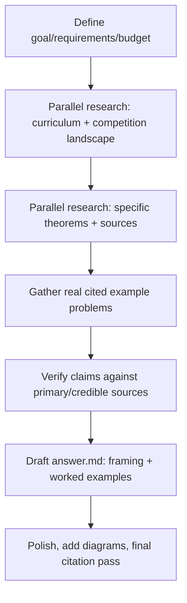

# Workflow — Competition Euclidean Geometry vs. Standard US HS Geometry

## Goals & success requirements

1. **End goal:** A blog post contrasting Euclidean geometry as it appears in US math competitions (AMC/AIME/Olympiad) with geometry taught in the standard American high-school curriculum, written for a reader who knows standard HS geometry but has no competition experience — including clear, worked examples of problem-solving techniques and theorems common in competition but not in the standard class.

2. **Minimum requirements (floor to ship):**
   - A clear, honest framing of *how* the two differ (goals, what "doing geometry" means in each).
   - At least 4 concrete techniques/theorems used in competition but not standard curriculum, each with a worked example a standard-HS reader can follow.
   - At least one example traced to a real competition problem (AMC/AIME/Olympiad), cited.
   - Standard-curriculum claims grounded in an authoritative source (Common Core / NCTM).

3. **Target requirements (excellent):**
   - Every theorem grounded in a credible reference (AoPS Wiki / Evan Chen / textbook).
   - Multiple worked examples tied to *specific, cited* real competition problems with year/number.
   - A diagram or two (ASCII/mermaid) to aid intuition.
   - Balanced, non-condescending tone; accurate about the standard curriculum's actual aims.

4. **Budget:** ~10 rounds (Moderate–Complex). Decomposition:
   - Standard US curriculum content (Common Core geometry): ~2
   - Competition topic/technique landscape: ~2
   - Specific theorem references (Power of a Point, Ptolemy, mass points, trig/Law of Sines extended, homothety): ~3
   - Real example problems + solutions (AMC/AIME): ~3
   - ~80% gather / 20% verify+write.

## Process flowchart

## Steps taken
- Round 1 (parallel ×3): Common Core HS geometry standards; AoPS competition-technique landscape; Evan Chen EGMO topic list. → established the curriculum-vs-competition framing and the candidate toolbox.
- Round 2 (parallel ×4): located real cited problems & verified theorem statements — Power-of-a-Point AIME problems; Ptolemy + equilateral-triangle (Van Schooten); mass-point cevian example; Stewart's theorem.
- Round 3: verification fetches — Stewart's exact formula + mnemonic (Wikipedia, OK); 1983 AIME #14 statement/answer (AoPS WebFetch 403 → confirmed answer **130** via targeted search). Constructed and self-checked the mass-point worked example (AP:PD = 2:3; cross-checked on second cevian).
- Round 4: verified contest formats (AMC 10/12, AIME, USAMO) against MAA/Wikipedia.
- Write: drafted answer.md — framing + 4 worked examples (angle chasing/cyclic quads, Power of a Point, mass points, Ptolemy) + toolbox/bashing section. Self-verified the orthic angle chase, Ptolemy ordering, and mass-point arithmetic by hand.

Used ~4 rounds of the ~10 budgeted — domain knowledge let gathering converge fast; remaining budget spent on verification rather than new scope (stop condition: target requirements met).

## Requirements check (stop condition)
- Minimum: framing ✓; 4 techniques each with a followable worked example ✓; ≥1 real cited competition problem (1983 AIME #14) ✓; curriculum claims grounded in Common Core ✓.
- Target: every theorem grounded in a credible reference (AoPS/Evan Chen/Wikipedia/Berkeley Math Circle) ✓; multiple cited specifics ✓; mermaid diagram + ASCII figure ✓; balanced, non-condescending tone ✓.

## Sources consulted
- Logged in `scratchpad/sources.md`; cited inline in `answer.md` (footnotes).

## Budget tracking
- Rounds used: ~4 search/verify rounds of ~10 budgeted. No extension needed.
