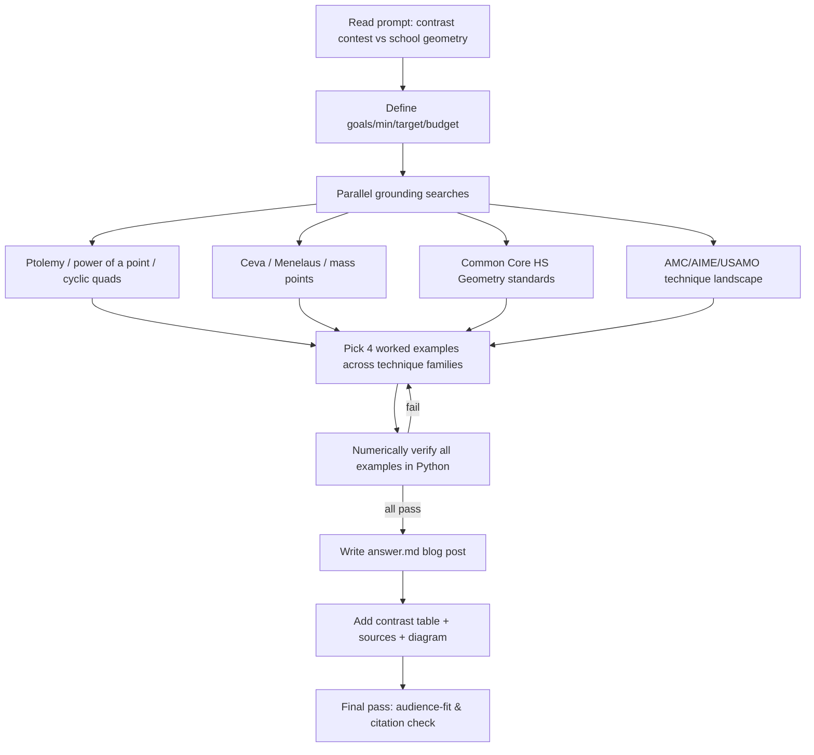

# Workflow — Competition vs. School Geometry blog post

## Goals & success requirements

1. **End goal** — A blog post that shows a reader who knows standard US high-school geometry (but no competition math) *how* and *why* contest Euclidean geometry differs, with concrete, correct, worked examples of techniques/theorems that contests use but classrooms skip.
2. **Minimum requirements**
   - Clear framing of the two worlds (curriculum scope + problem-solving philosophy).
   - At least 3 fully worked examples of "contest-only" tools, each correct and reproducible.
   - Each non-obvious theorem statement backed by a credible source, cited inline.
   - Accessible to the target audience (assumes inscribed-angle theorem, similar triangles, Pythagoras; explains everything beyond that).
3. **Target requirements**
   - 4+ worked examples spanning distinct technique families (synthetic/angle-chasing, metric, ratio/affine, and the "philosophy" shift).
   - Examples verified numerically, not just asserted.
   - Curriculum claims grounded in the actual Common Core HS Geometry standards, not hearsay.
   - A side-by-side contrast table and a clean narrative arc.
4. **Budget** — Moderate task (~8 rounds). I know the domain well; rounds spent mostly on (a) grounding curriculum + theorem statements in credible sources and (b) numerically verifying every worked example so nothing is wrong.

## Process

## Rounds spent
- **Round 1 (gather):** 4 parallel web searches — Ptolemy/power of a point, Ceva/Menelaus/mass points, Common Core geometry standards, AMC/AIME/USAMO technique landscape.
- **Round 2 (verify):** Python check of all four worked examples (power of a point, Ptolemy→golden ratio, mass points cevian ratio, plus pentagon Ptolemy identity). All passed exactly.
- **Round 3 (write):** Drafted `answer.md`.

Budget used: ~3 rounds of an ~8-round budget. Stopped because minimum and target requirements were met and the worked examples were verified — further searching would not meaningfully improve the post.

## Sources consulted
- Common Core State Standards Initiative — High School: Geometry (thecorestandards.org)
- AoPS Wiki — Ptolemy's theorem, Menelaus' theorem, Power of a Point
- Wikipedia — Ptolemy's theorem, Menelaus's theorem, AIME
- Brilliant — Ceva's theorem, Menelaus' theorem, Ptolemy's theorem
- cut-the-knot — Ptolemy, Ceva

## Synthesis notes
Organized the contrast along two axes: (1) *scope* — what tools exist in each toolbox; (2) *philosophy* — what counts as "doing geometry" (verifying given facts via two-column proofs vs. discovering hidden structure via auxiliary constructions and invariants). Each worked example doubles as evidence of both a missing tool and the different mindset.
