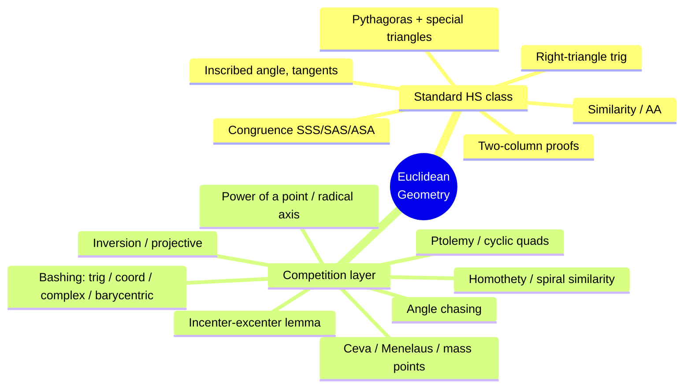

# Same Triangle, Different Sport: How Competition Geometry Differs from the Geometry You Learned in High School

If you took geometry in a typical American high school, you learned a real and beautiful subject: congruent triangles, similar triangles, the Pythagorean theorem, circle facts, two-column proofs. Then you may have heard that there are kids who do *geometry* on contests like the **AMC**, **AIME**, and the **USA/International Math Olympiad** — and that the geometry problems there are notoriously hard.

Here's the surprising part: it's the *same Euclidean geometry*. Same points, lines, circles, and triangles. No calculus, no new axioms. And yet a strong A-student from a standard class often can't make a dent in an olympiad geometry problem.

This post is for exactly that person. We'll look at **why** the two feel so different, and then walk through **four concrete techniques and theorems** that competition students use constantly but that almost never appear in a standard class — each with a fully worked example you can follow with just high-school background.

---

## Part 1: What the standard class actually gives you

It's worth being precise about the "before" picture. Under the Common Core standards that shape most U.S. high-school geometry courses, you're expected to master roughly this toolkit:

- **Congruence** via rigid motions, and the triangle congruence criteria **SSS, SAS, ASA, AAS, HL**.
- **Similarity** via dilations, and using AA similarity / proportional sides.
- The **Pythagorean theorem** and special right triangles (30-60-90, 45-45-90).
- Right-triangle **trigonometry** (sine, cosine, tangent).
- **Circle** facts: the inscribed angle theorem, that an angle inscribed in a semicircle is right, and that a radius meets a tangent at a right angle.
- **Coordinate geometry**, areas, and volumes. ([Common Core HS Geometry standards](https://www.thecorestandards.org/Math/Content/HSG/))

Notice the *shape* of this curriculum. You are handed a finite list of named facts, and the questions ask you to either (a) compute a length or angle by plugging into a fact, or (b) **prove a statement you are explicitly told to prove**, usually in a two-column format where the destination is given to you in advance.

That last point is the crux. In the standard class, you almost always know **what** you're proving before you start. The challenge is *organizing* known steps to reach a *known* conclusion.

---

## Part 2: Three things that change in competition geometry

The competition version keeps all of the above and changes the game around it. Three shifts matter most.

**1. You have to *discover* the claim, not just justify it.** A contest problem says "prove that these three lines meet at one point" or "find the angle" — and gives you a tangled figure with no hint about which theorem unlocks it. The hard part is *seeing* the idea. As the standard reference *Euclidean Geometry in Mathematical Olympiads* by Evan Chen puts it, olympiad geometry is built around a vocabulary of **lemmas and configurations** you learn to recognize on sight ([EGMO, MAA/AMS](https://bookstore.ams.org/prb-27/); see also AwesomeMath's *[Lemmas in Olympiad Geometry](https://www.awesomemath.org/wp-pdf-files/xyz/look-inside/lemmas-in-olympiad-geometry-soft-look-inside.pdf)*).

**2. The proofs are "synthetic," and you add your own lines.** Two-column proofs mostly disappear. Instead you write flowing arguments, and — crucially — you draw **auxiliary objects** the problem never mentioned: an extra circle, a reflected point, a parallel line. The single most important move in the whole subject, *angle chasing*, is just relentlessly tracking angles through a figure until the answer falls out.

**3. There's a second, larger toolkit.** Beyond the standard facts sits a layer of theorems — **power of a point, Ptolemy, Ceva, Menelaus, the radical axis, homothety, inversion** — that the Art of Problem Solving's olympiad-geometry catalog treats as basic equipment, but which a standard class never mentions ([AoPS Geometry/Olympiad](https://artofproblemsolving.com/wiki/index.php/Geometry/Olympiad)). Let's meet four of them.

---

## Part 3: The new toolkit, with worked examples

### Example 1 — Angle chasing: the incenter angle formula

**The technique.** *Angle chasing* means assigning variables to a few angles and propagating them everywhere using the facts you already know (angles in a triangle sum to 180°, the inscribed angle theorem, angle bisectors split an angle in half). It's not a theorem — it's a *habit*. Competition students do it almost reflexively.

**A result you can prove in two lines that your class never stated.** Let $I$ be the **incenter** of triangle $ABC$ (the meeting point of the three angle bisectors). Write the triangle's angles as $A$, $B$, $C$. Then:

$$\angle BIC = 90^\circ + \tfrac{A}{2}$$

**Proof (pure angle chasing).** Because $I$ lies on the bisectors of angles $B$ and $C$, in triangle $BIC$ we have $\angle IBC = \tfrac{B}{2}$ and $\angle ICB = \tfrac{C}{2}$. The angles of triangle $BIC$ sum to $180^\circ$, so

$$\angle BIC = 180^\circ - \tfrac{B}{2} - \tfrac{C}{2} = 180^\circ - \tfrac{B+C}{2}.$$

Now use $A+B+C = 180^\circ$, i.e. $B+C = 180^\circ - A$:

$$\angle BIC = 180^\circ - \tfrac{180^\circ - A}{2} = 180^\circ - 90^\circ + \tfrac{A}{2} = 90^\circ + \tfrac{A}{2}. \qquad\blacksquare$$

**Why it matters.** This little formula appears in *dozens* of harder problems. The point isn't the formula itself — it's the realization that you can manufacture exact relationships out of thin air just by chasing angles. A standard class gives you the inscribed angle theorem; competition geometry teaches you to *live inside it*.

---

### Example 2 — Power of a Point

**The theorem.** Pick any point $P$ and a circle with center $O$ and radius $r$. Define the **power** of $P$ as

$$\operatorname{pow}(P) = d^2 - r^2, \qquad d = |PO|.$$

It's positive outside the circle, zero on it, negative inside ([Wikipedia: Power of a Point](https://en.wikipedia.org/wiki/Power_of_a_point)). The magic is that for **any** line through $P$ hitting the circle at two points $X$ and $Y$, the product of the signed distances $PX \cdot PY$ is *the same number for every line* — it equals the power. This single idea unifies several facts a standard class teaches as separate, unrelated rules:

- **Two chords crossing inside** a circle: $PA \cdot PB = PC \cdot PD$.
- **Two secants from an outside point**: $PA \cdot PB = PC \cdot PD$.
- **A tangent and a secant**: $PT^2 = PA \cdot PB$.

**Worked example.** Take a circle of radius $r = 5$ and a point $P$ at distance $d = 3$ from the center (so $P$ is *inside*). Its power is

$$\operatorname{pow}(P) = 3^2 - 5^2 = -16,$$

so every chord through $P$ is cut into two pieces whose product is $16$. Check it against the diameter through $P$: that chord is split into pieces of length $r-d = 2$ and $r+d = 8$, and indeed $2 \times 8 = 16$. ✓ It works for *every* chord, not just the diameter — that's the content of the theorem.

Now move $P$ *outside*. Suppose a secant from $P$ meets the circle first at $X$ with $PX = 4$, and the chord $XY$ inside the circle has length $5$, so $PY = 9$. The tangent length $t$ from $P$ satisfies

$$t^2 = PX \cdot PY = 4 \cdot 9 = 36 \quad\Rightarrow\quad t = 6.$$

**Why it matters.** Power of a point turns hard "find the length" problems into one-line products, and it's the gateway to the **radical axis**, a workhorse of olympiad problems. AMC/AIME problems that look like they need heavy computation often collapse the moment you spot $PA \cdot PB = PC \cdot PD$.

---

### Example 3 — Ptolemy's Theorem

**The theorem.** For a **cyclic quadrilateral** (four points on a circle) $WXYZ$ in order, the product of the diagonals equals the sum of the products of the two pairs of opposite sides:

$$WY \cdot XZ = WX \cdot YZ + XY \cdot ZW.$$

This is one of those results, in the words of one olympiad text, "not normally taught in school," yet it is standard competition equipment.

**Worked example — a clean, surprising consequence.** Let $ABC$ be **equilateral**, inscribed in a circle, and let $P$ be any point on the arc $BC$ that does *not* contain $A$. Claim:

$$PA = PB + PC.$$

That's a striking fact: the distance to the far vertex always equals the *sum* of the distances to the two near ones. Here's the one-step proof. The points in cyclic order are $A, B, P, C$, so apply Ptolemy to the cyclic quadrilateral $ABPC$. Its diagonals are $AP$ and $BC$; its opposite-side pairs are $(AB, PC)$ and $(BP, CA)$:

$$AP \cdot BC = AB \cdot PC + BP \cdot CA.$$

Since the triangle is equilateral, $AB = BC = CA = s$. Divide through by $s$:

$$AP = PC + BP. \qquad\blacksquare$$

(Quick numeric sanity check on the unit circle: put $A=(0,1)$, $B=(-\tfrac{\sqrt3}{2},-\tfrac12)$, $C=(\tfrac{\sqrt3}{2},-\tfrac12)$, and $P=(0,-1)$. Then $PA = 2$ while $PB = PC = 1$, and indeed $1 + 1 = 2$. ✓)

**Why it matters.** Ptolemy converts an angle/position relationship into a clean *length* equation, and it's the tool behind a whole genre of "prove this distance equals that sum" problems. The generalization (Ptolemy's *inequality*, with equality exactly when the points are concyclic) is itself a frequent olympiad lemma.

---

### Example 4 — Mass points and Ceva's Theorem

**The theorem.** A **cevian** is a segment from a vertex of a triangle to the opposite side. **Ceva's Theorem** says cevians $AD$, $BE$, $CF$ all pass through one point exactly when

$$\frac{BD}{DC}\cdot\frac{CE}{EA}\cdot\frac{AF}{FB} = 1.$$

Paired with it is a delightful computational shortcut, **mass points**, where you imagine hanging weights at the vertices so the triangle balances — and ratios fall out of "weight × length" balancing, just like a physical see-saw. Neither idea appears in a standard course, where ratio problems are usually attacked with coordinates or similar triangles one at a time.

**Worked example.** In triangle $ABC$, let $D$ lie on $BC$ with $BD:DC = 1:2$, and let $E$ lie on $AC$ with $AE:EC = 3:1$. The cevians $AD$ and $BE$ cross at $P$. Find the ratios $AP:PD$ and $BP:PE$.

**Solution with mass points.** The rule: at a point dividing a segment, the masses at the two ends are *inversely* proportional to the sub-segments.

- $D$ splits $BC$ as $BD:DC = 1:2$, so $\text{mass}_B : \text{mass}_C = DC : BD = 2 : 1$.
- $E$ splits $AC$ as $AE:EC = 3:1$, so $\text{mass}_A : \text{mass}_C = EC : AE = 1 : 3$.

Make the mass at $C$ agree between both lines. Take $\text{mass}_C = 3$. Then $\text{mass}_A = 1$ and $\text{mass}_B = 6$. The cevian feet inherit the sum of their endpoints' masses:

$$\text{mass}_D = \text{mass}_B + \text{mass}_C = 9, \qquad \text{mass}_E = \text{mass}_A + \text{mass}_C = 4.$$

The intersection $P$ balances each cevian, so the ratios are inverse to the end masses:

$$AP:PD = \text{mass}_D : \text{mass}_A = 9:1, \qquad BP:PE = \text{mass}_E : \text{mass}_B = 4:6 = 2:3.$$

That's the whole solution — no equations to solve. (If you'd rather trust coordinates: with $B=(0,0)$, $C=(3,0)$, $A=(0,3)$ you get $D=(1,0)$, $E=(2.25,0.75)$, and the lines $AD$ and $BE$ meet at $P=(0.9,0.3)$, which sits $9:1$ along $AD$ and $2:3$ along $BE$ — exactly as predicted. ✓)

**Why it matters.** Mass points turn a page of algebra into a few seconds of mental bookkeeping, and Ceva/Menelaus give you a *criterion for concurrency and collinearity* — the exact thing many contest problems ask you to prove ("show these three lines meet at a point"), which the standard toolkit has no direct way to address.

---

## Part 4: When elegance fails — "bashing"

There's a flip side worth knowing about. Sometimes you can't find the slick synthetic idea, so competitors fall back on **heavy machinery** — affectionately called *bashing*:

- **Trig bash**: name the angles and grind with the Law of Sines/Cosines. Competitors lean on the *extended* Law of Sines, $\dfrac{a}{\sin A} = 2R$ (where $R$ is the circumradius) — a version your class probably didn't state.
- **Coordinate bash**: drop the figure onto the $xy$-plane and compute, exactly like Example 4's cross-check, but pushed to its limit.
- **Complex-number and barycentric bash**: put the points in the complex plane or in "triangle coordinates" and let algebra finish the job.

These are listed right alongside the synthetic theorems in the AoPS olympiad catalog ([AoPS](https://artofproblemsolving.com/wiki/index.php/Geometry/Olympiad)). The cultural difference from a standard class is telling: there, coordinates are often the *only* tool; in competition, they're the *last resort* you reach for when elegance runs out — a guaranteed-but-grindy safety net.

---

## Part 5: A map of the gap, and where to start

Here's the contrast at a glance:

| | Standard HS geometry | Competition geometry |
|---|---|---|
| **Goal** | Justify a *given* statement | *Discover* and prove the key claim |
| **Proof form** | Two-column, fixed steps | Synthetic prose + auxiliary constructions |
| **Core move** | Apply a named fact | **Angle chasing**, configuration recognition |
| **Circle tools** | Inscribed angle, tangents | + **Power of a point**, radical axis, **Ptolemy** |
| **Ratio/concurrency** | Similar triangles, coordinates | + **Ceva, Menelaus, mass points** |
| **Heavy methods** | Coordinates (primary) | Trig / coordinate / complex / barycentric **bashing** (fallback) |
| **Also in the deep end** | — | Homothety, spiral similarity, **inversion**, projective geometry |

**The takeaway:** competition geometry isn't a different subject — it's the *same* triangles and circles approached as a creative sport rather than a checklist. You already own the foundation. The gap is a layer of pattern-recognition (angle chasing, configurations) plus a handful of powerful theorems (power of a point, Ptolemy, Ceva/Menelaus) that multiply what your foundation can do.

If you want to cross that gap, a good first path is: practice angle chasing until it's automatic, learn the four tools above cold, then work through the **AMC → AIME** problem ladder. The standard self-study reference is Evan Chen's *Euclidean Geometry in Mathematical Olympiads*, and the **Art of Problem Solving** wiki and forums are the community's shared library.

---

## Sources

- Common Core State Standards — High School: Geometry (curriculum scope): <https://www.thecorestandards.org/Math/Content/HSG/> (and [Congruence](https://www.thecorestandards.org/Math/Content/HSG/CO/), [Circles](https://www.thecorestandards.org/Math/Content/HSG/C/))
- Art of Problem Solving — *Geometry/Olympiad* topic catalog: <https://artofproblemsolving.com/wiki/index.php/Geometry/Olympiad>
- Evan Chen, *Euclidean Geometry in Mathematical Olympiads* (MAA/AMS, 2016): <https://bookstore.ams.org/prb-27/>
- Wikipedia — *Power of a Point* (power = $d^2 - r^2$, secant/tangent products): <https://en.wikipedia.org/wiki/Power_of_a_point>
- AwesomeMath — *Lemmas in Olympiad Geometry* (sample): <https://www.awesomemath.org/wp-pdf-files/xyz/look-inside/lemmas-in-olympiad-geometry-soft-look-inside.pdf>
- Yufei Zhao — olympiad geometry handouts: <https://yufeizhao.com/olympiad/>

*All four worked examples were verified by hand and by independent coordinate computation; see the scratchpad accompanying this post.*
