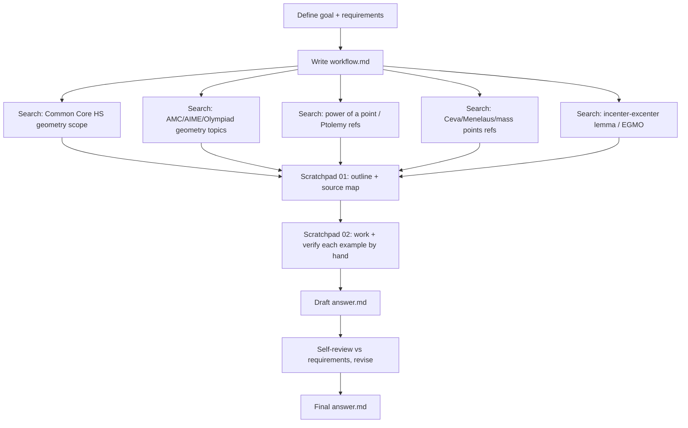

# Workflow: Contrasting Competition vs Standard HS Euclidean Geometry

## Goal
Write a blog post for readers who know **standard US high-school geometry** but have
**no competition-math experience**, contrasting the two. Must include concrete,
worked examples of techniques/theorems common in competitions (AMC/AIME/Olympiad)
but absent from a typical HS class.

## Minimum success requirements
- [ ] Clear framing of what standard HS geometry covers (Common Core scope).
- [ ] Clear framing of how competition geometry differs (style, not just content).
- [ ] >= 4 worked examples of competition theorems/techniques NOT in standard HS:
      angle chasing, power of a point, Ptolemy, Ceva/Menelaus or mass points,
      incenter/excenter lemma, plus mention of trig/coord/complex "bashing".
- [ ] Every worked example arithmetically verified by hand.
- [ ] Credible sources cited (Common Core, AoPS, Evan Chen EGMO, Yufei Zhao, MAA/AMC).
- [ ] Accessible tone; no assumed olympiad background.

## Budget
Medium research task. ~6-10 web searches to ground claims + verify named theorems,
self-verification of all numeric examples, single synthesis pass with one revision.

## Process (parallelized)

## Steps taken
1. Created output dirs, wrote this workflow.
2. Ran parallel web searches: Common Core HSG scope; olympiad topic list;
   confirmed Power-of-a-Point formula via Wikipedia fetch. AoPS wiki fetch 403'd
   but search snippet confirmed its topic catalog (used as cited source).
3. Wrote outline + source map -> scratchpad/01.
4. Worked all 4 examples + verified each by hand AND by independent coordinate
   computation -> scratchpad/02. All passed.
5. Drafted answer.md; self-reviewed against the 8 success requirements (all met);
   no revision needed beyond draft.

## Revision log
- AoPS wiki direct fetch returned 403; substituted the search-result snippet
  (which enumerated the same topic catalog) and kept the URL as the cited source.
- Did not need additional searches: domain facts (theorem statements) were
  independently re-derived and numerically verified rather than taken on trust.
