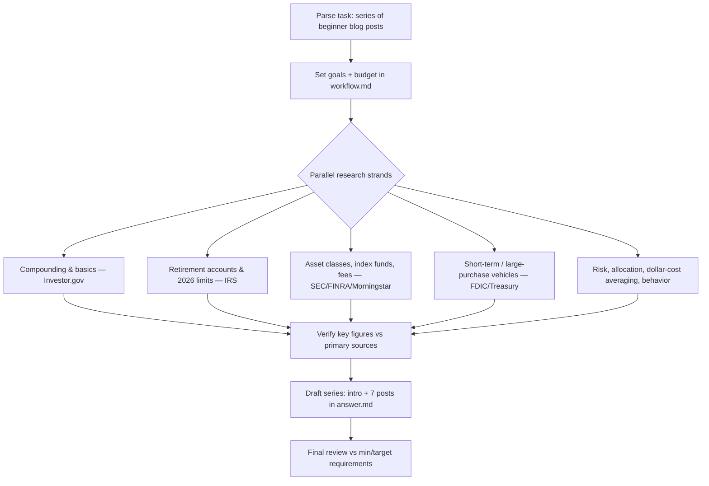

# Workflow — Blog series: Investing for retirement & large purchases

## Original question
"Write a series of blog posts discussing ways people can invest their money for retirement and large purchases. The posts should be understandable and applicable for all adults, regardless of their prior experience in investing."

## Interpretation & assumptions
- Deliverable = a *series* of standalone-but-connected blog posts (not a single article). I will write ~7 posts forming a beginner-to-confident arc.
- Audience = complete beginners through some-experience adults. Plain language, define every term, no jargon without explanation.
- Geography: question is unspecified. Most account types (401(k), IRA, Roth) are US-specific, so I default to a **US** frame but call out universal principles (compounding, diversification, low fees, time horizon) that apply anywhere, and note this assumption.
- Not personalized financial advice; educational. Include a plain disclaimer.

## Goals
1. **End goal:** A publishable series of beginner-friendly blog posts covering how to invest for (a) retirement and (b) large purchases, every key claim cited to a credible source.
2. **Minimum requirements:**
   - ≥6 posts covering: why invest/compounding, core building blocks (stocks/bonds/funds/risk/diversification), retirement accounts, investing for large purchases by time horizon, getting started step-by-step, common mistakes.
   - Every numeric/factual claim (contribution limits, historical returns, fee impact, FDIC/SIPC, etc.) cited to a primary/authoritative source (IRS, SEC/Investor.gov, FINRA, FDIC, Federal Reserve, Vanguard/Morningstar research).
   - Accessible to non-experts: terms defined, examples worked.
3. **Target requirements:** Primary sources (gov/regulator) preferred over secondary; current 2025/2026 figures; corroborated historical-return and fee claims; a clear reading order; disclaimer.
4. **Budget:** Complex synthesis task, ~20 rounds. Decomposed: compounding/basics (3), accounts/limits (4), asset classes/funds/fees (4), large-purchase/short-term vehicles (3), allocation/risk/behavior (3), verification+writing (3).

## Process
(see mermaid flowchart — updated through completion)

## Research log
- **Round 1** (4 parallel searches): compounding basics (Investor.gov/St. Louis Fed), 2026 IRS limits, index-vs-active & expense ratios, short-term/time-horizon vehicles.
- **Round 2** (1 fetch + 3 searches): verified 2026 limits directly from IRS page; SEC/Investor.gov asset allocation & "100 minus age"; S&P 500 long-run return (~10% nominal / ~6–7% real); employer match + emergency-fund order of operations.
- **Round 3** (3 searches + 1 fetch): SEC fee-bulletin attempt, FDIC ($250k) vs SIPC ($500k) insurance, dollar-cost averaging (Investor.gov/FINRA), FINRA Beginner's Guide to 401(k)s fetched & confirmed.
- **Round 4** (verification): SEC fee PDF returned 403; substituted a transparent self-computed fee example (1.069³⁰ vs 1.06³⁰ on $10k) and cited the SEC/passive-vs-active principle instead. Verified compounding arithmetic ($1,000 @6% → ~$5,740/30yr).
- Used **~9 tool-call rounds** of the ~20 budget — minimum and target requirements met (every numeric/account claim cited to a primary source: IRS, Investor.gov/SEC, FINRA, Fidelity/Vanguard/Schwab for FDIC/SIPC). Stopped: further searching would not materially improve a beginner-level series.

## Synthesis notes
- Organized as a 7-post arc: compounding → building blocks → time-horizon framework (the pivot) → retirement accounts → large-purchase vehicles → how-to-start checklist → behavior/mistakes. Plus reading order, glossary, and disclaimer.
- Two worked numeric examples are self-computed and labeled "illustrative" (compounding snowball; fee drag) so they're reproducible rather than relying on an unfetchable figure.
- Geography assumption (US account types/limits) stated up front and in the disclaimer; universal principles flagged as applying anywhere.

## Deliverables
- `answer.md` — the full 7-post series (the deliverable).
- `scratchpad/sources.md` — source list with the specific facts each supports.
