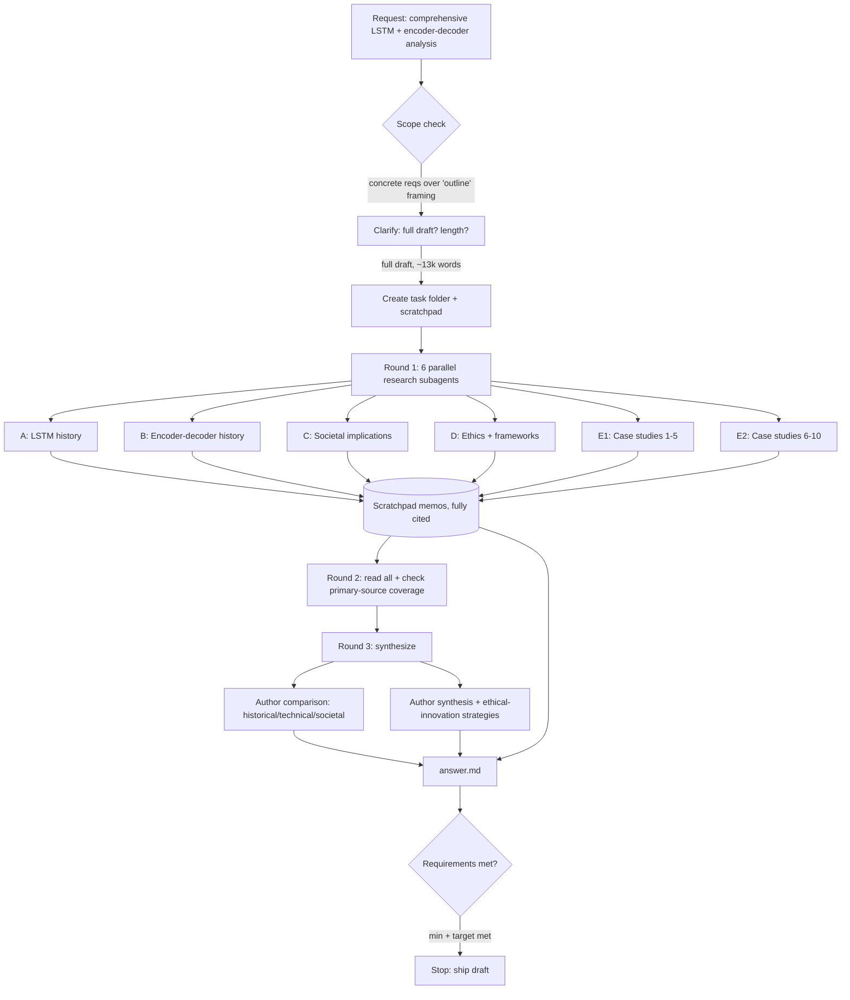

# Workflow — LSTM & Encoder–Decoder Comprehensive Analysis

*Record of the research process (not the answer's content). Updated through completion.*
*(Note: a per-strand workflow stub for Strand B previously occupied this file; it has been replaced by this task-level record. The Strand B detail lives in `scratchpad/strand_b_encoder_decoder_history.md`.)*

## Scope interpretation

The request is framed as help "outlining" a paper and being "stuck on scope," but the concrete requirements describe a full comprehensive expository analysis: two complete architecture histories, societal implications, ethics against formal frameworks, a direct comparison, and 10 synthesized case studies. Per the scope-determination rule, the concrete requirements define the real ask. A clarifying question confirmed the user wants a **full researched draft**; length was left to my judgment, set at **~13,000 words**. Deliverable = a complete, fully-cited paper draft (`answer.md`), not an outline.

## Goals and success requirements

1. **End goal** — A single comprehensive, peer-reviewed-cited paper covering: (a) full LSTM history, (b) full encoder–decoder history, (c) societal implications (MT, ASR, predictive text → globalization/accessibility/jobs), (d) ethics (bias, access, misuse) judged against formal frameworks (IEEE etc.), (e) a direct LSTM-vs-encoder-decoder comparison, and (f) 10 synthesized case studies feeding conclusions on responsible/ethical innovation.
2. **Minimum requirements (floor):**
   - Every architecture milestone backed by ≥1 primary or peer-reviewed source.
   - Societal + ethical claims cited; speculative claims flagged as such.
   - ≥1 named formal ethical framework summarized and applied (achieved: 6 — IEEE, EU, OECD, UNESCO, ACM, NIST).
   - 10 case studies, each with an architecture citation + impact + ethics.
   - A comparison section (historical/technical/societal) and a synthesis/conclusions section.
3. **Target requirements (excellence):** primary/peer-reviewed sources preferred over secondary throughout; single-source load-bearing claims flagged; benchmark-vs-deployment and marketing-vs-evidence gaps surfaced; case studies *synthesized* into cross-cutting theses, not just listed; framework principles quoted accurately and mapped to specific harms.
4. **Budget** — Complex, multi-strand. Decomposed into 6 strands, each ≈ Moderate (8 rounds) → ~40–48 rounds nominal. Executed via 6 parallel research subagents (one fan-out = many parallel searches each), so actual tool-call rounds were far below the nominal ceiling. ~80% gather / 20% verify+write split preserved. No extension needed.

## Process

- **Round 0 (setup):** Created task folder + `scratchpad/`. Asked one scoping question (deliverable + length).
- **Round 1 (parallel fan-out):** Launched 6 independent research subagents simultaneously, each writing a fully-cited memo into `scratchpad/`:
  - A — LSTM history; B — encoder–decoder history; C — societal; D — ethics & frameworks; E1 — case studies 1–5; E2 — case studies 6–10.
  - Each agent self-verified citations against arXiv / ACL Anthology / JMLR / publisher pages and returned a summary + flagged unverified claims.
- **Round 2 (verify + read):** Read all 6 memos in full; confirmed every milestone has a primary/peer-reviewed anchor and noted each strand's flagged caveats.
- **Round 3 (synthesize):** Wrote `answer.md` — composed the two histories and the societal/ethics parts from the memos, and authored the **comparison** (Part V) and **synthesis/conclusions** (Part VII) myself, since those depend on all strands being complete. Built a consolidated, de-duplicated reference list.

## Process flowchart

## Sources consulted

~70 distinct sources across the 6 memos (full lists with URLs/DOIs/page numbers in each `scratchpad/strand_*.md`). Mix: peer-reviewed papers (majority — arXiv/ACL/JMLR/Nature/Science/PNAS/NeurIPS/ICML), official framework documents (IEEE, EU HLEG, OECD, UNESCO, ACM, NIST), industry/official engineering blogs (Google, Microsoft, Apple, Meta, DeepL), and investigative journalism / NGO reports (The Intercept, WIRED, HRW, OECD, CSET). Source-type is labelled inline wherever a claim is not peer-reviewed.

## Synthesis approach

Each strand memo was treated as a verified evidence base. The two histories and the societal/ethics parts were condensed with citations preserved. The **comparison** was written from scratch on three axes (historical / technical / societal), built on the insight that LSTM is a *cell* and the encoder–decoder a *form* — which explains why the Transformer could keep the form while swapping the cell. The **case studies** were synthesized into three cross-cutting theses (dual-use/governance-neutral capability; benchmark-vs-deployment & marketing-vs-evidence gaps; harm concentrating on the marginalized), which drive seven framework-grounded **strategies for ethical innovation**.

## Stop condition

Stopped after Round 3: all minimum requirements met and target requirements substantially met. No budget extension needed. Residual caveats for a formal submission (flagged in `answer.md` §20 and the strand memos): re-verify the ACM Code numbering and the verbatim "stochastic parrot" page range at source (both bot-blocked at fetch); the Siri "LSTM acoustic model" attribution is indirect; several case-study impact figures are vendor-reported and labelled as such.
