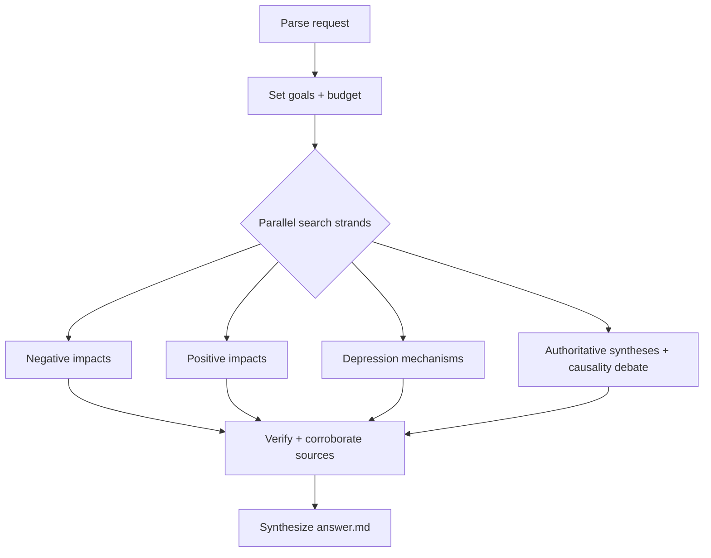

# Workflow — Social media & teen mental health

## Scope interpretation
Request: How does social media affect adolescent mental health — both positive and negative impacts — and why it might contribute to depression. Interpreted as a balanced, evidence-grounded research brief covering (a) negative impacts, (b) positive impacts, (c) causal/mechanistic pathways to depression, grounded in primary/authoritative sources (Surgeon General advisory, APA, longitudinal studies, meta-analyses, key researchers Twenge/Haidt/Orben/Przybylski).

## Goals & success requirements
1. **End goal:** A balanced, cited brief explaining how social media affects teen mental health (positive + negative) and the mechanisms linking it to depression.
2. **Minimum requirements:**
   - Both positive and negative impacts covered, each with ≥1 credible source.
   - ≥3 plausible mechanisms for depression, each sourced.
   - At least one authoritative synthesis (Surgeon General / APA / major meta-analysis).
   - Note the causality-vs-correlation debate honestly.
3. **Target requirements:**
   - Mechanisms backed by peer-reviewed or longitudinal evidence, not just opinion.
   - Represent the scientific debate (Twenge/Haidt strong-effect vs Orben/Przybylski small-effect).
   - Distinguish correlation from causation; note effect sizes; note moderators (sex, time, type of use).
   - Recent (2023–2025) syntheses included.
4. **Budget:** ~20 rounds (Complex). Decomposition: negative impacts (~6), positive impacts (~5), depression mechanisms (~6), authoritative syntheses/debate (~5). 80% gather / 20% verify+write.

## Process flowchart

## Log
- Round 0: folder + goals + budget set.
- Round 1 (4 parallel searches): Surgeon General advisory, longitudinal depression evidence, positive impacts, Orben/Przybylski small-effect debate. Established prevalence stats, balanced framing, and the small-effect-size pole.
- Round 2 (4 parallel searches): mechanisms (social comparison/FOMO/sleep/cyberbullying), Twenge/Haidt strong-effect pole, APA advisory, meta-analytic effect sizes (r≈0.217). Captured both sides of the causality debate.
- Round 3 (1 fetch + 2 searches): RCT meta-analysis fetch (g=0.28/0.25), experimental evidence (Hunt 2018, Allcott/Gentzkow deactivation), passive-vs-active + sex differences. Added causal-leaning experimental evidence and key moderators.
- Round 4 (1 fetch): confirmed RCT meta-analysis details (10 trials, 1,491 ppl, limited-use > abstinence, limitations).

## Stop decision
Used ~4 rounds of the ~20-round budget — well under. All minimum requirements met (positive + negative impacts sourced; ≥6 depression mechanisms sourced; multiple authoritative syntheses — Surgeon General, APA, NASEM; causality debate represented honestly). Target requirements met: peer-reviewed/longitudinal + RCT experimental evidence included; both Twenge/Haidt and Orben/Przybylski poles represented; correlation vs causation distinguished; effect sizes and moderators (passive/active, sex, dose) reported; 2023–2025 syntheses included. No further research would meaningfully improve the answer — stopped.

## Synthesis approach
Structured answer.md as: short verdict → positive impacts → negative impacts → mechanisms (the "why depression" core) → causality debate (skeptic vs strong-effect vs experimental) → bottom line + certainty note. Every claim carries an inline citation to a credible/primary source; unsupported claims excluded.
