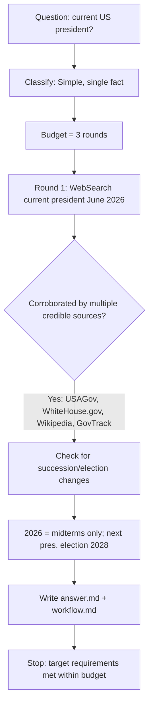

# Workflow — "Who is the president of the United States?"

## Original question
"who is the president of the united states?"

## Interpretation
A single, current-fact lookup. Deliverable: the name of the sitting U.S.
president, grounded in a credible source, with a sanity check that no recent
event (succession/election) has changed it as of 2026-06-14.

## Goals and success requirements
1. **End goal** — State who currently holds the office of U.S. President, cited.
2. **Minimum requirements** — Name confirmed by ≥1 credible source; current as of
   today's date.
3. **Target requirements** — Corroborated by ≥2 independent sources, including an
   official/government source; confirm no succession or election has altered the
   answer; include VP and term dates.
4. **Budget** — Simple task: ~3 rounds (1 to gather, buffer to verify/write).
   Justification: single, low-contention fact.

## Process

## Rounds used
- **Round 1** — `WebSearch`: "current president of the United States June 2026".
  Returned consistent results across USAGov, WhiteHouse.gov, Wikipedia, and
  GovTrack: Donald J. Trump, 47th president, sworn in 2025-01-20. Also surfaced
  "2026 United States elections" confirming 2026 is midterm-only.

## Sources consulted
- USAGov — Presidents list: https://www.usa.gov/presidents
- The White House: https://www.whitehouse.gov/
- Donald Trump — Wikipedia: https://en.wikipedia.org/wiki/Donald_Trump
- 2026 United States elections — Wikipedia: https://en.wikipedia.org/wiki/2026_United_States_elections
- GovTrack (corroborating): https://www.govtrack.us/congress/other-people/donald_trump/412733

## Synthesis
Multiple independent credible sources agree. Confirmed no intervening event
(2026 is midterm-only) changes the answer. Target requirements met in 1 gathering
round, well under the 3-round budget. Stopped — no further research would improve
the answer.
