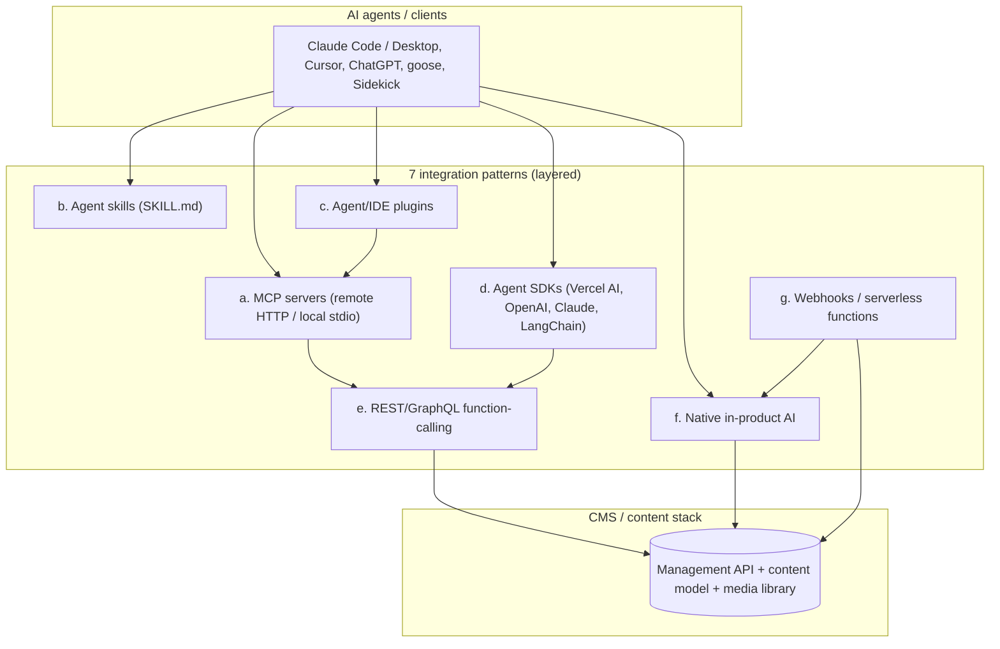

# How organizations connect AI agents to their CMS platforms

*Research date: 2026-06-19. Every load-bearing claim is cited to a primary source (vendor docs, source repos, npm/registry, or the MCP specification) where one exists; community and secondary sources are labeled, and unverifiable specifics are flagged in **[§11 Gaps](#11-gaps-unverified-claims-and-version-context)**. This space moves fast — versions and dates are recorded inline.*

---

## 1. Executive summary

By mid-2026 the dominant way to wire an AI agent to a CMS is a **first-party MCP (Model Context Protocol) server**, but that is only the headline. Across the platforms surveyed, agents actually connect through **seven distinct patterns** that layer on top of one another — from the raw REST/GraphQL Management API at the bottom, through MCP servers and agent SDKs, up to agent **skills**, vendor-native AI features, and webhook/serverless triggers. Most real integrations combine several.

Two populations diverge in a clear way:

- **General-purpose CMS frameworks** (Payload, Strapi, Sanity, Contentful, Storyblok, Directus, WordPress) converge on **generic, schema-driven content-CRUD** exposed as MCP tools. The tool surface is auto-generated from each project's content model, so the "business logic" an agent sees is essentially *list / get / create / update / delete / publish* per content type. The interesting variation is in *design* (one-tool-per-resource vs. a handful of generic meta-tools), *transport/auth*, and *whether binary media can be uploaded at all*.
- **Individual companies running their own content stacks** (Block, Shopify, Notion-as-CMS users, and the vendors' own "content agent" products) instead **encode their specific editorial and business workflow** into the integration — via tools named after business verbs, **Agent Skills** that act as editorial rulebooks, **approval states** (draft → proposed → release) and **destructive-operation gates**, and schema/permission scoping as guardrails.

The single most consistent technical gap across the whole landscape is **uploading new binary media** (images, files). MCP tool arguments are JSON, so there is no native way to pass raw bytes; platforms either solve it with base64/URL-import workarounds (Contentful, WordPress, the misterboe Strapi server), model it as a multi-step signed upload (Storyblok), or simply **do not support it** through MCP and tell you to use the REST upload API first (official Strapi, Directus `import-file` is URL-only, Sanity).

---

## 2. The integration-pattern taxonomy (emergent)

Categories were allowed to emerge from the evidence; seven recur. Each is defined with a real example and source.

| # | Pattern | What it is | Canonical CMS example |
|---|---------|-----------|----------------------|
| **a** | **MCP server** — remote/hosted HTTP **or** local/stdio | A server exposing CMS capabilities as standardized JSON-RPC tools/resources any MCP client can call. MCP defines two transports: **stdio** (client launches a local subprocess) and **Streamable HTTP** (independent HTTP endpoint, POST+GET, optional SSE). [MCP transports spec](https://modelcontextprotocol.io/specification/2025-11-25/basic/transports) | Sanity hosted `mcp.sanity.io`; Strapi built-in `/mcp`; `@contentful/mcp-server` (local stdio) |
| **b** | **Agent skill** (`SKILL.md`) | A capability packaged as a markdown manifest + optional scripts, loaded on demand via **progressive disclosure** (name+description ≈80 tokens at startup; body when selected; scripts at execution). [Agent Skills overview](https://platform.claude.com/docs/en/agents-and-tools/agent-skills/overview) | Payload `payloadcms/skills` (`payload`, `cms-migration`); Anthropic `brand-guidelines` |
| **c** | **Agent/IDE plugin** | Bundles skills, MCP server definitions (`.mcp.json`), slash commands and hooks into one installable marketplace unit; enabling it auto-starts its MCP servers. Claude Desktop analogue = Desktop Extension (`.mcpb`). [Desktop Extensions](https://www.anthropic.com/engineering/desktop-extensions) | Payload Claude Code plugin; CMS servers in `claudemarketplaces.com` |
| **d** | **Agent SDK wrapping CMS APIs** | Code frameworks where devs define tools (thin wrappers over CMS REST/GraphQL) and hand them to a model loop. Vercel AI SDK 6 (`needsApproval` HITL), OpenAI Agents SDK, Claude Agent SDK, LangChain. [Vercel AI SDK 6](https://vercel.com/blog/ai-sdk-6) | Wrapping `contentful.entry.createDraft()` / Sanity Agent Actions in an SDK tool |
| **e** | **REST/GraphQL function-calling** | The lowest level: expose existing Management API (REST) or GraphQL ops as model function definitions. This is what (a) and (d) ultimately wrap. | WordPress REST API + Application Passwords; Directus REST `/items`, `/files` |
| **f** | **Native in-product AI** | AI built into the CMS UI/API by the vendor, not connected externally. Editor-facing; an external agent reaches it only via the content it produces or by invoking it as a tool. | Sanity Agent Actions / AI Assist; Contentful AI Actions; Strapi AI; Storyblok AI Suite; Directus Labs AI operations |
| **g** | **Webhooks / serverless triggers** | Content events fire webhooks or run serverless functions that invoke an agent. | Sanity Functions (Node 22) → Agent Actions; Directus Flows `trigger-flow`; Contentful webhooks |

> These form a spectrum from raw API exposure (e) → wrappers (a, d) → packaging (b, c) → vendor-native (f) → event triggers (g). A typical production setup is an **MCP server (a) over the REST API (e), installed as a plugin (c), with Functions (g) for autonomous triggers**.

A **second axis** that emerged and matters as much as the pattern: **tool-surface design.**

- **One-tool-per-resource** (e.g. Strapi's 8 tools/type, Contentful's ~40, the community `hypescale/storyblok-mcp-server` with **160 tools across 30 modules**) — explicit, predictable, but large.
- **Generic meta-tools** (Storyblok's *official* hosted server: ~7 tools — `search`, `describe`, `execute_readonly/mutating/destructive`, `upload_asset(+_finish)` — over the whole Management API; WordPress mcp-adapter's discovery mode: `discover-abilities`/`get-ability-info`/`execute-ability`) — small, auto-covering new endpoints, but the agent must discover then execute.

---

## 3. Population A — general-purpose CMS frameworks

All seven named frameworks now ship or front an official agent integration. The table is the map; subsections give the primary-source tool inventories.

| Framework | Official agent surface (where it lives) | Pattern | Transport / auth | Open source? | Status / version (date) |
|---|---|---|---|---|---|
| **Payload** | `@payloadcms/plugin-mcp` (install into the app) + `payloadcms/skills` | Embedded MCP server + agent skills | Streamable HTTP at `/api/mcp`; Bearer **Payload API Key** (user-bound) | Yes (plugin open-source) | Beta (docs live Jun 2026) |
| **Strapi** | MCP server **built into core ≥ 5.47.0** + Docs MCP (Kapa) | Built-in MCP server | Streamable HTTP at `/mcp`, stateless, POST-only; Bearer **Admin** token (RBAC) | Yes (core) | **Beta**, launched Jun 8 2026 |
| **Sanity** | Hosted `mcp.sanity.io` + Sanity Context (read-only) + Agent Actions | Hosted MCP + native programmatic AI API | Streamable HTTP; **OAuth** or scoped token | Hosted=closed; AI Assist & old local server open | Remote "v2.6.0" (Dec 11 2025); reads production-ready by Jun 2026 |
| **Contentful** | `mcp.contentful.com/mcp` (remote) + `@contentful/mcp-server` (local) | Remote + local MCP, both over CMA | Remote: **OAuth 2.1**; local: stdio + **CMA PAT** | Yes (local, MIT) | **v1.12.3, published 2026-06-19** (very active) |
| **Storyblok** | Hosted `mcp.labs.storyblok.com/mcp` (self-host repo archived 2026-03-30) | Hosted meta-tool MCP | Streamable HTTP; Bearer **Personal Access Token**, `?role=` scoping | Hosted=closed; archived repo open (TS) | "Innovation phase", no semver |
| **Directus** | **MCP built into core v11.13** (2025-11-07) + standalone `@directus/content-mcp` | Built-in MCP + standalone stdio MCP | Built-in: HTTP, token (runs through permissions + audit log); standalone: stdio, token/login | Yes (core + MIT package) | Core v11.13 (Nov 7 2025) |
| **WordPress** | **Abilities API** (core 6.9, Nov 2025) → **`WordPress/mcp-adapter`** (lib) → MCP; `Automattic/wordpress-mcp` plugin (archived) | Capability registry → MCP adapter | stdio + Streamable HTTP; **Application Passwords / JWT / OAuth 2.1** | Yes (GPL-2.0+) | mcp-adapter v0.5.0 (~Apr 2026) |

### 3.1 Payload CMS

**Official MCP — `@payloadcms/plugin-mcp`** ([docs](https://payloadcms.com/docs/plugins/mcp), [RFC #14318](https://github.com/payloadcms/payload/discussions/14318)). Embedded MCP server running inside the Payload/Next.js app. Add `mcpPlugin({ collections: { posts: { enabled: true } } })` to `buildConfig.plugins`. **Transport:** Streamable HTTP at `POST /api/mcp`. **Auth:** Bearer = a Payload-managed **API Key** (a new "MCP → API Keys" admin collection). Keys are **user-bound**, so all Payload access control, hooks and multi-tenant rules apply. **Two-step access model:** enable a collection in config *and* toggle the capability ON for the specific key.

Tools are **auto-generated per enabled collection/global** in camelCase `{op}{Collection}` form:

| Tool (pattern) | Op | Params (type, required) | Returns |
|---|---|---|---|
| `find{Collection}` (verified: `findPosts`) | read | `select` (string JSON, opt); `locale`/`fallbackLocale` (string, opt if i18n); where/query args | document(s) |
| `create{Collection}` | create | collection fields per schema (virtual fields excluded) | created doc |
| `update{Collection}` | update | `id` + fields | updated doc |
| `delete{Collection}` | delete | `id` | result |
| `find{Global}` / `update{Global}` (verified: `findSiteSettings`, `updateSiteSettings`) | read/update | `select`/locale opt; global fields | global doc |

Only `findPosts`/`findSiteSettings`/`updateSiteSettings` appear verbatim in docs; the create/update/delete names are inferred from the documented camelCase pattern. **Extensibility:** fully custom `mcp.tools[]`, `mcp.prompts[]`, `mcp.resources[]`, with **parameters defined as Zod schemas**; handlers receive `(args, req)` with the full `PayloadRequest`. If localization is on, all tools auto-gain `locale`/`fallbackLocale`. **Media upload:** *not documented* — create tools take JSON fields only; uploading actual image bytes through the official plugin is **unverified** and likely needs a custom tool calling `payload.create({ collection, file, data })`. The open-source **`@ai-stack/payloadcms`** (`ashbuilds/payload-ai`) in-admin AI plugin *does* write AI-generated media into an upload collection via exactly that `payload.create({…, file})` pattern.

**Skills — `payloadcms/skills`** ([repo](https://github.com/payloadcms/skills), `npx skills add payloadcms/skills`): two coding-agent skills — `payload` (dev guidelines) and `cms-migration` (interactive workflow to map a source CMS export to Payload collections). These teach an agent to *write Payload code*; they are not a runtime connector. **Enterprise:** native AI writing/translation/image-gen (some "coming soon") and **RAG auto-embedding** (vector indexes written into your own DB) — [enterprise AI](https://payloadcms.com/enterprise/enterprise-ai), [AI framework](https://payloadcms.com/enterprise/ai-framework).

### 3.2 Strapi

**Official MCP — built into core ≥ v5.47.0 (Beta)** ([docs](https://docs.strapi.io/cms/features/strapi-mcp-server), [launch blog Jun 8 2026](https://strapi.io/blog/the-strapi-mcp-server-is-out-wire-agents-to-your-content)). No install: add `mcp: { enabled: true }` to `config/server.ts`. **Transport:** Streamable HTTP at `POST /mcp`, **stateless** (each POST spins an ephemeral server scoped to the token; GET/DELETE → 405). **Auth:** **Admin API Tokens** (not Content API tokens, which 401); the token's RBAC decides which tools, fields and locales are visible.

Tools are generated per content type from schema — **collection types get up to 8, single types up to 6** (fully verified from docs):

| Tool | Action | Required permission |
|---|---|---|
| `list` | read (pagination/sort/filter) | `read` |
| `get` | read one by `documentId` | `read` |
| `create` | create (draft if Draft&Publish on) | `create` |
| `update` | update by `documentId` | `update` |
| `delete` | delete by `documentId` | `delete` |
| `publish` / `unpublish` / `discard_draft` | publishing lifecycle (only if D&P on) | `publish` |

Single types replace `list`+`create`+`update` with `get` + `write` (create-or-update). The `list` tool's params are fully documented: `page` (number, default 1), `pageSize` (number, default 25, max 100), `sort` (string/array/object), `filters` (full Strapi operator syntax). **Extensibility:** custom tools via `strapi.ai.mcp.registerTool({ name, title, description, resolveInputSchema, resolveOutputSchema, auth | devModeOnly })`, where **schemas are functions** evaluated per request (so a tool can narrow itself for a lower-privilege token) using `z` from `@strapi/utils` ([extend-MCP blog](https://strapi.io/blog/how-to-extend-strapi-s-mcp-server-with-a-custom-tools-via-a-plugin)). **Media upload — documented hard gap:** the docs' "Known limitations" state the MCP server *cannot upload new files*; agents may only reference already-uploaded asset IDs, and must use Strapi's REST [Upload API](https://docs.strapi.io/cms/api/rest/upload) (`POST /api/upload`, multipart) first.

Strapi also ships a **second official MCP — a Docs MCP** (Kapa-powered, `https://strapi-docs.mcp.kapa.ai`) for coding assistants ([docs](https://docs.strapi.io/cms/ai/docs-mcp-server)), and **Strapi AI** (GA Oct 14 2025) — a native Content-Type-Builder copilot that generates schema from a prompt, a JS app, or a Figma file ([Strapi AI](https://strapi.io/ai)). **Community servers:** `@bschauer/strapi-mcp-server` (misterboe — stdio, JWT; notably **does** support upload via `strapi_upload_media` fetching from a URL, ~1 MB base64 cap; "not for production") and `@sensinum/strapi-plugin-mcp` (VirtusLab — Streamable HTTP, introspection-only, **dev-only, never in production**).

### 3.3 Sanity

Sanity stores structured content in the **Content Lake**, queried with **GROQ**; agents compile natural language → GROQ via `query_documents`. Several surfaces exist:

1. **Remote MCP — `https://mcp.sanity.io`** (official, hosted, closed-source) ([docs](https://www.sanity.io/docs/ai/mcp-server), [changelog](https://www.sanity.io/docs/changelog/e75b1d45-03be-4fa6-994b-248750b3fa9f)). Streamable HTTP; **OAuth** (default, sessions ≈7 days) or scoped API token. "40+ tools" (a marketing figure). Documented tool names include `query_documents`, `semantic_search`, `get_document`, `create_document_from_json`/`_from_markdown`, `patch_document(s)`, `publish_documents`/`unpublish_documents`/`discard_drafts`, `get_schema`/`deploy_schema`, `create_release`/`create_version`, `generate_image`/`transform_image` (AI media, consumes credits), plus project/dataset management. Per-tool parameter schemas are **not enumerable** (closed source).
2. **Sanity Context** — a *separate read-only* MCP endpoint, Bearer read-token, exactly **4 tools**: `initial_context`, `schema_explorer`, `groq_query`, `array_field_reader` ([docs](https://www.sanity.io/docs/ai/sanity-context)).
3. **Local `@sanity/mcp-server`** — **deprecated/archived** ("use the remote server"), MIT, npm 0.12.2 (2026-03-12), stdio.
4. **Agent Actions** (`client.agent.action.*`, beta) — the editorially-relevant native AI API, requires `@sanity/client` ≥ 7.1.0, schema-aware, **triggerable from Sanity Functions, webhooks, CI/CD** ([intro](https://www.sanity.io/docs/agent-actions/introduction), [cheatsheet](https://www.sanity.io/docs/agent-actions/agent-action-cheatsheet)):

| Action | Purpose | Key params (req/opt) |
|---|---|---|
| `generate()` | create new content (additive only) | `schemaId`(req), `targetDocument`(req), `instruction`(req); `path`/`target`/`noWrite`/`async`(opt) |
| `transform()` | modify existing content in place | `schemaId`(req), `documentId`(req), `instruction`(req); `target`/`noWrite`(opt) |
| `translate()` | schema-aware deep translation | `schemaId`(req), `documentId`(req), `fromLanguage`(req), `toLanguage`(req) |
| `prompt()` | LLM call using content as context, returns text/JSON, no write | signature partly unverified |
| `patch()` | schema-validated patch *without* LLM | signature partly unverified |

5. **AI Assist — `@sanity/assist`** (open-source in-Studio plugin). 6. **Community `@purple-horizons/sanity-mcp`** adds refs/diff/history/bulk tools the official server lacks.

**Media upload — gap.** Sanity's MCP only does AI image *generation/transformation*; there is **no tool to upload an arbitrary binary to the Media Library**, and Agent Actions explicitly **don't support the `file` type** and won't save generated images to the Media Library.

### 3.4 Contentful

The **Content Management API (CMA)** is the CRUD backbone; two MCP servers share the toolset.

- **Remote `mcp.contentful.com/mcp`** (EU variant exists) — **OAuth 2.1** browser sign-in, two-layer permission gating (user perms + per-environment app config) ([docs](https://www.contentful.com/developers/docs/tools/mcp-server/)).
- **Local `@contentful/mcp-server`** — MIT, **v1.12.3 published 2026-06-19** (very actively maintained), stdio via `npx`. Env: `CONTENTFUL_MANAGEMENT_ACCESS_TOKEN` (req), `SPACE_ID` (req), `ENVIRONMENT_ID` (opt, default `master`), `PROTECTED_ENVIRONMENTS` (opt) ([repo](https://github.com/contentful/contentful-mcp-server)). **Tools are defined one-file-per-tool with Zod schemas** under `packages/mcp-tools/src/tools/…` (`@contentful/mcp-tools` is published separately and is extensible).

Verified tool inventory (README + repo file tree): **context** (`get_initial_context`); **content types** (`list/get/create/update/publish/unpublish/delete_content_type`, plus field-level `deleteContentTypeField`/`disableContentTypeField`/`omitContentTypeField`); **entries** (`search_entries`, `semantic_search`, `get_entry`, `create/update/publish/unpublish/delete_entry`, `archiveEntry`/`unarchiveEntry`, snapshots); **assets** (`upload_asset`, `list/get/update/publish/unpublish/delete_asset`); **spaces/envs**, **locales**, **tags**; **AI Actions** (`list/get/create/update/publish/unpublish/delete_ai_action`, `invoke_ai_action`, `get_ai_action_invocation`); **editor interfaces**; **jobs** (`exportSpace`/`importSpace`).

**Media upload — solved (verified from `uploadAsset.ts`).** `upload_asset` params: `title` (req string), `description` (opt), `file` (req `{ fileName(req), contentType(req MIME), upload(opt) }`), `metadata`, `locale` (opt, default `en-US`). The `upload` field accepts a public `https://` URL **or a base64 data URI** — so the client base64-encodes a local file. The **remote** server instead uses a two-phase `create_upload_session` → PUT raw bytes → `upload_asset` flow (sessions single-use, 1-hour expiry). **AI Action invocation** (verified `invokeAiAction.ts`): `invoke_ai_action({ aiActionId (req), fields[] })`, polling the invocation until `COMPLETED`. Native **AI Actions** (reusable instruction templates, ≤10 variables, tied to Workflow Automation steps) and the **AI Content Type Generator** round out the surface.

### 3.5 Storyblok

**Official MCP is hosted** at `https://mcp.labs.storyblok.com/mcp`; the self-host repo `storyblok/mcp-server` is **archived (2026-03-30)** and superseded by the hosted service ([setup page](https://mcp.labs.storyblok.com/), [repo](https://github.com/storyblok/mcp-server)). **Transport:** Streamable HTTP; **auth:** Bearer Personal Access Token, `?role=` scoping. Its design is the **generic meta-tool** approach over the Management API's OpenAPI catalog (new API operations are reachable without new tool code):

| Tool | What it does |
|---|---|
| `search` | discover API operations by keyword (returns `operationId`s) |
| `describe` | full param docs for an operation |
| `execute_readonly` | run GET operations |
| `execute_mutating` | run POST/PUT/PATCH |
| `execute_destructive` | run DELETE (requires explicit user confirmation) |
| `upload_asset` | **step 1** of asset upload — returns a signed S3 URL + ready-to-run `curl` |
| `upload_asset_finish` | **step 2** — finalize after the file is transferred to S3 |

**Media upload — modeled as the underlying 3-step signed upload** (sign → multipart POST to S3 → finalize); the MCP emits a `curl` command for the out-of-band binary POST. Exact JSON param schemas are not published (descriptions only). **Native AI** = "AI Suite" (AI Translations, AI SEO, AI Alt-Text) + Ideation Room (Beta), all **bring-your-own-provider** (OpenAI/Gemini), editor-facing not agent-callable. **Community:** `hypescale/storyblok-mcp-server` (MIT, **160 tools / 30 modules**, one-tool-per-resource — the opposite design) and several smaller ones. The official SDK substrate is `storyblok-js-client`.

### 3.6 Directus

**Native MCP built into core** — shipped in **v11.13 (2025-11-07)**, baseline v11.12+ ([release](https://directus.com/resources/directus-v11-13-release), [MCP guide](https://directus.com/docs/guides/ai/mcp)). Enabled in **Settings → AI**; **token auth** for a dedicated MCP user; crucially it **runs through the existing permissions system and writes every change to the audit/activity log**, and ships **global delete protection (off by default)**. This in-process, permission-and-audit-native MCP is the notable "built-in" example.

A **separate standalone `@directus/content-mcp`** (MIT, `npx`, stdio) exists for older/local setups ([repo](https://github.com/directus/mcp)); its tools are registered in `src/tools/index.ts` and built on `@modelcontextprotocol/sdk` + `@directus/sdk`. Verified inventory (~20 tools) with Zod schemas for items/files:

| Tool | Key params (type, required?) |
|---|---|
| `read-items` | `collection` (string, **req**); `query` (itemQuerySchema, **req**) |
| `create-item` | `collection` (**req**); `item` (record, **req**); `query` (opt) |
| `update-item` | `collection` (**req**); `id` (string\|number, **req**); `data` (record, **req**) |
| `delete-item` | `collection` (**req**); `id` (**req**) — destructive-annotated |
| `read-files` | `query`(opt); `id`(opt); `raw`(bool, opt → returns **base64**) |
| `import-file` | `url` (string, **req**); `data` (file metadata, opt) |
| `read/create/update-field`, `read-collections`/schema, `users-me`, `read-users`, `read-folders`, `update-files`, `read/upsert-comment`, `markdown-tool`, `read-flows`, `trigger-flow`, `get-prompt(s)` | per docs / source |

**Media upload — gap confirmed.** `import-file` is **URL-only**; there is **no binary upload tool** — agents must drop to REST `/files` (multipart). Reading binaries works via `read-files raw:true` → base64. `DISABLE_TOOLS` lets you switch off destructive tools. **Directus Automate (Flows)** is a distinct surface: agents `trigger-flow`; native AI is delivered as **Directus Labs flow operation extensions** (AI Writer, Image Generation, Transcription, Translator, Alt-Text, +more), each BYO-key.

### 3.7 WordPress

WordPress consolidated its agent stack in late 2025/early 2026 into a clean layered architecture ([Abilities API blog](https://developer.wordpress.org/news/2025/11/introducing-the-wordpress-abilities-api/), [mcp-adapter](https://github.com/WordPress/mcp-adapter)):

**REST API + Application Passwords** (universal backbone) → **Abilities API** (capability registry, in **core 6.9**, Nov 2025; JS counterpart in 7.0) → **`WordPress/mcp-adapter`** (converts abilities → MCP tools/resources/prompts; v0.5.0 ~Apr 2026) → MCP clients, often via the **`@automattic/mcp-wordpress-remote`** stdio↔HTTP proxy.

**Abilities API is the extension point:** `wp_register_ability( 'namespace/ability-name', $args )` on the `wp_abilities_api_init` hook, with `input_schema`/`output_schema` (JSON Schema), `execute_callback`, `permission_callback`, `category`, `meta`. mcp-adapter exposes abilities either via three discovery meta-tools (`discover-abilities`/`get-ability-info`/`execute-ability`) or as **direct tools** via `create_server()`. **Transports:** stdio + Streamable HTTP (and **stdio via WP-CLI**). **Auth:** Application Passwords (core since 5.6, HTTPS-only), JWT, or OAuth 2.1 (PKCE) via the proxy.

The widely-deployed (now **archived 2026-01-19**) `Automattic/wordpress-mcp` plugin v0.2.5 ships a fixed ~55-tool set read directly from its PHP files: Posts (`wp_posts_search`, `wp_get_post`, `wp_add_post` [content must be Gutenberg block format], `wp_update_post`, `wp_delete_post`, categories/tags), Pages, Custom post types, Users (7), Settings, Site info, and generic REST CRUD (`list_api_functions`/`get_function_details`/`run_api_function`).

**Media upload — supported here** (verified from `McpMediaTools.php`, correcting the common "MCP can't upload images" claim for this plugin): **`wp_upload_media`** (POST `/wp/v2/media`) takes `file` (string, **base64-encoded**, required — a pre-callback strips any `data:*;base64,` prefix, decodes, and sniffs MIME via `finfo`) plus `title`/`caption`/`description`/`alt_text`. **WooCommerce** in the archived plugin is products-CRUD + **read-only** orders/reports; the **newer native WooCommerce MCP** (built on Abilities) adds order create/manage (exact ability names only in vendor blogs — flagged). **Native AI:** Jetpack AI Assistant (Gutenberg content gen) and WordPress.com **Big Sky** agentic site builder (`@automattic/big-sky-agents`) — first-party AI, not MCP servers.

---

## 4. Population B — companies running their own content stacks

Where frameworks expose generic CRUD, individual companies must teach the agent their **specific editorial and business workflow**. The evidence shows four encoding mechanisms (synthesis in §4.6). Note the honest gap: **no published primary case study** describes a company wrapping a *homegrown internal CMS* with MCP *and* detailing its approval representation — Block is the closest but names no CMS server.

### 4.1 Block / Square — `goose` + an internal MCP fleet
Block open-sourced **`goose`**, an on-machine MCP-compatible agent and the **first public MCP client** ([announcement](https://block.xyz/inside/block-open-source-introduces-codename-goose), [engineering blog](https://dev.to/goose_oss/mcp-in-the-enterprise-real-world-adoption-at-block-ci5)). Goose connects to internal systems **only through MCP servers authored by Block's own engineers** — "this allows us to tailor each integration to our systems and use cases" (named: Snowflake, GitHub, Jira, Slack, Drive, internal compliance/support-triage APIs). **Business-flow encoding:** custom in-house servers per system; **approval via tool annotation** (tools marked "read-only" vs "destructive" to force confirmation); data-governance gating (LLM allowlists, output-sharing restrictions). The "60+ servers / 12,000 employees / 50–75% time saved" figures are self-reported/secondary.

### 4.2 Anthropic Agent Skills — workflows-as-skills
A `SKILL.md` body **is** the encoded workflow, delivered via progressive disclosure ([overview](https://platform.claude.com/docs/en/agents-and-tools/agent-skills/overview), [anthropics/skills](https://github.com/anthropics/skills)). The `brand-guidelines` skill is a concrete editorial example — it enforces palette/typography/accent rules programmatically (RGB-accurate color via `python-pptx`). Document skills (docx/pptx/xlsx read-write-edit) are content-production ops. This is the most portable way to capture *editorial* rules (brand, ordering, "always do X before Y") as agent-consumable artifacts; the standard was opened (agentskills.io, Dec 2025) and adopted across Copilot/Cursor/Codex/Gemini CLI/goose.

### 4.3 Anthropic's tool-design guidance — the workflow-as-tools pattern
"[Writing effective tools for AI agents](https://www.anthropic.com/engineering/writing-tools-for-agents)" gives the load-bearing principle: **don't wrap every API endpoint** — build a few **workflow-shaped tools named after business actions** that consolidate calls (a single `schedule_event` that finds availability *and* books, not `list_users`+`list_events`+`create_event`), with **namespacing** (`asana_search`) and semantic, UUID-resolved returns. Applied to a homegrown CMS, this is why a team exposes `publish_article`, `request_review`, `assign_editor` rather than raw CRUD — *the workflow is the tool surface.* (This article does not cover approval gating; that pattern appears in Block and the vendors below.)

### 4.4 Notion — official MCP (Notion-as-CMS)
Notion's hosted MCP exposes a workspace to agents with **AI-first tools** (`create-pages`, `update-page`, semantic `search`) plus wrapped v1 endpoints ([inside look](https://www.notion.com/blog/notions-hosted-mcp-server-an-inside-look), [repo](https://github.com/makenotion/notion-mcp-server)). Key design choice: content is exposed as **Notion-flavored Markdown** instead of nested block JSON for token efficiency. **Business-flow encoding:** the **schema/data-source model** (`retrieve-a-data-source` exposes types/properties/validation) + **OAuth scoping** narrower than the API. **No native approval/review-gating tool** — teams inherit Notion's permission model (gap flagged).

### 4.5 Vendor "content agents" with explicit approval gating — Sanity & Contentful
**Sanity Content Agent** is the clearest example of **approval states exposed to an agent** ([content-agent](https://www.sanity.io/content-agent)): schema-aware ops; all edits **staged as "proposed changes," released together** via Content Releases; for publishing/deleting, **human approval can be required** and agents **create drafts for review**; full auditability; operable over Slack and APIs. **Contentful** ties AI Actions to **Workflow Automation** steps that auto-progress on completion (vendor-marketing-flavored; specific gating less precisely documented). **Shopify** ([storefront MCP](https://shopify.dev/docs/apps/build/storefront-mcp)) is a commerce-content example: Sidekick uses the Dev MCP to author **Shopify Flow** automations (the workflow engine where business rules live) and pushes event-driven inventory updates to external buying agents.

### 4.6 How business-flow knowledge gets encoded (synthesis)
1. **Tools named after business verbs, not raw CRUD** (Block's in-house servers; Anthropic's guidance; Notion's `create-pages`).
2. **Skills as editorial rulebooks** (`SKILL.md` capturing brand/format/ordering rules via progressive disclosure).
3. **Approval modeled as content states or destructive-tool gates with a human in the loop** (Sanity draft→proposed→release + required approval; Block read-only/destructive annotations; Vercel `needsApproval`).
4. **Schema + permission scoping as guardrails** (schema-aware ops constrain to valid types/fields; OAuth scopes and LLM allowlists bound reach; Notion-flavored Markdown makes the model legible and token-cheap).

> Historical note: news-org systems (WaPo *Heliograf*, AP *Wordsmith*, Bloomberg *Cyborg*) are **template/NLG automation with human editorial review, not LLM agents**, and have no verified MCP/skill tie as of mid-2026 — the conceptual ancestor of "workflow-as-tool + approval gate," included only for contrast.

---

## 5. Cross-cutting mechanics: transport, auth, and how tools are defined

- **Transport evolution.** MCP defined stdio + HTTP+SSE (2024-11-05); **Streamable HTTP** (2025-03-26) replaced HTTP+SSE — one endpoint for POST+GET, optional SSE for streaming, sessions via `MCP-Session-Id` ([spec](https://modelcontextprotocol.io/specification/2025-11-25/basic/transports)). CMS reality: **hosted servers use Streamable HTTP** (Sanity, Contentful remote, Storyblok, Strapi, Payload); **local servers use stdio** (Contentful/Sanity/Directus packages); stdio-only clients bridge to HTTP via `mcp-remote`.
- **Auth split.** Remote servers lean to **OAuth 2.1 + PKCE** (Contentful remote, Sanity default, WordPress proxy) — the spec mandates OAuth 2.1 for remote HTTP servers, servers act as OAuth Resource Servers (RFC 9728), tokens never in query strings ([authorization spec](https://modelcontextprotocol.io/specification/2025-11-25/basic/authorization)). Local/self-host servers lean to **API key / PAT** (Strapi Admin token, Contentful CMA PAT, Payload API Key, Directus token, Storyblok PAT, WordPress Application Passwords). The token's **RBAC is the real permission boundary** — Strapi and Directus gate tool/field/locale visibility by the token's role.
- **How tools/schemas are defined & extensibility.** The pattern is consistent: **per-project auto-generation from the content model** (Strapi, Payload, Contentful entries), with **Zod schemas** the dominant definition language (Payload `mcp.tools`, Strapi `registerTool` with `@strapi/utils` Zod, Contentful one-file-per-tool, Directus `src/tools`). WordPress is the outlier — **JSON Schema abilities** in a core registry. All the official frameworks are **extensible** with custom tools; Storyblok's generic-meta-tool design makes new API endpoints reachable without new tool code at all.

---

## 6. The media / file-upload gap (probed specifically)

This is the clearest fault line in the whole landscape. **Root cause:** MCP messages are JSON-RPC (UTF-8) — there is no first-class way to pass raw bytes, so binary upload needs base64-in-text (inefficient, size-limited), as documented in MCP proposal **SEP-1306** ([issue #1306](https://github.com/modelcontextprotocol/modelcontextprotocol/issues/1306)). Base64 expands payloads ~33% and routing media through the model burns the context window; real Claude Code bugs show file tools truncating around ~10K base64 chars ([#50358](https://github.com/anthropics/claude-code/issues/50358)). Asset APIs are also multi-call (Contentful: create → process → publish).

| Platform | Upload new bytes via the agent integration? | Mechanism |
|---|---|---|
| **Contentful** | ✅ Yes | `upload_asset`: `https://` URL **or base64 data URI** (local); remote server uses signed two-phase upload sessions |
| **WordPress** (`wordpress-mcp`) | ✅ Yes | `wp_upload_media`: `file` as base64 (prefix-stripped, MIME-sniffed) |
| **Storyblok** | ✅ Yes (multi-step) | `upload_asset` + `upload_asset_finish` — MCP emits a `curl` for the out-of-band signed-S3 POST |
| **Strapi** (official) | ❌ No | Documented limitation — reference existing assets only; use REST Upload API first |
| **Directus** | ⚠️ URL-only | `import-file` fetches from a URL; raw bytes need REST `/files` |
| **Sanity** | ❌ No | Only AI image generation/transform; Agent Actions don't support the `file` type |
| **Payload** (official) | ⚠️ Undocumented | No documented binary param; likely needs a custom tool calling `payload.create({…, file})` |
| **Strapi** (misterboe community) | ✅ Yes | `strapi_upload_media` fetches from a URL, ~1 MB base64 cap |

**Workarounds in the wild:** URL-import (CMS fetches the bytes — Contentful, Directus), base64 data URIs for small files (Contentful, WordPress), two-phase signed sessions (Contentful remote, Storyblok), and out-of-band REST upload then reference (Strapi, Directus). SEP-1306 proposes a native binary elicitation mode as the real fix.

---

## 7. Synthesis through common content workflows

The most useful comparison is *per task*: what does each workflow require, and where do products diverge? **Seven generic primitives** recur — **query, create-draft, set-locale, patch, publish/status-transition, asset upload/reference, schema-mutation**. Below, each workflow is shown as a concrete tool-call sequence on ≥2 platforms.

### (a) Draft and publish a localized article
- **Contentful:** `create_entry(contentTypeId, fields:{ title:{ "en-US":…, "de-DE":… } })` → (optional `invoke_ai_action` for translation) → `publish_entry(entryId)`. Fields are always locale-keyed.
- **Strapi:** `create({ data, locale:"en" })` (draft, if D&P on) → `create`/`write` for the `de` locale → `publish(documentId)`.
- **Sanity:** `create_document_from_markdown` (draft) → `translate({ schemaId, documentId, fromLanguage, toLanguage })` (Agent Action) → `publish_documents`.
- **Divergence:** Contentful encodes locales *inside one entry's fields*; Strapi/Sanity model locales as related documents; Sanity can do the translation natively as an Agent Action.

### (b) Bulk-update entries matching a query
- **Sanity:** `query_documents` (GROQ filter) → loop `patch_documents` (saves to draft) → `publish_documents`; or community `sanity_bulk` for an atomic batch.
- **Strapi:** `list({ filters, pageSize:100 })` → iterate `update(documentId, data)` → `publish`.
- **Directus:** `read-items({ collection, query:{ filter } })` → iterate `update-item({ collection, id, data })`.
- **Divergence:** GROQ gives Sanity the most expressive selection; Strapi/Directus iterate REST-style; only some servers offer an atomic bulk primitive.

### (c) Upload and attach media
- **Contentful:** `upload_asset({ file:{ fileName, contentType, upload:<URL|base64> } })` → `publish_asset` → `update_entry` to set the asset reference.
- **Storyblok:** `upload_asset` (get signed URL + curl) → out-of-band S3 POST → `upload_asset_finish` → `execute_mutating` to attach.
- **Strapi / Directus / Sanity:** **cannot** through MCP — fall back to REST (`POST /api/upload`, `/files`) or pass a URL (`import-file`), then reference the returned ID.
- **Divergence:** this is the workflow that most separates the platforms (see §6).

### (d) Scaffold a new content type / schema
- **Contentful:** `create_content_type({ name, fields[] })` → `publish_content_type`; or the native **AI Content Type Generator** from a prompt.
- **Strapi:** native **Strapi AI** Content-Type Builder generates schema from a prompt/JS app/Figma (the MCP itself does not create content types).
- **Sanity:** schema is code; `deploy_schema` after editing schema files.
- **WordPress:** register a custom post type (code/ability), not a runtime MCP tool.
- **Divergence:** highest-privilege, most "destructive" class; Contentful and Strapi expose it to AI most directly, Sanity treats schema as deployed code.

### (e) Run an editorial approval
- **Sanity Content Agent:** edits staged as **proposed changes** → assemble a **Content Release** → **human approval required** → `publish_documents`.
- **Strapi:** `create`/`update` leaves a **draft** → human review → `publish`/`discard_draft`.
- **Contentful:** AI Action tied to a **Workflow Automation** step that auto-progresses on completion.
- **Divergence:** Sanity models approval as first-class staged changes + required-approval flags; Strapi relies on the draft/publish split; the generic SDK pattern is Vercel's `needsApproval`.

### (f) Launch a marketing campaign (custom styles + web pages)
Composite, and where products diverge most. Generic shape: `schema-mutation` (new page/component types) → `create-draft`(s) → `set-locale`(s) → `asset upload/attach` (styles, images) → `status-transition` (review) → `publish`, often wired to **webhook/function triggers** for downstream rebuilds.
- **Storyblok** (visual/component model) suits this: `execute_mutating` to create component schemas + stories, `upload_asset(+_finish)` for imagery, role-scoped publish; AI Suite for SEO/alt-text.
- **WordPress.com Big Sky** does it as a native agentic site builder (generates design, typography, color, pages, content in the block editor).
- **Contentful/Sanity** assemble it from primitives (content-type create → entries → assets → workflow), leaning on AI Actions/Agent Actions for the copy and Functions/webhooks for publishing pipelines.
- **Divergence:** component/visual CMSs (Storyblok) and site-builder AIs (Big Sky) express "styles + pages" more natively than structured-content CMSs, which compose it from lower-level primitives.

---

## 8. Capability matrix (frameworks)

| Capability | Payload | Strapi | Sanity | Contentful | Storyblok | Directus | WordPress |
|---|:--:|:--:|:--:|:--:|:--:|:--:|:--:|
| Official MCP server | ✅ plugin | ✅ in-core | ✅ hosted | ✅ remote+local | ✅ hosted | ✅ in-core+pkg | ✅ via adapter |
| Open source (the MCP path) | ✅ | ✅ | ⚠️ hosted closed | ✅ local MIT | ⚠️ hosted closed | ✅ | ✅ GPL |
| Content CRUD tools | ✅ | ✅ | ✅ | ✅ | ✅ (meta) | ✅ | ✅ |
| Publish / lifecycle tools | ✅ globals | ✅ | ✅ | ✅ | via execute | (status) | ✅ |
| **Upload new media via MCP** | ⚠️ undoc. | ❌ | ❌ | ✅ | ✅ multi-step | ⚠️ URL-only | ✅ base64 |
| Schema/content-type via AI | — | ✅ Strapi AI | code+`deploy_schema` | ✅ generator | — | `create-field` | code |
| Native programmatic AI API | enterprise | Strapi AI | ✅ Agent Actions | ✅ AI Actions | AI Suite (editor) | Flow AI ops | Jetpack/Big Sky |
| Custom tools (extensible) | ✅ Zod | ✅ Zod | (hosted) | ✅ Zod | auto via meta | ✅ | ✅ abilities |
| RBAC-scoped tool visibility | user-key | ✅ admin RBAC | token scope | user+app | `?role=` | ✅ perms+audit | caps |
| Webhooks / event triggers | hooks | ✅ | ✅ Functions | ✅ webhooks | ✅ | ✅ Flows | hooks |

Legend: ✅ supported · ⚠️ partial/caveated · ❌ not supported · — not applicable.

**Contrasts requested:** *Framework vs company-built* — frameworks ship **generic CRUD auto-generated from the content model**; company stacks add **workflow-verb tools + approval states + skills**. *Open vs closed* — the **local/self-host** MCP servers are open (Contentful MIT, Directus MIT, Strapi/Payload/WordPress), while the **hosted** ones are closed services (Sanity `mcp.sanity.io`, Storyblok hosted, Contentful remote endpoint) even when a sibling local package is open. Open servers let you read the tool-definition files and verify schemas; closed hosted ones force reliance on docs + live `tools/list`.

---

## 9. Maturity assessment

- **Most CMS MCP servers are young (2025–2026) and labeled Beta/Innovation** — Strapi (Beta, Jun 2026), Payload (Beta), Storyblok ("Innovation phase," no semver). **But not uniformly:** Contentful's local server is **actively shipping** (v1.12.3, 2026-06-19) and Sanity's official server reads production-ready by mid-2026 — assess **per vendor**, not with a blanket "everything is beta."
- **Built-in-to-core is the maturity signal to watch:** Strapi (≥5.47), Directus (v11.13), WordPress (Abilities API in 6.9 core) moved MCP/agent capability *into the platform*, which implies longer support horizons than sidecar community servers.
- **Community servers vary widely** — from the prolific (`hypescale` 160 tools) to explicitly **not-for-production** (misterboe Strapi, VirtusLab dev-only). Treat them as leads, not dependencies.

## 10. Security assessment

- **The token's RBAC is the real boundary.** Strapi (Admin-token RBAC gates tools/fields/locales), Directus (runs through existing permissions + writes to the audit log), Payload (user-bound keys inherit access control) push security down to the platform's own model — the strongest pattern. MCP spec reinforces **scope minimization** (no wildcard `*`/`all`/`full-access` scopes; least-privilege, incremental elevation) ([security best practices](https://modelcontextprotocol.io/specification/2025-11-25/basic/security_best_practices)).
- **Destructive-operation gating** appears two ways: **tool annotations** (Contentful's `readOnly`/`destructive`/`idempotent`/`openWorld`; Block's read-only-vs-destructive confirmation; Storyblok's separate `execute_destructive` needing confirmation; Directus delete-protection off by default) and **draft safety** (Sanity never mutates published content directly — writes go to drafts/releases, with separate publish tools).
- **Prompt injection via content is the signature risk:** untrusted CMS content can carry instructions that steer an agent operating with legitimate access — RBAC doesn't stop it. Mitigations: least-privilege scopes, human approval on destructive/publish actions, and treating retrieved content as data not instructions.
- **Transport hygiene** (per spec): validate `Origin` (DNS-rebinding), bind local servers to `127.0.0.1`, never pass through tokens not issued for the server, don't use sessions for auth, OAuth + PKCE + HTTPS for remote.
- **`PROTECTED_ENVIRONMENTS` / delete-protection / IP allowlists** (Contentful, Directus, VirtusLab Strapi) are the emerging guardrail conventions.

---

## 11. Gaps, unverified claims, and version context

**Version/date context** (this space moves monthly): Strapi MCP launched Jun 8 2026 (core ≥5.47.0); Contentful local MCP v1.12.3 published 2026-06-19; Sanity remote "v2.6.0" Dec 11 2025 (reads production-ready Jun 2026); Directus core v11.13 released 2025-11-07; WordPress Abilities API in core 6.9 (Nov 2025), mcp-adapter v0.5.0 (~Apr 2026); Storyblok self-host repo archived 2026-03-30; Sanity local server and `Automattic/wordpress-mcp` both archived/deprecated.

**Unverified or partially verified (flagged honestly):**
- **Closed hosted servers' per-tool parameter schemas** can't be enumerated from source — Sanity remote (40+ tools is a marketing count), Storyblok hosted (descriptions only), Contentful remote extra domains (Taxonomy/Organizations). Resolve via a live `tools/list`.
- **Payload official MCP media upload** is undocumented; whether an agent can transmit file bytes through `@payloadcms/plugin-mcp` is unverified. Collection create/update tool *names* (`createPosts` etc.) are inferred from the camelCase pattern, not quoted verbatim.
- **Strapi/Payload/Contentful create-update JSON schemas** are runtime-generated per content model — not generically enumerable; tool names + permission maps are verified, per-field input schemas need a live server.
- **Sanity Agent Actions `prompt()`/`patch()` exact signatures** are described in prose, not confirmed field-by-field. **Directus** native-in-core MCP transport string and native-vs-standalone tool parity not byte-verified.
- **Native WooCommerce MCP order-creation ability names** come only from vendor blogs; the archived plugin's order tools are read-only.
- **Company-built population:** no primary case study of a *homegrown internal CMS* wrapped in MCP with documented approval representation (Block is closest but names no CMS server). Block's adoption metrics, Notion's lack of approval gating, Contentful's workflow-gating specifics, and the Canva skill's official status are unverified/secondary.
- **Contentful Functions** (vs. confirmed Sanity Functions) and **SDK launch dates/features** (Vercel AI SDK 6, OpenAI Agents SDK) come from secondary sources; webhooks are confirmed, Functions are not.

---

## 12. Key sources

**Specification & patterns:** MCP transports / authorization / security ([modelcontextprotocol.io/specification/2025-11-25](https://modelcontextprotocol.io/specification/2025-11-25/basic/transports)); SEP-1306 binary uploads ([issue #1306](https://github.com/modelcontextprotocol/modelcontextprotocol/issues/1306)); Anthropic [Agent Skills](https://platform.claude.com/docs/en/agents-and-tools/agent-skills/overview) & [Writing tools for agents](https://www.anthropic.com/engineering/writing-tools-for-agents).
**Frameworks:** Payload [MCP](https://payloadcms.com/docs/plugins/mcp) / [skills](https://github.com/payloadcms/skills); Strapi [MCP docs](https://docs.strapi.io/cms/features/strapi-mcp-server) / [extend](https://strapi.io/blog/how-to-extend-strapi-s-mcp-server-with-a-custom-tools-via-a-plugin); Sanity [MCP](https://www.sanity.io/docs/ai/mcp-server) / [Agent Actions](https://www.sanity.io/docs/agent-actions/introduction) / [Context](https://www.sanity.io/docs/ai/sanity-context); Contentful [MCP](https://www.contentful.com/developers/docs/tools/mcp-server/) / [server repo](https://github.com/contentful/contentful-mcp-server); Storyblok [MCP setup](https://mcp.labs.storyblok.com/) / [repo](https://github.com/storyblok/mcp-server); Directus [v11.13](https://directus.com/resources/directus-v11-13-release) / [MCP repo](https://github.com/directus/mcp); WordPress [Abilities API](https://developer.wordpress.org/news/2025/11/introducing-the-wordpress-abilities-api/) / [mcp-adapter](https://github.com/WordPress/mcp-adapter).
**Company-built:** Block [goose](https://block.xyz/inside/block-open-source-introduces-codename-goose) / [MCP at Block](https://dev.to/goose_oss/mcp-in-the-enterprise-real-world-adoption-at-block-ci5); Notion [hosted MCP](https://www.notion.com/blog/notions-hosted-mcp-server-an-inside-look); Sanity [Content Agent](https://www.sanity.io/content-agent); Shopify [Storefront MCP](https://shopify.dev/docs/apps/build/storefront-mcp).

*Full per-platform notes, additional community servers, and every source URL are in `scratchpad/` (`payload_strapi.md`, `sanity_contentful.md`, `storyblok_directus.md`, `wordpress.md`, `company_built.md`, `cross_cutting.md`).*
