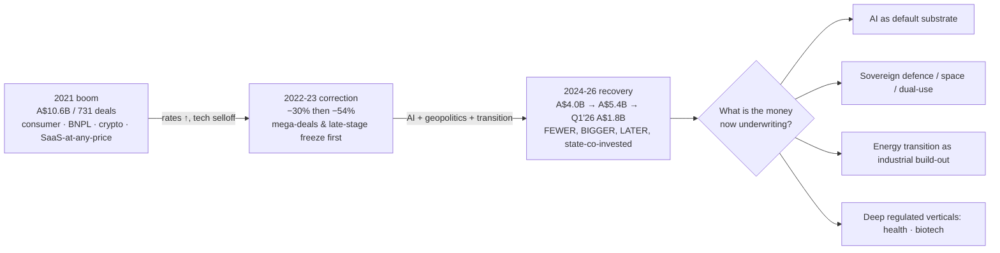

# What Australian Investors Believe the Future Looks Like
### Reading the high-conviction venture bets, June 2021 – June 2026

*An evidence-based inference of the future Australian capital is underwriting, derived from where seed-to-growth money concentrated, accelerated, and repeated across the cycle — weighted toward June 2023–June 2026.*

---

## 1. The one-paragraph thesis

Between 2021 and 2026 Australian venture capital stopped betting on **cheap-capital consumer growth** and started betting on **sovereign, physical, and AI-infused capability**. The 2021 playbook — BNPL, neobanks, crypto/NFTs, quick-commerce, growth-at-all-costs SaaS — has been almost entirely repudiated by the market. What replaced it is a concentrated, conviction-heavy portfolio organised around four assumptions about the future: (1) **AI is now the default substrate of every company**, not a sector; (2) **the West will re-arm and re-shore, and Australia will pay for sovereign defence, space, and critical-capability technology**; (3) **the energy transition is a multi-decade industrial build-out**, not a hype cycle, and needs patient blended capital; and (4) **deep, regulated, data-rich verticals (health, biotech) are where software defensibility actually lives**. The money is now fewer, larger, later, and more state-co-invested than in 2021 — the top 20 deals took **58% of all 2025 capital and 79% in Q1 2026** [[concentration]](https://www.scalesuite.com.au/resources/state-of-australian-startup-funding). Australia is converging on US "future-facing" venture signals in AI, defence/dual-use, and climate/energy, but diverges sharply in *how* it funds them: government, superannuation, and billionaire family offices underwrite risk that US private VC would take alone.

---

## 2. The macro arc — boom, correction, and a concentration-driven recovery

| Year | Capital raised | Deals | Signal |
|------|---------------|-------|--------|
| **2021** | ~A$10.6B | 731 | Boom peak; 54 deals >A$50M |
| **2022** | A$7.4B | 712 | −30%; mega-deals collapse first (28 >A$50M), early-stage hits records |
| **2023** | A$3.5B | 413 | **−54% trough**; only 15 deals >A$50M; no new unicorns; Series B+ valuations −41% |
| **2024** | A$4.0B | 414 | +11% capital; early-stage medians record-high; VC *fundraising* hits a decade low |
| **2025** | ~A$5.4B | 390 | 3rd-largest year ever — **but capital UP while deal count DOWN ~17–20%** |
| **Q1 2026** | A$1.8B | ~107 | +63% YoY; strongest start since the 2022 boom |

Sources: Cut Through Venture / Folklore *State of Australian Startup Funding* 2021–2025 [[2024]](https://www.cutthrough.com/insights/state-of-australian-startup-funding-2024) [[2025/ScaleSuite]](https://www.scalesuite.com.au/resources/state-of-australian-startup-funding); [[2023 −54%]](https://www.smartcompany.com.au/startupsmart/funding-plummeted-54-2023-early-stage-startups-fared-best/); [[Q1 2026]](https://www.wholesaleinvestor.com/australian-startup-funding-q1-2026/); [[2023 detail, Gilbert+Tobin]](https://www.gtlaw.com.au/insights/venture-capital-2024-australia).

**The single most important macro signal is concentration, not totals.** 2025 raised *more* money across *fewer* deals than 2024; the top 20 deals took 58% of capital, rising to 79% in Q1 2026. Sub-A$5M deals hit their lowest quarterly level since 2020. **Investors are funnelling conviction into a small number of category winners rather than spreading bets** — a structural inversion of the 2021 "spray and pray" environment.

**Where conviction sits by stage now vs 2021.** In 2021 conviction was broad and late-stage (mega-rounds). By 2025–26 it is **bifurcated**: hyper-selective early stage (competitive pre-seed/seed deals rose from ~30% to **59%**, with record median round sizes) *plus* a handful of very large AI/deep-tech/defence growth rounds. The "messy middle" (Series A→B for non-AI companies) is where local capital is thinnest — founders needing >A$20M routinely go offshore [[stage detail]](https://www.cutthrough.com/insights/state-of-australian-startup-funding-2024).

---

## 3. The conviction ranking — themes by strength of evidence

Each theme is scored on the dimensions in the brief (capital raised · deal count · round-size acceleration · follow-on · investor quality · repeat participation · valuation step-ups · sector concentration · dedicated fund vehicles · durability vs hype). **Conviction grade** reflects how many of those signals fire together; **confidence** reflects source strength.

| Rank | Theme | 2025 capital¹ | Conviction grade | Momentum | Confidence |
|------|-------|--------------|------------------|----------|-----------|
| **1** | **AI — infrastructure, agents/apps, AI-for-vertical** | ~A$1.0B pure + **61% of *all* dollars** touch AI | ★★★★★ | Newer (post-2022, accelerating) | High |
| **2** | **Defence / dual-use / space / quantum** | A$229M+ (Q1'26 alone) + A$1B gov co-invest scheme | ★★★★★ | **Strongest *new* momentum** | High |
| **3** | **Biotech / medtech / health-AI** | A$829M (#3), #1 by deal count (49) | ★★★★☆ | Durable + accelerating | High |
| **4** | **Climate / energy storage / critical-minerals tech** | A$585–680M (#4) | ★★★★☆ | Durable plateau (matured, not boomed) | High |
| **5** | **Fintech — B2B/cross-border/embedded only** | A$868M (#2 by $, but narrowed) | ★★★☆☆ | Survivor consolidation | High |
| **6** | **Robotics / autonomy / dual-use sensing** | within Hardware A$297M | ★★★☆☆ | Emerging, dual-use-led | Medium |
| **7** | **Cybersecurity** | ~A$32M / 4 deals (but +840% YoY) | ★★☆☆☆ | Thin VC, state-led demand | Medium |
| **8** | **Developer tools / data-infra (classic)** | not a marquee AU category | ★★☆☆☆ | Subsumed into "AI infra" | Medium |

¹ Sector $ from Cut Through Venture SoASF 2025 [[ranking]](https://www.cutthrough.com/insights/state-of-australian-startup-funding-2025) and ScaleSuite [[$585M climate, $1B AI]](https://www.scalesuite.com.au/resources/state-of-australian-startup-funding). AI pervasiveness 61% [[ScaleSuite "$1B into AI"]](https://www.scalesuite.com.au/resources/1-billion-into-ai).

---

## 4. Theme deep-dives — the future each bet underwrites

### #1 — AI: the default substrate (the assumption: *"non-AI is a discount"*)

**The future being underwritten:** that within a few years there is no such thing as a "non-AI" company, that *sovereign/regional AI compute* is strategic infrastructure, and that defensible AI value accrues at the **infrastructure and application layers — not in building frontier foundation models**.

- **Pervasiveness as the headline:** **61% of every 2025 startup dollar (~A$3.1B)** went to companies citing AI; ~62% of rounds had AI participation; AI de-throned fintech as the #1 sector at ~A$1.0B *pure* AI [[SmartCompany biggest raises]](https://www.smartcompany.com.au/startupsmart/biggest-australian-startup-raises-2025/) [[ScaleSuite]](https://www.scalesuite.com.au/resources/1-billion-into-ai).
- **Layer 1 — AI infrastructure/compute (the single biggest capital sink):** **Firmus Technologies** raised three escalating rounds in ~6 months — A$330M (Sep 2025) → A$500M (Nov 2025) → **US$505M at a US$5.5B valuation (Apr 2026, Coatue + Nvidia)** — plus a **US$10B Blackstone debt package**, targeting an ASX IPO; at one point ~⅓ of a whole national quarter's VC [[Bloomberg]](https://www.bloomberg.com/news/articles/2026-04-06/nvidia-backed-data-center-builder-firmus-raises-505-million). Microsoft separately committed **US$18B** to its Australian AI footprint (Apr 2026) [[CNBC]](https://www.cnbc.com/2026/04/23/microsoft-expands-ai-footprint-in-australia-with-18-billion-investment.html).
- **Layer 2 — Enterprise AI agents/apps (the consensus venture bet):** **Lorikeet** (AI customer-support agents) raised a **US$35M Series A (Aug 2025, QED-led)** and became **the first company since Canva backed by all three top AU VCs** (Blackbird + Square Peg + AirTree) — the clearest single signal of consensus conviction [[Business News Australia]](https://www.businessnewsaustralia.com/articles/sydney-startup-lorikeet-raises--54m-for-ai-concierges-that-make-multi-conditional--judgement-calls-.html). **Relevance AI** (AI "workforce") raised a **US$24M Series B (May 2025, Bessemer-led;** returning King River, Insight, Peak XV) [[TechCrunch]](https://techcrunch.com/2025/05/06/relevance-ai-raises-24m-series-b-to-help-anyone-build-teams-of-ai-agents/). **King River Capital** explicitly repositioned its A$157M sixth fund to AI software, "making AI investments every month" [[Startup Daily]](https://www.startupdaily.net/topic/venture-capital/king-river-capital-is-building-a-157-million-sixth-vc-fund-to-back-ai/).
- **Layer 3 — AI-for-vertical (healthcare is the clearest moat):** see #3 — Harrison.ai and Heidi Health.
- **The flagship exit:** **Leonardo.AI** (Sydney GenAI, Blackbird-led ~A$47M Series A Dec 2023) was **acquired by Canva in Jul 2024** at an implied ~US$300M — Australia's marquee GenAI outcome [[TechCrunch]](https://techcrunch.com/2024/07/29/canva-acquires-leonardo-ai-to-boost-its-generative-ai-efforts/).
- **The anchor & bellwether — Canva:** US$40B (2021) → marked down to ~US$26–32B (2024) → recovered to **US$42B (Aug 2025 employee sale, IPO path)** and ~A$48.7B late-2025 [[Bloomberg US$42B]](https://www.bloomberg.com/news/articles/2025-08-20/canva-begins-share-sale-at-42-billion-valuation-in-road-to-ipo) [[Startup Daily A$49B]](https://www.startupdaily.net/topic/funding/canva-valuation-jumps-23-to-49-billion-following-share-trade/). Canva is also a serial AI acquirer (Leonardo.AI, Affinity); its 2026 IPO is the key liquidity event for the whole ecosystem.
- **What AU is NOT underwriting:** frontier **foundation models**. The clearest tell — **Maincode's** "Matilda" LLM is **A$30M self-funded, not VC-backed**; CSIRO notes foundation models are "rarely made in Australia" [[ACS]](https://ia.acs.org.au/article/2025/maincode-debuts-matilda-ai-after-ditching--sovereign--label.html). Australia plays infra + apps, ceding the model layer to the US hyperscalers.
- **Caveat insiders flag:** some AI rounds are being done "quietly at 2021-style valuations" (Cut Through Venture) — a froth signal worth watching [[Startup Daily]](https://www.startupdaily.net/topic/venture-capital/ai-cut-through-venture-australian-vc/).

**Lead funds:** Blackbird (Leonardo, Lorikeet), Square Peg & AirTree (Lorikeet), King River (AI-dedicated fund), Bessemer/QED (foreign leads). **Confidence: High.**

### #2 — Defence / dual-use / space / quantum: the strongest *new* conviction

**The future being underwritten:** a multi-decade, bipartisan re-armament in which Australia pays for **sovereign capability** — autonomy, undersea, electronic warfare, space, quantum, hypersonics — and where **government is a co-underwriter of venture risk**. This theme went from near-uninvestable in 2021 to the *plurality of 2026's biggest rounds*.

- **The trigger stack:** Ukraine (proved cheap autonomy at scale) + **AUKUS Pillar II** (tech-sharing + procurement pull) + the **2024/2026 National Defence Strategy** (Integrated Investment Program to ~A$425B; **+A$117B over the decade**; defence to **3% of GDP by 2033**) + **ASCA** (A$748M/4yr) + the marquee **2026 Advanced Capabilities Investment (ACI) Fund — up to A$500M government co-investment, boosted to ≥A$1B with private capital**, explicitly recruiting VCs into cyber/AI-autonomy/EW/quantum/undersea (REOI due 30 Apr 2026) [[Defence Minister 2026 NDS]](https://www.minister.defence.gov.au/media-releases/2026-04-16/2026-national-defence-strategy-integrated-investment-program) [[ACI Fund]](https://www.minister.defence.gov.au/media-releases/2026-02-18/australian-government-seeking-proposals-co-invest-aussie-ingenuity-through-venture-capital-market). Global tailwind: defence-tech VC hit a record **US$49.1B in 2025** (from US$27.2B) [[Crunchbase]](https://news.crunchbase.com/defense-tech/startup-venture-funding-all-time-record-ai-anduril/).
- **The demand anchor:** **Anduril Australia's Ghost Shark** XL autonomous submarine became a **A$1.7B (US$1.13B) program of record (Sep 2025)** — procurement, not VC, but the "this market is real" proof for investors [[Naval News]](https://www.navalnews.com/naval-news/2025/09/anduril-ghost-shark-now-australian-1-7-bn-program-of-record/).
- **Marquee venture rounds (all well-sourced, with strong step-ups):**
  - **Gilmour Space** (sovereign rockets) — **A$217M Series E** (NRFC A$75M + Hostplus co-leads; Future Fund, Blackbird, HESTA, Funds SA, Main Sequence, QIC). Blackbird led Series A, Main Sequence led Series B — a textbook follow-on ladder [[Space.gov.au]](https://www.space.gov.au/news-and-media/gilmour-space-secures-217-million-in-private-investment).
  - **Fleet Space** (satellites + ExoSphere minerals exploration) — **A$150M Series D at A$800M+ valuation** (Ontario Teachers' / Blackbird, Dec 2024) [[Fleet Space]](https://www.fleetspace.com/newsroom/fleet-space-closes-a-150m-series-d-with-a-800m-valuation).
  - **Q-CTRL** (quantum sensing/control) — **US$113M Series B** (GP Bullhound; **Lockheed Martin Ventures**, Airbus Ventures), a global quantum-software fundraising record, plus DARPA RoQS A$38M [[Quantum Insider]](https://thequantuminsider.com/2024/10/08/q-ctrl-sets-global-quantum-technology-fundraising-record-increasing-series-b-to-usd-113m-led-by-gp-bullhound/).
  - **Advanced Navigation** (inertial navigation / PNT / robotics) — **A$110M Series C** (AirTree-led, NRFC; **In-Q-Tel** and KKR backers, Mar 2026) [[Marine Technology News]](https://www.marinetechnologynews.com/news/advanced-navigation-raises-series-660119).
  - **Hypersonix** (hydrogen scramjet) — **A$46M Series A** (High Tor; NRFC's *first* defence deal, QIC, Saab, Nov 2025) [[Space Connect]](https://www.spaceconnectonline.com.au/industry/6810-australian-hypersonic-start-up-secures-46m-backing-from-sovereign-and-global-defence-investors).
  - **Arkeus** (AI ISR sensing) — A$4.45M seed (2023) → **A$25M Series A (QIC Ventures-led, May 2026)** — strong seed→A step-up [[PR Newswire]](https://www.prnewswire.com/news-releases/arkeus-announces-18m-series-a-to-scale-ai-sensing-systems-for-autonomous-platforms-operating-in-contested-military-environments-302773282.html). Plus **Breaker** (A$9M seed, Bessemer + Main Sequence), **Nomad Atomics** (A$12M, Blackbird), **Myriota** (NRFC A$25M).
- **Lead funds:** **Main Sequence** and **Blackbird** are the deep-tech leads; **Beaten Zone Venture Partners** (Steve Baxter) is the **first dedicated Australian sovereign-defence VC** (~A$17M committed of a A$60M target — a small-but-symbolic first mover) [[SecurityBrief]](https://securitybrief.com.au/story/beaten-zone-hits-aud-17-million-defence-fundraise); **Salus Ventures** specialises in national-security; sovereign capital (NRFC, QIC, Future Fund, Hostplus, HESTA) and US strategics (In-Q-Tel, Lockheed Martin Ventures, Bessemer) stack the cap tables.

**Confidence: High** on the structural shift and named rounds; **Medium** on near-term ACI-Fund deployment (still at REOI stage).

### #3 — Biotech / medtech / health-AI: the most infrastructure-backed durable theme

**The future being underwritten:** that **regulated, data-rich health verticals are where software moats and deep-science breakthroughs compound**, supported by a uniquely deep institutional funding stack (super funds, sovereign NRFC, billionaire health vehicles, global crossover biotech).

- **Ranking:** biotech/medtech was the **#3 funded sector (A$829M) and #1 by deal count (49) in 2025** [[SoASF 2025]](https://www.cutthrough.com/insights/state-of-australian-startup-funding-2025).
- **Health-AI (the AI-for-vertical proof):** **Harrison.ai / annalise.ai** (medical imaging + pathology) — **A$179M (US$112M) Series C (Feb 2025)**, co-led by **Aware Super, ECP, Horizons Ventures**, with **NRFC A$32M**; ~6M patients/yr [[TechCrunch]](https://techcrunch.com/2025/02/11/australian-healthtech-startup-harrison-ai-scores-112m-series-c/). **Heidi Health** (AI medical scribe) — **A$100M (US$65M) Series B at a US$465M valuation (Oct 2025, Point72-led)**, a fast step-up from a US$17M Series A in Mar 2025 [[Startup Daily]](https://www.startupdaily.net/topic/funding/heidi-health-bags-98-million-series-b-at-703-million-valuation/).
- **Deep-science / medtech:** **Synchron** (brain–computer interface, Melbourne-origin) — **US$200M Series D (Nov 2025;** Bezos Expeditions, Khosla + **NRFC A$54M**) [[FierceBiotech]](https://www.fiercebiotech.com/medtech/synchron-raises-200m-advance-its-brain-computer-interface-paralysis). **AdvanCell** (targeted-alpha radiopharma) — **US$112M Series C (Feb 2025;** Sanofi Ventures, SV Health + **Tenmile, Brandon Capital**) [[AdvanCell]](https://www.advancell.com.au/news/advancell-successfully-completes-an-oversubscribed-us112m-series-c-financing/). **Vaxxas** (needle-free vaccine patch) — **~A$90M (Aug 2025)** [[GlobeNewswire]](https://www.globenewswire.com/news-release/2025/08/25/3138224/0/en/Vaxxas-secures-A-90-million-in-funding-to-commercialise-needle-free-vaccination-delivery-technology.html).
- **Digital health / GLP-1 telehealth — the defining exit:** **Eucalyptus** (Juniper weight-loss brand; ARR run-rate >US$450M) was **acquired by Hims & Hers for up to US$1.15B (~Feb 2026)** — validating the telehealth + GLP-1 thesis [[Pharmaphorum]](https://pharmaphorum.com/news/hims-hers-buys-australian-digital-health-firm-115bn).
- **Lead funds:** **Brandon Capital / Brandon BioCatalyst** (ex-MRCF; Fund VI A$270m, >A$800m AUM) is the institutional spine; **Tenmile** (Andrew Forrest's A$250M Tattarang vehicle) is the deep-pocketed challenger; sovereign **NRFC** and global crossover (Sanofi Ventures, SV Health, Abingworth) fill the large rounds.

**Confidence: High.**

### #4 — Climate / energy storage / critical-minerals tech: a durable, blended-capital plateau

**The future being underwritten:** that decarbonisation is a **multi-decade industrial build-out** (manufacturing, offtakes, scale-up) requiring patient blended capital — *not* a fast software flip. The signal of durability is that climate-dedicated funds were raised *in the down market*.

- **Trajectory:** A$338M (2021) → A$553M (2022) → **~A$585–680M in 2025**, a steady top-3/top-4 sector for five consecutive quarters — a **matured plateau, not a 2021-style spike** (the 2022 ambition to triple funding to A$1.5B/yr never materialised) [[Climate Salad 2025]](https://www.startupdaily.net/topic/climate-tech/2025-australian-climate-tech-industry-report/) [[Cut Through climate $585M]](https://www.cutthrough.com/insights/cut-through-quarterly-1q-2025).
- **Highest-conviction verticals (by repeat capital + step-ups):**
  - **Green-hydrogen electrolysers:** **Hysata** — **US$111M Series B (May 2024;** bp Ventures, Templewater, IP Group, **Virescent/CEFC, Hostplus**), Australia's record green-H2 raise [[CEFC]](https://www.cefc.com.au/media/media-release/cefc-backed-hysata-raises-us-111-million-in-series-b-round/).
  - **Long-duration & flow/thermal storage:** Allegro Energy (A$17.5M Series A, Grantham + Origin), **MGA Thermal** (multiple rounds 2023→2024→2026, >A$50M), Relectrify (A$19M + A$25M ARENA).
  - **Enzymatic recycling:** **Samsara Eco** — A$54M Series A → **A$100M extension (Jun 2024, Temasek + Main Sequence-led)** with Woolworths/lululemon offtakes [[SmartCompany]](https://www.smartcompany.com.au/startupsmart/samsara-eco-100-million-raise-investment-plastic-recycling/).
  - **Soil carbon / agtech:** **Loam Bio** — A$40M Series A → **A$105M Series B (Feb 2023, Lowercarbon + Wollemi)** [[Startup Daily]](https://www.startupdaily.net/topic/funding/climate-change-agtech-startup-loam-raises-105-million-series-b/).
  - **Copper solar:** **SunDrive** (Blackbird, Grok, CEFC; ARENA A$25.3M 2025 + commercial copper-plating JDA) [[Startup Daily]](https://www.startupdaily.net/topic/funding/arena-shines-25-3-million-on-copper-solar-panel-startup-sundrive/).
  - **Critical-minerals *processing* tech (thin but emerging):** **Novalith** (CO₂-based lithium extraction, A$23M Series A, Lowercarbon + TDK + CEFC) is the clearest pure-play [[PR Newswire]](https://www.prnewswire.com/news-releases/novalith-technologies-raises-au23-million-in-series-a-funding-to-revolutionise-lithium-production-301801414.html). Most critical-minerals capital still flows through listed miners and government (FMIA), not classic VC.
- **The defining feature — blended/sovereign/billionaire capital:** **CEFC** (record A$4.7B committed FY24-25, ~A$32.5B capacity, crowding A$4.14 private per A$1) [[CEFC AR]](https://www.cefc.com.au/annual-report-2025/); **Virescent Ventures** (CEFC-spun, Fund II ~A$125M+, largest specialist climate VC) [[CEFC/Westpac]](https://www.cefc.com.au/media/media-release/cefc-westpac-back-first-close-of-new-virescent-ventures-climate-tech-fund/); **Main Sequence** (decarb-focused Fund III A$450M); **Grok Ventures** (Cannon-Brookes' ~A$1.5B all-climate pivot + SunCable); **Squadron/Tattarang** (Forrest's 14GW pipeline). Almost every flagship round pairs a CEFC/ARENA/Virescent/Main Sequence cornerstone with a strategic corporate (bp, Origin, Shell, NRG, Temasek, Woolworths, POSCO).

**Confidence: High** on tier-status, blended-capital structure, and named rounds; **Medium** on the precise 2023–24 annual totals (sources jump 2022→2025).

### #5 — Fintech: a narrowed, B2B-only survivor thesis

**The future being underwritten:** that **global financial *infrastructure* and B2B/embedded finance** endure, while consumer credit and retail banking do not. Fintech remained #2 by dollars (**A$868M, 2025**) but lost the #1 crown to AI and shed its 2021 themes.

- **Durable:** **Airwallex** (B2B cross-border payments) stepped up from **US$6.2B (Series F, May 2025) to US$8B (Series G, ~US$498M, late 2025)** — the **first round to include all three big AU VCs**, ~US$1B annualised revenue, building a dual SF HQ; Blackbird now calls it "the new Canva" [[Airwallex Series G]](https://www.airwallex.com/global/newsroom/awx-raises-usd330m-series-g-at-usd8b-valuation-establishes-sf-as-dual-global-hq). **Zeller** (SME merchant payments + banking) became a **unicorn at A$100M Series B**; **Constantinople** (embedded core-banking) raised **A$50M Series A (Prosus-led)** [[Constantinople]](https://thedigitalbanker.com/aussie-banking-platform-constantinople-lands-33m-series-a-funding/).
- **Faded (the 2021 repudiation):** consumer **BNPL** imploded — Afterpay/Square A$39B (2021) → **sector cap A$85B → <A$1B**, Openpay receivership, Zip −78% [[S&P Global]](https://www.spglobal.com/marketintelligence/en/news-insights/latest-news-headlines/australia-s-buy-now-pay-later-players-face-battles-after-pandemic-highs-77566401); retail **neobanks** dead (Volt, Xinja; Judo the SME-focused survivor); consumer **crypto** flat (**Immutable** stuck at US$2.5B since 2022, layoffs); distressed paytech **Till Payments** sold to Nuvei at ~A$47M vs a A$500M forecast.

**Confidence: High.**

### #6–8 — Robotics/autonomy, cybersecurity, and "classic" dev-tools

- **Robotics / autonomy (Medium):** mostly expressed *through* the dual-use stack (Advanced Navigation, Fleet Space, Nomad Atomics) and mining automation (CSIRO predicts ~half of Australian mining automated by 2030; mining-tech dealmaking hit a record A$4.8B in 2025) [[Mine Australia]](https://mine.nridigital.com/mine_australia_may25/automation-australian-mining). The PNT/sensing/autonomy stack monetising in *both* mining and defence is the core dual-use thesis super funds can underwrite.
- **Cybersecurity (Medium):** a **thin VC theme** (~A$319M cumulative; only ~A$32M / 4 deals in 2025) but **+840% YoY** and policy-favoured. Bright spots: **Kasada** (anti-bot, US$60M total, ~US$300M val, EQT-led 2026) and **QuintessenceLabs** (quantum-safe, **NRFC-led A$20M**) [[SecurityWeek]](https://www.securityweek.com/kasada-raises-20-million-for-anti-bot-expansion/). Government/sovereign capital — not classic VC — is the dominant force; the ACI Fund will be the test of whether cyber becomes a real priced-VC category.
- **Classic developer tools / data infrastructure (Medium):** did *not* surface as a marquee standalone Australian category — it has been **subsumed into "AI infrastructure"** (Firmus) and AI tooling. The 2021-era observability/data-platform SaaS thesis is not where current conviction sits.

---

## 5. Five years vs three years — separating fading 2021 themes from durable momentum

The clearest way to read investor *future-assumptions* is the delta between the 2021-vintage portfolio and the 2023–2026 portfolio.

| | **Fading (2021-era, repudiated)** | **Durable / accelerating (2023–2026 conviction)** |
|---|---|---|
| **Consumer credit** | BNPL (A$85B→<A$1B), neobanks (Volt/Xinja) | — (consumer credit thesis abandoned) |
| **Crypto/Web3** | NFTs, consumer crypto (Immutable flat) | Near-absent from rankings since 2023 |
| **Consumer/quick-commerce** | Delivery, consumer apps, Spriggy-style | — |
| **SaaS** | Growth-at-any-price (Go1: 5 layoff rounds; Culture Amp/Dovetail flat vs 2021 marks) | AI-infused *vertical* SaaS with real ARR (Employment Hero A$263M Series F; SafetyCulture A$2.7B; Deputy unicorn) |
| **Fintech** | Consumer BNPL/neobank | **B2B/cross-border/embedded** (Airwallex, Zeller, Constantinople) |
| **New themes (≈0% in 2021)** | — | **Defence/dual-use/space, sovereign AI compute, quantum** (now the plurality of 2026's biggest rounds) |
| **Climate** | Hype-stage ambition (3× funding promise) | Manufacturing/offtake scale-up, blended capital (Hysata, Samsara, SunDrive) |

**The structural inflection:** *"Five years ago [defence/space/hardware/climate infrastructure] barely registered… now they account for the plurality of capital — a genuine structural shift"* (Cut Through Venture, Q1 2026) [[Wholesale Investor]](https://www.wholesaleinvestor.com/australian-startup-funding-q1-2026/). The three-year window (2023–2026) is defined by AI-as-default and sovereign-capability; the five-year window adds the cautionary tale of what the cheap-capital 2021 themes became.

---

## 6. Who underwrites the conviction — the capital-source structure

Australia's distinctive feature is *who* provides the conviction capital. This is where it diverges most from the US.

- **Superannuation funds — the patient, counter-cyclical backbone.** **Hostplus** alone has committed >A$350M to local VCs; **AustralianSuper, HESTA, Aware Super, Future Fund** anchored Blackbird's ~A$1B Fund V — and these funds *held and grew* VC conviction *through* the 2022–23 selloff, increasing allocations post-2024 [[InvestorDaily]](https://www.investordaily.com.au/australiansuper-hostplus-among-investors-in-record-1bn-vc-fund/). They now stack defence (Gilmour) and biotech (Vaxxas) cap tables directly.
- **Government / sovereign vehicles — risk co-underwriters.** The **NRFC** (A$15B) is now active across defence (Gilmour A$75M, Hypersonix A$10M), biotech (Synchron A$54M, Harrison.ai A$32M) and cyber (QuintessenceLabs A$15M); **CEFC/ARENA** anchor climate; the **2026 ACI Fund** (≤A$500M→≥A$1B) institutionalises government-as-VC-co-investor in defence. State funds **QIC** and **Funds SA** lean in.
- **Billionaire family offices — uniquely large and patient.** **Grok Ventures** (Cannon-Brookes, ~A$1.5B all-climate) and **Tattarang/Tenmile/Squadron** (Forrest, A$250M health + 14GW energy) blur the line between VC and infrastructure; **Skip Capital** (Farquhar/Jackson) co-invests with the Big 3.
- **Corporate venture (CVC).** **Main Sequence** (CSIRO; Fund III A$450M with Temasek + Daiwa LPs) is the deep-tech CVC leader; Telstra Ventures, Firemark (IAG), Macquarie active.
- **Foreign co-investors — the rising late-stage gap-filler.** International participation rose from **57% (2024) to 66% (2025)** of deals, concentrated at growth stage where local cheque depth is thin: Coatue/Nvidia/Blackstone (Firmus), Point72 (Heidi), QED/Bessemer (Lorikeet/Breaker), Ontario Teachers' (Fleet Space), Temasek (Samsara, Immutable), In-Q-Tel/Lockheed Martin Ventures (defence) [[SoASF foreign share]](https://www.scalesuite.com.au/resources/state-of-australian-startup-funding). **Australia effectively outsources growth-stage conviction to foreign and sovereign capital.**

---

## 7. The fund thesis-leadership map — which fund owns which future

| Thesis lane | Lead fund(s) | Signal of conviction |
|---|---|---|
| **Generalist scale (the core)** | **Blackbird** (Fund V A$1.0B; Fund VI A$700M first close Jan 2026; ~A$9.9B portfolio, 36% net IRR) → **Square Peg** (US$3.6B AUM) ≈ **AirTree** (A$1.3B) | Canva is the shared trophy + IRR engine; all three cut Canva ~36% in lockstep (2023), then converged on Airwallex & Lorikeet |
| **Deep tech / space / quantum** | **Main Sequence** (CSIRO, >A$1B) | Co-*founds* companies (Gilmour, Samsara, Q-CTRL, Quasar) |
| **Climate** | **Virescent** (CEFC, largest specialist) · **Grok** (family office) · **Tenacious** (agtech) | New climate-dedicated funds raised *in the down market* |
| **Biotech / health** | **Brandon Capital/BioCatalyst** (>A$800M) · **Tenmile** (Forrest) | Institutional MRCF network; sovereign NRFC co-invests |
| **AI software** | **King River** (A$157M AI-dedicated 6th fund) | Explicit repositioning to AI |
| **Defence / sovereign** | **Beaten Zone** (1st dedicated) · **Salus** · the gov **ACI Fund** | First-mover specialist + A$1B state co-investment architecture |

**The fundraising environment is itself a conviction signal.** 2023 capital raised fell 54%; 2024 VC *fundraising* hit a decade low, >50% of VCs reported a portfolio failure ("a new valley of death"), and **Tenacious cut its Fund II target from A$50M to an A$18M first close** — while "zombie VCs" limped on [[Capital Brief reckoning]](https://www.capitalbrief.com/newsletter/australias-vc-reckoning-a36cdc53-2f56-4caf-bb9a-1bcb58bd6e85/) [[valley of death]](https://www.startupdaily.net/topic/a-new-valley-of-death-more-than-half-of-australian-vcs-said-a-startup-they-invested-in-failed-in-2024/). The 2025–26 recovery (Blackbird A$700M, King River A$157M) is **top-heavy**: LPs re-back proven brands and clear theses (AI, defence, climate) while sub-scale managers struggle. **Net: conviction capital is more concentrated, more thesis-specialised, and more state-co-invested in 2026 than in 2021.**

---

## 8. How closely does Australia track US "future-facing" venture signals?

| US future-facing signal | AU alignment | Notes |
|---|---|---|
| **AI (apps/agents/infra)** | **Strong convergence** | But AU plays infra + apps, *cedes* foundation models |
| **Defence / dual-use** | **Strong & accelerating** | AU lags US in absolute scale but the policy + capital architecture (ACI Fund, AUKUS) is now explicit |
| **Climate / energy storage** | **Strong** | AU *over-indexes* globally in energy & critical minerals (Dealroom); more blended/sovereign than US |
| **Critical-minerals tech** | **Partial** | Strong national priority, but mostly funded via miners/government, thin in classic VC |
| **Biotech / healthtech** | **Strong** | AU punches above weight (BCI, radiopharma, health-AI) on deep research base |
| **Robotics** | **Partial** | Expressed via dual-use + mining automation, not consumer/humanoid robotics |
| **Cybersecurity** | **Weak/thin** | A clear gap vs US; state-led demand, sub-scale VC |
| **Fintech** | **Diverged** | AU narrowed to B2B/infra; the US consumer-fintech parallel was repudiated |
| **Dev tools / data infra** | **Weak as standalone** | Subsumed into AI infra |
| **Vertical SaaS** | **Moderate** | Durable winners (Employment Hero, SafetyCulture) but "SaaS-first" is out of fashion vs AI-native |

Australia most resembles US venture in **AI, defence/dual-use, and climate**; it diverges in funding *mechanism* (super/sovereign/family-office heavy) and in **ceding the frontier-model and consumer-fintech layers**.

---

## 9. Confidence, caveats, and data limitations

- **High confidence:** the macro arc and concentration metrics; AI pervasiveness (61%); the defence structural shift and the ACI Fund; sector rankings (AI #1, fintech #2, biotech #3, climate #4); the fading of BNPL/crypto/neobanks; the named marquee rounds and their lead investors; the super/sovereign/family-office capital structure; the fund thesis map.
- **Medium confidence:** precise 1H2026 totals (partly run-rate/single-tracker); near-term ACI-Fund *deployment* (still at REOI stage as of Apr 2026); exact 2023–24 annual climate totals; whether current AI valuations are sustainable (insiders flag 2021-style pricing).
- **Low confidence / excluded:** family-office *quantification* (qualitative only); current NAB/Woodside CVC activity; several brief-named entities that could **not be verified and were excluded** — "Cosmos" (AU data-infra), "Klátia", "Eugene" (healthtech), "EdenRoc", "ParticleX", and "Conscious Capital/Kelvin/Dingo/HyperSpace" (defence). "HyperSpace" appears to be a mis-reference to **Hypersonix**.
- **Figure reconciliations:** 2025 total cited as both A$5.1B and A$5.48B (rounding/accelerator scope — central estimate ~A$5.4B); **SafetyCulture's latest verified valuation is A$2.7B (Nov 2024), not the A$3.7B in the brief**; Synchron's Series D is reported variously as US$200M headline / ~A$305M total.
- **Source-method caveat:** Cut Through Venture (deal-tracking) and Climate Salad (survey) differ in methodology but agree on order of magnitude; sector $ figures are best treated as directional rankings, not precise accounting.

---

## 10. Bottom line — the future Australian capital is underwriting

Stripped to its assumptions, the high-conviction Australian portfolio of 2026 underwrites a future in which:

1. **AI is infrastructure, not a feature** — and the durable value is in compute and applications, with sovereign/regional compute treated as strategic (Firmus, Lorikeet, Harrison.ai). Australia will *not* build the frontier models.
2. **The West re-arms and re-shores, and Australia funds its own capability** — defence, space, quantum, and undersea autonomy move from uninvestable to a state-co-underwritten venture category (Gilmour, Anduril/Ghost Shark, Q-CTRL, the ACI Fund).
3. **The energy transition is a 20-year industrial build**, financed by patient blended capital, not a software flip (Hysata, Samsara, SunDrive, CEFC/Virescent/Grok).
4. **Defensible software lives in deep, regulated, data-rich verticals** — above all health and biotech (Heidi, Harrison.ai, Synchron, AdvanCell), and in B2B financial infrastructure (Airwallex).
5. **Returns come from a few category winners, financed later and larger, with foreign and sovereign capital filling the growth-stage gap** — the opposite of the broad, consumer-led, cheap-capital 2021 thesis it replaced.

The strongest *durable* conviction (multiple signals firing: capital, follow-on, repeat tier-1 investors, step-ups, dedicated vehicles) sits in **AI infra+apps, defence/dual-use, biotech/health-AI, and energy-transition hardware**. The clearest *repudiated* bets are **consumer BNPL, retail neobanks, consumer crypto, and growth-at-any-price consumer SaaS**. That delta — what the money walked away from versus what it now concentrates on — is the most reliable read on what Australian investors believe the future will look like.

---

### Key sources
Cut Through Venture / Folklore *State of Australian Startup Funding* (2021–2025) and Q1 2026 trackers; SmartCompany & Startup Daily funding reports; Climate Salad *Australian Climate Tech Industry Report* (2022, 2025); CEFC annual report & media releases; Australian Government Defence Minister releases (2026 NDS/IIP, ACI Fund); NRFC investment releases; Bloomberg, TechCrunch, FierceBiotech, Capital Brief, Business News Australia, PR Newswire/GlobeNewswire company announcements; Dealroom Australia; KPMG Venture Pulse; Gilbert+Tobin VC trends. Full URLs are inline above and in `scratchpad/s1–s6`. *(Compiled 22 June 2026.)*
