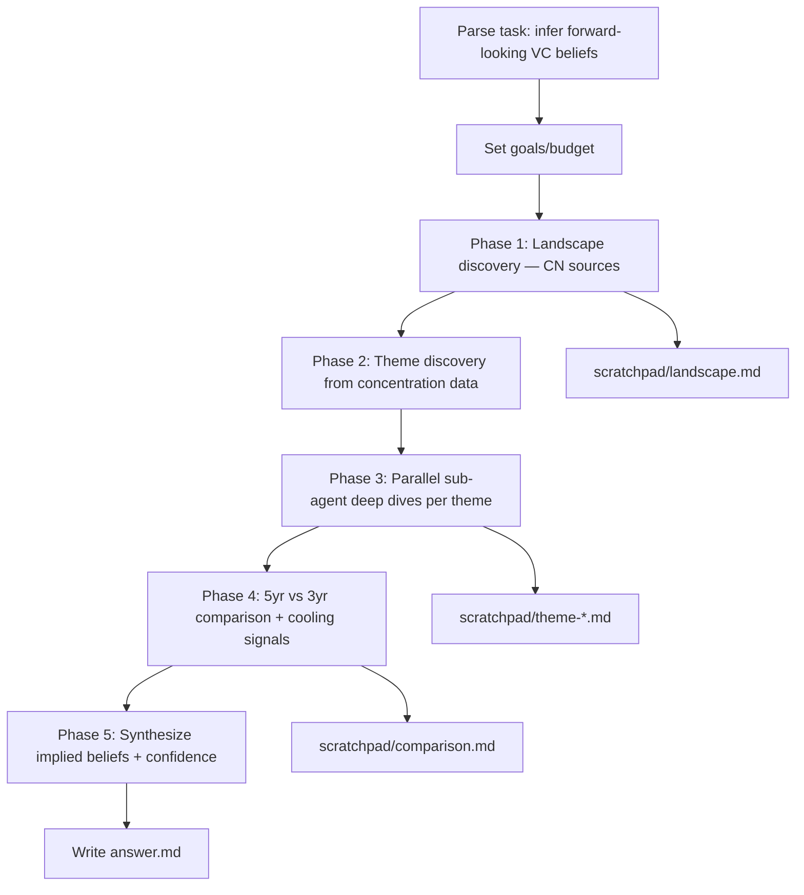

# Workflow — China VC High-Conviction Bets (Jun 2021 – Jun 2026)

## Original question
Research China's startup and venture investment activity June 2021–June 2026 (heavier weight on Jun 2023–Jun 2026) to infer what Chinese investors believe the future looks like, based on where high-conviction bets are placed. Early-to-growth stage (angel → Series C+ / growth). Chinese-language sources first. Discover sectors from the data (capital concentration, rising deal volume, larger rounds, follow-on, high-quality investors, policy alignment, procurement traction, continued funding after corrections). Compare full 5-yr vs recent 3-yr to separate old hype from new momentum. For each theme: representative startups, notable rounds, leading funds/strategics, implied thesis, future assumptions underwritten, confidence level. Preserve Chinese original terms in parentheses. Goal = infer forward-looking beliefs, not list largest rounds.

## Interpretation / assumptions
- "Chinese investors" = RMB and USD funds active in China, government-guided funds (政府引导基金), CVCs, and strategic investors operating in the China market.
- Scope is mainland China-focused startups/themes. Cross-border (e.g. China-founded global AI) included where Chinese capital drives it.
- Because live deal-level databases (ITjuzi/IT桔子, PitchBook, Crunchbase) are partly paywalled, I rely on business/industry media summaries, fund announcements, official reports, and aggregated database commentary, cross-checked across sources.
- "Future as of June 2026" — today's date is 2026-06-22; treat 2026 YTD data as partial.

## Goals
1. **End goal:** An English report identifying the major sectors where Chinese VC is placing high-conviction bets (Jun 2023–Jun 2026 weighted), the forward-looking beliefs each bet implies, with representative startups/rounds/investors and confidence ratings.
2. **Minimum requirements:**
   - ≥6 data-grounded themes, each with: ≥2 representative startups, ≥1 notable round w/ amount+date, ≥1 named lead/notable investor, implied thesis, future assumption, confidence rating.
   - Explicit 5-yr vs 3-yr comparison distinguishing fading vs rising themes.
   - Chinese original terms preserved in parentheses for sectors/policy/stages/investor types.
   - Every claim cited inline to a credible source.
3. **Target requirements:**
   - Quantitative grounding (deal counts, capital totals, round-size trends) from venture databases / industry reports, not just anecdotes.
   - Each theme corroborated across ≥2 independent sources; primary sources (fund/company announcements, filings, gov't fund disclosures) where possible.
   - A synthesis of the overarching "future thesis" Chinese capital is underwriting, plus counter-signals (themes cooling).
4. **Budget:** ~40 rounds (Complex, multi-strand). Decomposition below.

## Budget decomposition
- Landscape/discovery (overall China VC trends 2021–2026, who's investing, totals): ~8
- Theme discovery (identify recurring concentration sectors): ~6
- Per-theme deep dives (~7 themes × ~4): ~28 — delegated to sub-agents in parallel
- 5-yr vs 3-yr comparison + cooling themes: ~5
- Verification + writing: ~5
- Total target ~40, extend in +5 increments only if a minimum req unmet.

## Process flowchart

## Log
- 2026-06-22: Folder created, goals/budget set. Starting Phase 1 landscape discovery.
- 2026-06-22: Phase 1 done — 2 parallel CN search batches (8 queries) + 1 fetch batch (3 articles). Identified ~9 candidate themes + structural backdrop. Saved scratchpad/landscape.md.
- 2026-06-22: Phase 2/3 — launched 7 parallel general-purpose sub-agents (each given task-folder path + scratchpad-only rules per CLAUDE.md), one per theme strand: embodied-ai-robotics, semiconductors, ai-models-apps, space-lowaltitude, biotech, materials-energy, structure-comparison. All returned with sourced scratchpad files + 200-word summaries. Each ran ~12–15 internal tool calls.
- 2026-06-22: Phase 4/5 — lead read all 7 scratchpad files, synthesized the 5yr-vs-3yr rotation, the 6 high-conviction themes, cooling sectors, and the overarching implied-belief thesis. Corrected two source garbles (沐曦 raise ¥4.2B not ¥42B; biotech Q1-26 BD ~$60B not $600B). Wrote answer.md.

## Budget actuals
- Lead rounds: ~3 (2 search batches + 1 fetch batch). Sub-agent strands: 7 × ~12 internal rounds ≈ 84 delegated rounds, run in parallel (2 waves of 3 + 1). Well within the ~40-round lead budget (most work parallelized to sub-agents). No extension needed — minimum & target requirements met:
  - ✓ 6 data-grounded themes, each with ≥2 startups, notable rounds w/ amount+date, named investors, implied thesis, future assumption, confidence.
  - ✓ Explicit 5yr-vs-3yr comparison + cooling-sector counter-signal.
  - ✓ Chinese terms preserved in parentheses throughout.
  - ✓ Inline citations to credible sources; cross-corroboration ≥2 sources per major theme; primary/state sources (发改委, 新华网, exchange filings) where available.

## Stop condition
- Stopped: target requirements met; further research would not materially change the directional thesis (HIGH confidence) — only refine fast-moving valuations (already flagged MEDIUM). No new scope added beyond original question.

## Deliverables
- answer.md — final report (7 sections + sources).
- scratchpad/ — landscape.md + 7 theme strand files with full sourced detail.
