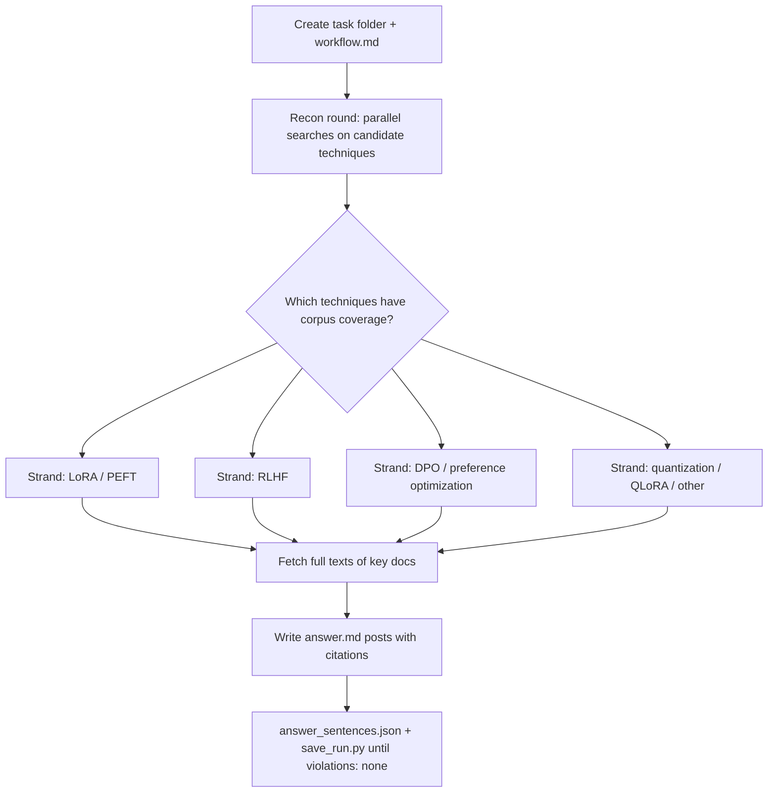

# Workflow — LLM training & fine-tuning blog series (2023–2025)

## Original question
"Write a series of technical blog posts on some of the advancements in Large Language Model (LLM) training and fine-tuning in 2023-2025. Each post should at least contain: the intuition and motivation behind the technique; detail the methodology; provide mathematical derivations where applicable; discuss practical use cases, limitations, and open challenges. The writing should be accessible to readers with a graduate-level ML background."

## Interpretation & assumptions
- Deliverable: a *series* of blog-post-style sections in `answer.md`, each covering one technique with the four required elements (intuition/motivation, methodology, math where applicable, use cases/limitations/open challenges).
- The `answer_sentences.json` hard cap of 1024 words means the series must be compact: I target 3–4 posts of ~200–300 words each rather than long-form essays.
- Technique selection is corpus-driven: I will only write posts on techniques the ClimbMix corpus actually documents (recon round decides). Candidates: RLHF, DPO, LoRA/QLoRA, instruction tuning, PEFT, quantization-aware training, mixture-of-experts.
- "2023–2025" is treated as the era of the techniques (LoRA 2021→popularized 2023, DPO 2023, QLoRA 2023, RLHF as productionized in 2022–2024) — the corpus is a web crawl and may not date-stamp claims; I take corpus support for the technique itself as sufficient.

## Goals
1. **End goal**: a blog-post series on 3–4 corpus-supported LLM training/fine-tuning advancements, each with intuition, methodology, math, and practice/limitations, fully cited by ClimbMix docids.
2. **Minimum requirements**:
   - ≥3 technique posts, each with all four required elements present.
   - Every claim cited to a retrieved docid; no uncited claims.
   - Math included wherever the corpus evidence supports it (e.g. LoRA ΔW = BA, RLHF objective, DPO loss).
3. **Target requirements**:
   - 4 posts; each post's core claims corroborated by ≥2 distinct documents.
   - Key documents fetched in full (not judged from snippets) before being cited for math/derivations.
   - A short series intro tying the posts together.
4. **Budget**: 4 moderate sub-tasks (one per candidate technique ≈ 4 rounds each) + 1 recon round + 1 verification/fetch round ≈ **18 rounds**. Justification: multi-part synthesis task decomposed into per-technique moderate sub-tasks; 80% gathering / 20% verifying.

## Planned process

## Round log
(updated as research proceeds)

- **Round 1 (recon, 8 parallel searches)**: LoRA, RLHF, DPO, instruction tuning, QLoRA/quantized fine-tuning, PEFT, mixture-of-experts, RLAIF/constitutional AI.
