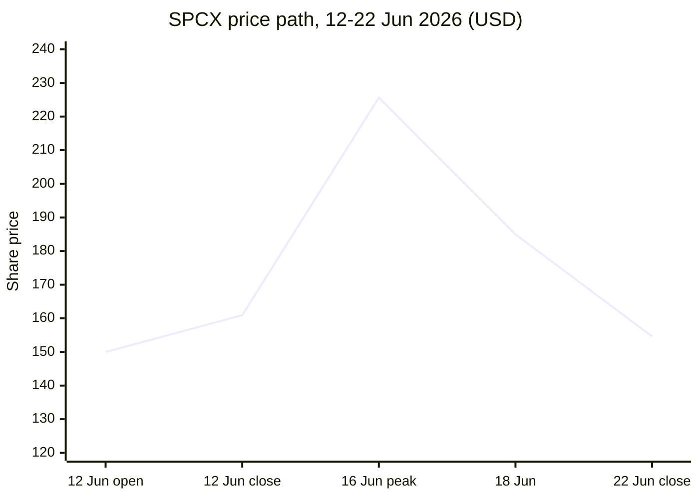

# Why SpaceX (SPCX) round-tripped from $135 → $225 → the $150s

**Bottom line up front.** SpaceX's record-breaking IPO and the violent reversal that followed are, at heart, *one story*: the public market spent eleven days discovering that the rocket company it thought it bought in the biggest IPO in history is now a **leveraged AI conglomerate** — and then repricing it as one. The euphoria phase priced the rocket; the crash priced the AI bet, the debt behind it, and the thin float holding it all up. Below are the five leads that drove the swing, ranked by how much they actually moved the stock, each with its full story, followed by the bigger picture.

---

## The price timeline (12–22 June 2026)

| Date | Event | Price action |
|---|---|---|
| **Fri 12 Jun** | IPO prices at **$135** (largest ever, ~555.6M shares, ~$75B raised). Opens at **$150**, closes **$160.95** | **+19%**, mkt cap >$2T [CNBC](https://www.cnbc.com/2026/06/12/spacex-ipo-spcx-live-updates.html), [NPR](https://www.npr.org/2026/06/12/nx-s1-5855004/stock-ai-spacex-ipo-elon-musk), [NBC](https://www.nbcnews.com/business/business-news/spacex-ipo-trading-price-rcna349225) |
| **Mon 15 Jun** | First full trading day | **+20%** [CNBC](https://www.cnbc.com/2026/06/15/spacex-stock-record-ipo-debut.html) |
| **Tue 16 Jun** | All-time high **$225.64** (~$2.7T mkt cap); briefly 4th-most-valuable US company, above Amazon & Microsoft | Peak [indmoney](https://www.indmoney.com/blog/us-stocks/why-is-spacex-stock-dropping-ipo-spcx-decline), [Yahoo](https://finance.yahoo.com/markets/stocks/article/spacex-stock-tumbles-164-shaving-off-most-ipo-gains-since-debut-141725657.html) |
| **Wed 17 Jun** | **SPCX options begin trading**; Cursor deal digested | **−5%** [indmoney](https://www.indmoney.com/blog/us-stocks/why-is-spacex-stock-dropping-ipo-spcx-decline) |
| **Thu 18 Jun** | Slide continues | **−3.6%** [Yahoo](https://finance.yahoo.com/markets/stocks/article/spacex-stock-tumbles-164-shaving-off-most-ipo-gains-since-debut-141725657.html) |
| **Mon 22 Jun** | **$20B bond launch + KeyBanc cautious initiation** | **−16.4%** to **$154.60**; ~3-day loss 23%, ~$600B value erased [Yahoo](https://finance.yahoo.com/markets/stocks/article/spacex-stock-tumbles-164-shaving-off-most-ipo-gains-since-debut-141725657.html), [Bloomberg](https://www.bloomberg.com/news/articles/2026-06-22/spacex-shares-poised-to-slide-again-as-us-market-reopens) |

Net result: from the $225.64 peak the stock has shed ~30%, landing in the **$150s** — around its first-day *open* ($150) and below its first-day *close* ($160.95). The round-trip happened in seven trading sessions.

---

## Lead 1 — The identity switch: SpaceX quietly became an AI company, and the market repriced it

This is the master narrative behind every other lead. Investors lined up for a **space** IPO; what they actually own is an **AI conglomerate with a rocket division attached.**

- **Feb 2026 — the xAI merger.** SpaceX absorbed Elon Musk's xAI in an all-stock deal that valued SpaceX at ~$1T and xAI at ~$250B ([TheNextWeb](https://thenextweb.com/news/xai-all-cofounders-departed-musk-spacex-rebuild)). From that point, SPCX's financials *consolidate* xAI's losses.
- **16 Jun 2026 — the Cursor bombshell, four days after the IPO.** SpaceX agreed to buy **Anysphere (maker of the Cursor AI coding assistant) for $60B in an all-stock deal**, converting Cursor equity into new SpaceX Class A shares ([DevOps.com](https://devops.com/spacex-to-acquire-ai-coding-leader-cursor-in-60-billion-blockbuster-deal/), [Qz](https://qz.com/spacex-buying-cursor-anysphere-60-billion-deal-061626), [CBS News](https://www.cbsnews.com/news/spacex-cursor-60-billion-ai-acquisition/)). Cursor brings ~$2B ARR and 50,000 enterprise customers ([TFN](https://techfundingnews.com/spacex-buys-anysphere-cursor-60b-all-stock-xai-enterprise-ai/)), but the structure means **immediate dilution for public buyers who had owned the stock for four days.**
- **The capital-allocation alarm.** Using freshly-floated stock for a $60B acquisition within a week of listing raised the question of whether management views the IPO as a war chest for empire-building rather than disciplined growth — and whether it is *destroying* value ([indmoney](https://www.indmoney.com/blog/us-stocks/why-is-spacex-stock-dropping-ipo-spcx-decline)).

**Full story:** the market's first euphoric instinct ("it's SpaceX!") collided with the realisation that the AI side now drives both the valuation *and* the losses. That repricing is what the other four leads accelerated.

## Lead 2 — The $20B bond sale right after a $75B IPO: the immediate trigger of the 22 June crash

The single largest down day (−16.4%) was lit by SpaceX confirming its **first-ever bond sale** essentially on top of the IPO.

- **What:** a debut offering of **at least $20B in senior unsecured, investment-grade notes**, proceeds earmarked to **repay the bridge loan (due 2027) taken to fund the xAI merger/restructuring** plus general corporate/AI purposes ([TradingKey](https://www.tradingkey.com/analysis/stocks/us-stocks/261981295-spacex-stock-spcx-investment-grade-ratings-20-billion-bond-deal-tradingkey), [cryptoticker](https://cryptoticker.io/en/why-is-spacex-stock-crashing-spcx-pullback-explained/)).
- **Why it spooked the market:** raising $75B in equity and then immediately borrowing $20B more was read as *"the company is extremely short of cash."* ([TradingKey bond-panic](https://www.tradingkey.com/analysis/stocks/us-stocks/261981729-stock-spacex-spcx-elon-musk-xai-gork-cursor-orcl-tradingkey)). Even with **$100.8B of cash disclosed as of 19 Jun**, and even with investment-grade ratings, the stock fell — the signal mattered more than the balance sheet ([Investing.com/KeyBanc](https://www.investing.com/news/stock-market-news/riskreward-appears-balanced-keybanc-starts-spacex-at-sector-weight-4751788)).
- **The longer arc:** analysts model SpaceX **capex topping $1T by 2031 and net debt approaching $400B** — which would exceed any publicly traded US company ([TradingKey](https://www.tradingkey.com/analysis/stocks/us-stocks/261981729-stock-spacex-spcx-elon-musk-xai-gork-cursor-orcl-tradingkey)). The bond was the market's first concrete glimpse of how capital-hungry the AI+Starship build-out really is.

**Full story:** the bond didn't just add interest expense — it confirmed Lead 1's fear. The AI pivot is so expensive that equity alone can't fund it, and the debt clock started ticking the same week retail investors arrived.

## Lead 3 — The analyst valuation reckoning: Wall Street says it's worth far less

As the first sell-side coverage landed, the verdict was that even after the drop SPCX is priced for perfection it can't deliver.

- **KeyBanc — 22 Jun, Sector Weight (Hold).** Broke from six Buy-rated peers, calling SpaceX "the dominant leader in space launch" but saying **"risk/reward appears balanced until there is greater visibility,"** with Starship's timeline the swing variable. It flagged **~29x price-to-sales and 71x EV/EBITDA on 2027 estimates** — huge premiums to space, AI and comms peers ([Investing.com](https://www.investing.com/news/stock-market-news/riskreward-appears-balanced-keybanc-starts-spacex-at-sector-weight-4751788)). Its initiation coincided with the −16.4% day.
- **Morningstar — fair value $780B**, *less than half* the ~$1.75–1.8T IPO valuation. Analyst Nicolas Owens: **"the company is significantly overvalued, and investors will have the opportunity to buy in at a more attractive price following the IPO."** ([TradingKey](https://www.tradingkey.com/analysis/stocks/us-stocks/261943170-spacex-spcx-ipo-valuation-morningstar-fair-value-xai-ai-uncertainty-governance-risk-lockup-tradingkey)).
- **Aswath Damodaran (NYU)** called the S-1's **$28.5T total addressable market (with $26T attributed to AI) a "hallucination,"** valuing SPCX at **$1.3T — ~28% below the IPO price** ([indmoney](https://www.indmoney.com/blog/us-stocks/why-is-spacex-stock-dropping-ipo-spcx-decline)).
- **A chasm of opinion:** price targets run from **$62 (Morningstar/CFRA-style Sell) to $401 (Arete Buy)** — a ~547% spread, reflecting genuine disagreement on whether xAI is ever profitable ([indmoney](https://www.indmoney.com/blog/us-stocks/why-is-spacex-stock-dropping-ipo-spcx-decline)). Even post-crash, SPCX trades **>90x trailing sales** vs the S&P 500's ~3.7x.

**Full story:** the IPO pop ran far ahead of any sober valuation. As real cash-flow-based models hit the tape, the floor under the rally gave way — and the company's own TAM claims became a liability.

## Lead 4 — Thin float + a looming lockup cliff: a meme-stock setup in both directions

The mechanics of *who can actually sell* amplified every headline above.

- **Only ~4–5% of shares trade freely** today ([indmoney](https://www.indmoney.com/blog/us-stocks/why-is-spacex-stock-dropping-ipo-spcx-decline), [cryptoticker](https://cryptoticker.io/en/why-is-spacex-stock-crashing-spcx-pullback-explained/)). That razor-thin float supercharged the surge *and* now magnifies the fall — modest selling moves the price several percent because there's little liquidity to absorb it. Pre-options, it "traded more like a meme stock than a fundamentals-driven company."
- **The unlock cliff is near and large.** Analyst **Jeff Jacobson warned insiders could sell up to 44% of SpaceX shares by early September** ([Yahoo](https://finance.yahoo.com/markets/stocks/article/spacex-stock-tumbles-164-shaving-off-most-ipo-gains-since-debut-141725657.html)). The schedule: first insider windows around **late-Jul/Aug earnings (a ~20% unlock)**, the standard **180-day lockup lapsing in December 2026 (~96% of shares)**, and **Musk's own stake locked until June 2027** ([cryptoticker](https://cryptoticker.io/en/why-is-spacex-stock-crashing-spcx-pullback-explained/), [indmoney](https://www.indmoney.com/blog/us-stocks/why-is-spacex-stock-dropping-ipo-spcx-decline)).
- **The precedent investors fear:** Rivian ($78 IPO → $172 → −80% in 6 months), Snowflake ($120 → $253 → −70%), and Figma ($33 → $142.92 → −87% by Jun 2026) all show thin-float pops that reversed hard once supply arrived ([indmoney](https://www.indmoney.com/blog/us-stocks/why-is-spacex-stock-dropping-ipo-spcx-decline)).

**Full story:** the same scarcity that launched SPCX to $225 is now the overhang. Anyone holding above $150 is staring at a wall of insider supply hitting from August onward, so the rational move is to sell into strength — which is exactly what's happening.

## Lead 5 — Options launch enabled the shorts, and the fundamentals finally got a vote

The euphoria had no counterweight until mid-week — and once it did, weak underlying numbers came into focus.

- **17 Jun — options begin trading on SPCX**, giving short sellers their **first practical mechanism to bet against the stock.** Structural selling pressure arrived precisely one day after the peak ([indmoney](https://www.indmoney.com/blog/us-stocks/why-is-spacex-stock-dropping-ipo-spcx-decline)).
- **The fundamentals the shorts targeted:**
  - **FY2025 net loss of $4.9B**, reversing 2024 profitability; **Q1 2026 consolidated loss of $4.28B — enough to erase Starlink's profit** ([indmoney](https://www.indmoney.com/blog/us-stocks/why-is-spacex-stock-dropping-ipo-spcx-decline)).
  - **xAI alone burned $6.36B in operating losses on $12.7B of capex.**
  - **Starlink — the cash cow — is showing margin strain:** $11.4B revenue and $4.4B operating profit on 10.3M subscribers, but **ARPU down ~33% since 2023 to ~$66/month.**
  - **Leadership red flag:** **all 11 non-Musk xAI co-founders have departed**, with Musk conceding xAI was **"not built right the first time around"** — undermining confidence in the division carrying most of the valuation ([TheNextWeb](https://thenextweb.com/news/xai-all-cofounders-departed-musk-spacex-rebuild), [CNBC](https://www.cnbc.com/2026/03/13/elon-musk-xai-co-founders-spacex-ipo.html), [Electrek](https://electrek.co/2026/03/13/elon-musk-admits-xai-built-wrong-rebuild-tesla-spacex-investment/)).
  - **Governance:** Musk controls **~82–85% of voting power**, so public holders cannot block the Cursor deal, the bond, or future dilution ([indmoney](https://www.indmoney.com/blog/us-stocks/why-is-spacex-stock-dropping-ipo-spcx-decline)).

**Full story:** until 17 Jun the only trade was "buy." Options opened the other side of the book just as the losing fundamentals (and a hollowed-out AI leadership bench) became the story — turning a momentum melt-up into a momentum melt-down.

---

## The bigger scope — what's really being repriced

1. **A three-engine company with one profit engine.** SPCX is now (a) **Starlink** — the only real profit center, but with falling ARPU; (b) **Starship/launch** — strategically dominant but pre-cash-flow, and KeyBanc's key uncertainty; and (c) **xAI + Cursor** — the growth narrative *and* the loss center. The June swing is the market learning to price all three at once, and disliking the blend.
2. **An AI-bubble stress test wearing a SpaceX badge.** The stock's S-1 leaned on a $26T AI TAM; its losses are AI losses; its acquisition is an AI deal; its debt funds AI. SPCX is now effectively a **leveraged bet on Musk's AI ecosystem**, dropping into a market already nervous about AI valuations — which is why valuation-discipline voices (Damodaran, Morningstar, KeyBanc) landed so hard.
3. **Founder-control + capital intensity = a trust trade.** With ~$1T capex ahead, ~$400B potential net debt, 82–85% Musk voting control, and a December supply cliff, owning SPCX means trusting one person's capital allocation with no shareholder brake. The first eleven days were a referendum on that trust — and after the Cursor deal and the bond, the market voted "show me."

**Net:** the round-trip wasn't one shock but a sequence — euphoric thin-float pop (Leads 4–5 up) → AI-pivot realisation (Lead 1) → options + fundamentals (Lead 5 down) → bond + analyst reckoning (Leads 2–3) → lockup overhang capping any bounce (Lead 4 down). The $150s is the market's current price for "great rockets, unproven and expensive AI, heavy debt, and a wave of insider selling coming."

---

### Sources
- CNBC IPO live/takeaways — https://www.cnbc.com/2026/06/12/spacex-ipo-spcx-live-updates.html
- CNBC first full day +20% — https://www.cnbc.com/2026/06/15/spacex-stock-record-ipo-debut.html
- NPR / NBC / CNN / Axios debut coverage — https://www.npr.org/2026/06/12/nx-s1-5855004/stock-ai-spacex-ipo-elon-musk · https://www.nbcnews.com/business/business-news/spacex-ipo-trading-price-rcna349225 · https://www.cnn.com/2026/06/12/business/live-news/spacex-goes-public-ipo · https://www.axios.com/2026/06/12/spacex-shares-rocket-first-trades
- Yahoo Finance −16.4% tumble (Jacobson 44%/Sept) — https://finance.yahoo.com/markets/stocks/article/spacex-stock-tumbles-164-shaving-off-most-ipo-gains-since-debut-141725657.html
- Bloomberg $600B erased — https://www.bloomberg.com/news/articles/2026-06-22/spacex-shares-poised-to-slide-again-as-us-market-reopens
- indmoney "Why is SPCX dropping" (12-reason teardown, Damodaran, options, Starlink ARPU, governance, comps) — https://www.indmoney.com/blog/us-stocks/why-is-spacex-stock-dropping-ipo-spcx-decline
- TradingKey bond panic — https://www.tradingkey.com/analysis/stocks/us-stocks/261981729-stock-spacex-spcx-elon-musk-xai-gork-cursor-orcl-tradingkey
- TradingKey $20B IG bond — https://www.tradingkey.com/analysis/stocks/us-stocks/261981295-spacex-stock-spcx-investment-grade-ratings-20-billion-bond-deal-tradingkey
- TradingKey Morningstar fair value — https://www.tradingkey.com/analysis/stocks/us-stocks/261943170-spacex-spcx-ipo-valuation-morningstar-fair-value-xai-ai-uncertainty-governance-risk-lockup-tradingkey
- Investing.com KeyBanc Sector Weight — https://www.investing.com/news/stock-market-news/riskreward-appears-balanced-keybanc-starts-spacex-at-sector-weight-4751788
- cryptoticker lockup/float/bond — https://cryptoticker.io/en/why-is-spacex-stock-crashing-spcx-pullback-explained/
- Cursor/Anysphere $60B: DevOps.com · TFN · Qz · CBS News — https://devops.com/spacex-to-acquire-ai-coding-leader-cursor-in-60-billion-blockbuster-deal/ · https://techfundingnews.com/spacex-buys-anysphere-cursor-60b-all-stock-xai-enterprise-ai/ · https://qz.com/spacex-buying-cursor-anysphere-60-billion-deal-061626 · https://www.cbsnews.com/news/spacex-cursor-60-billion-ai-acquisition/
- xAI co-founder exodus / "not built right": TheNextWeb · CNBC · Electrek — https://thenextweb.com/news/xai-all-cofounders-departed-musk-spacex-rebuild · https://www.cnbc.com/2026/03/13/elon-musk-xai-co-founders-spacex-ipo.html · https://electrek.co/2026/03/13/elon-musk-admits-xai-built-wrong-rebuild-tesla-spacex-investment/
