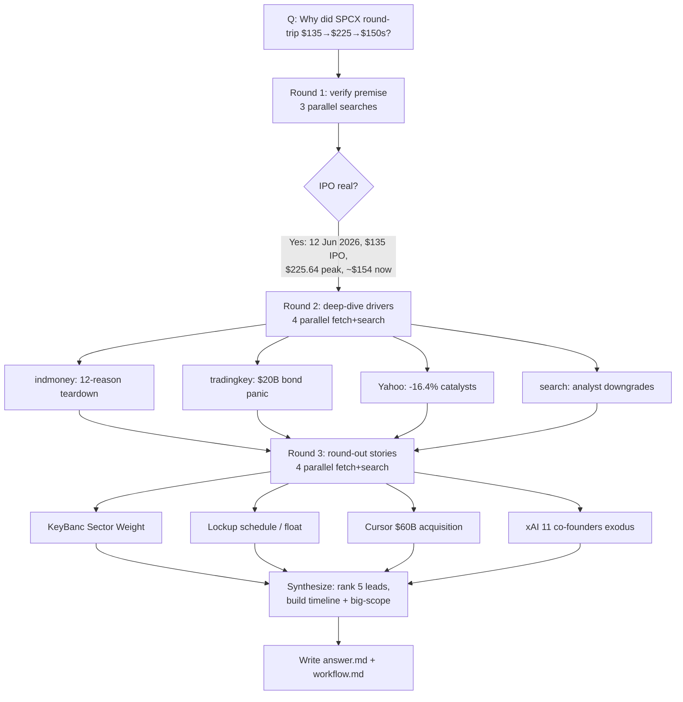

# Workflow — SpaceX (SPCX) post-IPO price shift: top 5 leads

## Original question
"SpaceX just went public 11 days ago and stock soared to more than 200 at a time, but now it's down in 150 range, lower than the first day launch price. Track and analyse recent events and the bigger scope related to SpaceX's price shift; find the top 5 leads and their full story behind the market change."

## Interpretation / scope
Treated as a **Complex** research task: reconstruct the SPCX price timeline (IPO 12 Jun 2026 → ~$225 peak → ~$150s), then identify and fully narrate the **five most important drivers** of the round-trip, plus the "bigger scope" (what the market is really repricing). Deliverable = a cited `answer.md` with a ranked top-5 plus timeline and big-picture synthesis. Premise was unverified at my knowledge cutoff (Jan 2026), so step 1 was to confirm the IPO and price action actually happened before analysing causes.

## Goals & success requirements
- **End goal:** A cited, ranked explanation of the top 5 leads behind SPCX's June 2026 round-trip, each with its full story, plus a synthesis of the bigger picture.
- **Minimum:** Confirm the IPO/price facts; ≥5 distinct, sourced drivers; an accurate price timeline; each lead backed by ≥1 credible source.
- **Target:** Each lead corroborated by ≥2 independent outlets; named analysts/figures and exact prices/dates/multiples; primary-ish sources (CNBC/Bloomberg/Yahoo/company disclosures) preferred over aggregators; bigger-scope synthesis tying the threads together.

## Budget
~14 rounds (Complex, but a single fast-moving news cluster). Spent 4 rounds (1 verify premise, 3 deep-dive on drivers). Stopped early: minimum + target requirements met, sources highly consistent, further searches were returning the same facts.

## Process

## Sources consulted (by lead)
- **Timeline / debut:** CNBC (12 Jun, 15 Jun), CNN, NPR, NBC, Axios, Investing.com quote board.
- **Lead 1 – AI pivot/Cursor:** DevOps.com, TFN, Qz, CBS News, TradingKey (Cursor); TheNextWeb, CNBC, Gizmodo, Electrek, ALM Corp (xAI co-founder exodus).
- **Lead 2 – $20B bond:** TradingKey (bond panic + IG ratings), Yahoo Finance (-16.4%), TechTimes, cryptoticker.
- **Lead 3 – valuation/analysts:** Investing.com (KeyBanc Sector Weight), TradingKey (Morningstar), indmoney (Damodaran, target spread).
- **Lead 4 – lockup/float:** Yahoo Finance (Jeff Jacobson 44% by September), cryptoticker (lockup schedule, 4–5% float), indmoney (Dec unlock, comparables).
- **Lead 5 – options/euphoria/fundamentals:** indmoney (options 17 Jun, meme dynamics, Starlink ARPU, governance), Bloomberg ($600B erased).

## Assumptions / notes
- The "Monday" −16.4% crash to ~$154.60 is dated **22 Jun 2026** (a Monday); one Yahoo headline says "23 Jun" — treated as a typo, since 23 Jun 2026 is a Tuesday and Bloomberg's 22 Jun piece already reports the three-day slide.
- Intraday "current" quotes vary by source ($154.60 close 22 Jun; some boards showed $165.78 / prev close $185 on 22 Jun). Reported as a $150s range rather than a single figure.
- "Lower than first-day launch price": first-day **open** was $150 and **close** $160.95; the $154–155 close is below the close and around the open — framed accordingly.
