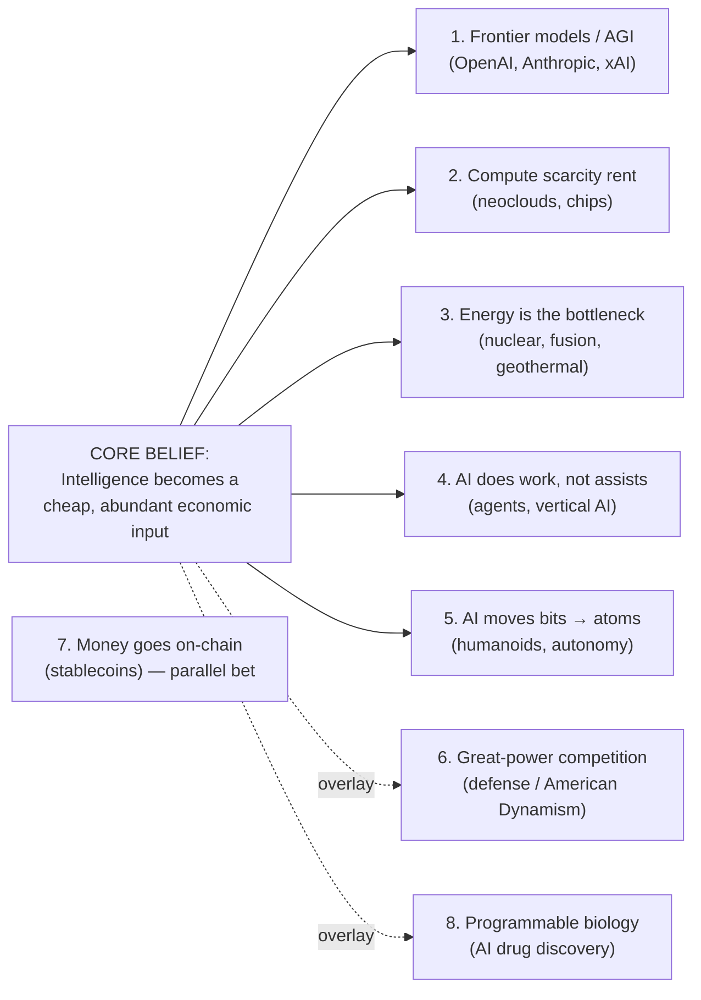

# What US Venture Capital Believes About the Future (June 2021 – June 2026)

*Inferring forward-looking beliefs from where US investors are placing high-conviction bets, with heavier weighting on June 2023 – June 2026.*

---

## The one-sentence answer

US venture capital is making one giant, internally-consistent wager: **that machine intelligence is about to become a cheap, abundant input to the whole economy — and that whoever owns the stack required to produce and deploy it (frontier models, compute, energy, the software that turns AI into labor, and eventually the robots that give it a body) captures the defining economic rents of the next decade.** Almost every other 2023–2026 high-conviction theme — energy, defense/reindustrialization, robotics, even parts of biotech and fintech — is either a *supporting bet* on that thesis (power and chips for AI; physical embodiment of AI; AI-designed drugs) or a *parallel structural bet* that has survived the 2022–2023 correction on its own fundamentals (stablecoins, defense). The market is not broadly bullish; it is **narrowly, intensely bullish on a single connected idea, and largely starving everything else.**

This document discovers the themes from capital-allocation patterns (concentration, round sizes, follow-on, investor quality, strategic participation, policy tailwinds, post-correction persistence) rather than assuming them, ranks them by conviction, separates durable momentum from zero-interest-rate (ZIRP) / pandemic-era hype, and states the future assumption each bet underwrites with a confidence rating.

---

## 1. The macro shape: peak → correction → AI-concentrated rebound

US VC moved through a full cycle in five years, and the *shape* of the rebound is the first major signal.

| Year | US VC deal value | Deals | What it means |
|---|---|---|---|
| 2021 | **~$329.9B** (all-time high) | ~17,054 | ZIRP peak; cheap money + "tourist"/non-traditional capital ([NVCA](https://nvca.org/press_releases/u-s-venture-capital-soars-to-new-highs-in-2021/)) |
| 2022 | ~$236.2B | 18,290 | Correction begins as rates rise; deal count still high ([PitchBook](https://pitchbook.com/newsletter/final-data-for-2023-illustrates-the-extent-of-vcs-tough-year)) |
| 2023 | **~$168.8B** (trough) | 15,379 | Toughest year of the cycle (~49% below the 2021 peak) ([PitchBook](https://pitchbook.com/newsletter/final-data-for-2023-illustrates-the-extent-of-vcs-tough-year)) |
| 2024 | ~$213.2B | ~15,250 | AI-led recovery starts; AI = **47.2%** of US deal value ([PitchBook](https://pitchbook.com/news/articles/artificial-intelligence-share-vc-deals)) |
| 2025 | **~$339.4B** (2nd-highest ever) | 16,709 | Near-record, but AI = **65.6%** of deal value ([Inc./PitchBook-NVCA](https://www.inc.com/brian-contreras/venture-capital-rebound-ai-pitchbook-nvca/91284645); [Q4'25 Venture Monitor](https://nvca.org/wp-content/uploads/2026/01/q4-2025-pitchbook-nvca-venture-monitor.pdf)) |
| Q1 2026 | **$267.2B in one quarter** | — | Five deals = **73%** of the total; AI most-invested vertical at every stage ([PitchBook Q1'26](https://pitchbook.com/news/reports/q1-2026-pitchbook-nvca-venture-monitor); [GamesBeat](https://gamesbeat.com/q1-2026-hit-big-vc-records-but-top-5-ai-deals-were-most-of-the-funding-pitchbook-nvca/)) |

**The dollar rebound is real but it is almost entirely an AI + mega-deal phenomenon.** Deal counts never returned to 2021–2022 highs; in 2025 **half of all US venture dollars went into just 0.05% of deals** ([Q4'25 Venture Monitor](https://nvca.org/wp-content/uploads/2026/01/q4-2025-pitchbook-nvca-venture-monitor.pdf)). The six largest 2025 rounds — OpenAI ($41B), Anthropic ($32.5B), Scale ($14.8B), xAI ($12.8B), Databricks ($5B), Aligned ($5B) — were all AI and together equalled **24% of all venture capital** ([CB Insights State of Venture 2025](https://www.cbinsights.com/research/report/venture-trends-2025/)). Globally, AI took **48% of all venture funding** in 2025 and the US captured **85% of all AI funding** ([CB Insights](https://www.cbinsights.com/research/report/venture-trends-2025/)).

**The "barbell" / disappearing middle.** Capital concentrated at both ends: record seed valuations (median post-money **$24M**) and a Series A median up **37% YoY to $78.7M** (with AI foundation-model Series A near a **$300M** median) at the top — while **35% of pre-seed rounds fell below $250K** ([Carta — record valuations](https://carta.com/data/record-setting-valuations/); [Carta — disappearing middle](https://carta.com/data/disappearing-middle-pre-seed-market/)). Down rounds normalized back to ~11% (2019 levels) only in 2025–2026 ([Carta Q1'26](https://carta.com/data/state-of-private-markets-q1-2026/)).

**Who controls the money.** Fundraising concentrated into a handful of megafunds — **a16z closed >$15B** (the largest VC raise in Silicon Valley history), **Thrive Capital $10B**, plus large Lightspeed, Founders Fund ($4.5B growth) and General Catalyst vehicles; in 2024, **9 firms collected roughly half** of all US VC fundraising ([a16z $15B](https://www.newcomer.co/p/andreessen-horowitzs-fresh-15-billion); [PitchBook — concentration](https://pitchbook.com/news/articles/us-vc-fundraising-concentration-andreessen-horowitz)). The same names (a16z, Sequoia, Thrive, Founders Fund, General Catalyst, Coatue, Greenoaks, Kleiner Perkins, Lightspeed) recur across nearly every theme below — high-conviction signal travels through a small, repeat set of allocators.

### Full 5 years vs. most-recent 3 years

- **Full window (2021–2026):** ZIRP bubble → sharp correction → AI re-acceleration. The headline "VC is back" hides that 2025's near-record $339B is a *different market* from 2021 — broad-based exuberance then, concentrated AI capital now.
- **Recent 3 years (2023–2026) — the durable signal:** unambiguously **AI-concentrated and top-heavy**. AI share went 47% → 66% → higher; a handful of labs absorb most dollars; the long tail starves; exits, though record by value, are driven by 1–2 names (xAI + Wiz = **81%** of Q1 2026 exit value). Durable conviction points to **AI/AI-infrastructure, a small set of category leaders, and the top ~9 megafunds — not a generalized return of 2021-style risk appetite** ([macro synthesis, sourced above]).

---

## 2. How to read the rest: themes ranked by conviction

The themes below are ordered by **strength of high-conviction signal** (capital concentration × round-size growth × follow-on velocity × investor quality × post-correction persistence × strategic/policy reinforcement). Each carries a confidence rating:

- 🟢 **High** — marquee rounds cross-confirmed by primary filings + multiple Tier-1 sources; many actors are public.
- 🟡 **Medium-High** — direction and leaders well-sourced; some valuations/ARR self-reported or "in talks."
- 🟠 **Medium** — real but contested, pre-revenue, or hostage to a single upstream variable (usually the AI capex cycle).

---

## 3. The themes

### Theme 1 — Frontier intelligence as a winner-take-most prize 🟢→🟠

**The bet:** scaling laws hold, a handful of "frontier labs" reach near-AGI capability, and the payoff is so large it justifies the most expensive private financings in history — even pre-revenue.

**Representative bets & rounds (2023–2026):**
- **OpenAI** — **$40B Series F (Mar 2025) at $300B**, the largest private fundraise on record, led by **SoftBank ($30B)** with Microsoft, Coatue, Altimeter, Thrive; SoftBank fully funded it by Dec 2025; a further ~$120B raise followed in early 2026 ([CNBC](https://www.cnbc.com/2025/03/31/openai-closes-40-billion-in-funding-the-largest-private-fundraise-in-history-softbank-chatgpt.html); [Crunchbase](https://news.crunchbase.com/venture/foundational-ai-startup-funding-doubled-openai-anthropic-xai-q1-2026/)).
- **Anthropic** — the fastest valuation ramp in tech: **$183B (Sep 2025) → $350B (Nov 2025, with $15B from Microsoft + Nvidia) → $380B (Jan 2026) → $965B Series H (May 2026)**, alongside run-rate revenue scaling **~$1B → ~$47B in ~18 months** ([Anthropic Series H](https://www.anthropic.com/news/series-h); [Bloomberg](https://www.bloomberg.com/news/articles/2025-11-18/microsoft-nvidia-to-invest-up-to-15-billion-in-anthropic)).
- **xAI** — **$20B Series E (~$230B, closed ~Jan 2026)**, Nvidia + Cisco + Gulf sovereigns, earmarked for the Colossus data-center buildout ([CNBC](https://www.cnbc.com/2026/01/06/elon-musk-xai-raises-20-billion-from-nvidia-cisco-investors.html)).
- **Pure-conviction pre-revenue raises:** **Safe Superintelligence (SSI)** $2B at **~$32B** (Ilya Sutskever, ~20 employees, no product) and **Thinking Machines Lab** a **$2B seed at $12B** (Mira Murati) — the largest seed on record, led by a16z ([TechCrunch SSI](https://techcrunch.com/2025/04/12/openai-co-founder-ilya-sutskevers-safe-superintelligence-reportedly-valued-at-32b/); [TechCrunch TML](https://techcrunch.com/2025/07/15/mira-muratis-thinking-machines-lab-is-worth-12b-in-seed-round/)).

**Leading funds/strategics:** SoftBank, Microsoft, Nvidia, Thrive, Coatue, Altimeter, Greenoaks, Sequoia, Gulf sovereign wealth (MGX, QIA, Mubadala), Alphabet.

**Future assumption underwritten:** that "intelligence" is a commodity with a near-vertical demand curve; that scaling continues to convert capital → capability → revenue; and that a winner-take-most outcome makes even a $30B+ pre-revenue valuation rational as **AGI optionality** plus **sovereign-AI** demand for national/regional compute independence.

**5yr vs 3yr / durability:** this barely existed at scale in 2021; it *is* the 2023–2026 story. Valuations **ratcheted up every cycle, not down**, with rapid oversubscribed follow-ons and real compounding revenue for the leaders — distinguishing it from 2021 froth. **Confidence: High on the facts (most actors disclose); Medium-to-Low (🟠) on whether the valuations are *justified*** — the murkiest area is the economic substance of circular vendor-investor arrangements (below).

---

### Theme 2 — Compute as the new oil (the "picks and shovels") 🟢

**The bet:** GPU/compute capacity is the binding scarcity, so owning the infrastructure that produces and rents it captures a **compute scarcity rent** regardless of which model wins.

**Representative bets & rounds:**
- **Neoclouds (GPU cloud):** **CoreWeave** — $19B private (2024) → **Nasdaq IPO Mar 2025**, Nvidia-anchored, guiding to **$12–13B revenue for 2026** ([CNBC](https://www.cnbc.com/2025/03/28/coreweave-starts-trading-on-nasdaq-at-per-share.html)); **Crusoe** $2.8B → **>$10B in 7 months** plus **$11.6B in project finance** for OpenAI's Stargate site ([Crusoe](https://www.crusoe.ai/resources/newsroom/crusoe-announces-series-e-funding)); **Lambda** $1.5B Series E after a multibillion-dollar Microsoft deal ([TechCrunch](https://techcrunch.com/2025/11/18/ai-data-center-provider-lambda-raises-whopping-1-5b-after-multibillion-dollar-microsoft-deal/)); **Nebius** public at ~$72B.
- **AI silicon (Nvidia challengers):** **Cerebras** — $23B private → up to **~$48.8B IPO (May 2026)**, with a **>$20B OpenAI compute deal** ([CNBC](https://www.cnbc.com/2026/05/11/cerebras-raises-ipo-range.html)); **Groq** $750M at $6.9B, then a **~$20B Nvidia asset/licensing deal** ([TechCrunch](https://techcrunch.com/2025/09/17/nvidia-ai-chip-challenger-groq-raises-even-more-than-expected-hits-6-9b-valuation/)); **Etched** $120M for a transformer-only inference ASIC ([CNBC](https://www.cnbc.com/2024/06/25/etched-raises-120-million-to-build-chip-to-take-on-nvidia-in-ai.html)).

**Leading funds/strategics:** Coatue, Blackstone & Magnetar (debt/project finance), Founders Fund, Mubadala, Valor — and above all **Nvidia**, which is simultaneously supplier, equity holder, and consolidator across the stack.

**Future assumption underwritten:** that compute demand outruns supply for years; that the bottleneck monetizes via rental/scarcity; and that hardware deserves an "infrastructure" (not "components") multiple. The **reopened IPO window for compute** (CoreWeave, Cerebras, Nebius) is the clearest exit-validated signal in the entire dataset.

**Durability:** strongly durable in aggregate (real revenue, real exits, hyperscaler offtake), but exposed to the same circular-financing risk as Theme 1. **Confidence: High** — deal transparency is unusually high because so many actors are public and disclose via filings/PPAs.

---

### Theme 3 — Energy is the real bottleneck to AI (the electricity supercycle) 🟡

**The bet (the surprise winner of 2024–2026):** AI compute demand reframed **firm, baseload, carbon-free power** as the highest-conviction *hard-tech* theme, displacing the diffuse 2021–2022 "climate tech / ESG" wave. Data-center electricity use surged **~17% in 2025** and is set to roughly double by 2030 ([IEA](https://www.iea.org/news/data-centre-electricity-use-surged-in-2025-even-with-tightening-bottlenecks-driving-a-scramble-for-solutions)).

**Representative bets & rounds:**
- **Fusion:** **Commonwealth Fusion Systems** $863M Series B2 (Aug 2025; Nvidia's NVentures, Google, Druckenmiller) on top of its 2021 $1.8B round, **>$3B total**, with a **$1B+ Eni PPA** and a Google 200 MW PPA ([TechCrunch](https://techcrunch.com/2025/08/28/nvidia-google-and-bill-gates-help-commonwealth-fusion-systems-raise-863m/)); **Helion** $425M Series F at **$5.4B** (SoftBank, Lightspeed, Altman; Microsoft PPA for power by 2028) ([Helion](https://www.helionenergy.com/newsroom/helion-announces-425m-series-f-investment-to-scale-commercialized-fusion-power)); **Pacific Fusion** **$900M Series A** in milestone tranches (General Catalyst) ([Bloomberg](https://www.bloomberg.com/news/articles/2024-10-25/nuclear-startup-pacific-fusion-raises-900-million-in-funding)). Private fusion has crossed **~$13B cumulative**, with 17 startups each >$100M ([TechCrunch](https://techcrunch.com/2025/12/31/every-fusion-startup-that-has-raised-over-100m/)).
- **Fission / small modular reactors (SMRs):** **X-energy** ($500M Amazon-led, 5+ GW by 2039, then a ~$1B IPO); **Oklo** (Altman-chaired, public via SPAC, market cap from ~$49M to ~$11B); **Aalo Atomics** $100M Series B (Valor) explicitly co-locating reactors with data centers ([TechCrunch](https://techcrunch.com/2025/08/19/aalo-atomics-raises-100m-to-build-a-microreactor-and-data-center-together/)); **TerraPower** (Meta 8-plant deal, Jan 2026).
- **Geothermal:** **Fervo Energy** — four rounds 2024–2025 culminating in a **$462M Series E** (B Capital, Google) → **~$10B Nasdaq IPO (May 2026)**, which popped ~33% "fueled by AI data-center demand" ([TechCrunch](https://techcrunch.com/2026/05/13/geothermal-startup-fervo-energy-pops-33-in-ipo-debut-fueled-by-ai-data-center-demand/)).
- **The validating events:** hyperscaler nuclear PPAs — **Microsoft/Constellation** restarting Three Mile Island (835 MW, ~$16B), **Amazon/X-energy**, **Google/Kairos**, **Meta** up to 6.6 GW — which re-rated the whole space ([CNBC](https://www.cnbc.com/2024/09/20/constellation-energy-to-restart-three-mile-island-and-sell-the-power-to-microsoft.html)).

**Future assumption underwritten:** decades of flat US power demand are over; **firm/dispatchable clean power wins** over intermittent renewables for 24/7 AI load; **whoever supplies power captures outsized value**; and **policy is a durable tailwind** (bipartisan ADVANCE Act 2024; Trump's 2025 nuclear executive orders targeting 400 GW by 2050).

**5yr vs 3yr / why it's durable, not the old ZIRP climate hype:** the 2021–2022 wave was broad and ZIRP-fueled — **69 climate SPACs in 2021, down ~70% by 2023**, with casualties like Nikola and Heliogen ([ctvc](https://www.ctvc.co/a-brief-climate-tech-spacback/)). The new wave is **narrower and demand-pulled by contracted hyperscaler PPAs** plus supply-side policy — a hard demand signal a 2021 hydrogen/EV SPAC never had. **Confidence: Medium-High** — rounds and PPAs are well-sourced, but the bets are pre-revenue, long-dated, and **hostage to the AI capex cycle** (an AI slowdown or efficiency gains could deflate the power-demand premium) and to unproven physics/engineering milestones (fusion net energy).

---

### Theme 4 — AI does the work, not just assists ("service-as-software") 🟡

**The bet:** the value moves from the model layer to the **application/agent layer**, priced on *work done* (resolved tickets, drafted contracts, written code, clinical notes) rather than seats — tapping **labor budgets** far larger than software budgets. Bain sizes the US "cross-system labor" opportunity at **~$100B with >90% untapped** ([Bain](https://www.bain.com/insights/100-billion-saas-opportunity-hiding-in-cross-system-labor/)); Bessemer frames it as **"AI systems of action" / "digital labor"** ([Bessemer](https://www.bvp.com/atlas/roadmap-ai-systems-of-action)).

**Representative bets & rounds (the densest cluster of fast repeat up-rounds in the whole dataset):**
- **AI coding (highest conviction):** **Cursor/Anysphere** $9.9B (Jun 2025) → $29.3B (Nov 2025) → reported **~$50B (2026)**, ARR ~$100M → ~$2B run-rate in ~14 months ([TechCrunch](https://techcrunch.com/2025/06/05/cursors-anysphere-nabs-9-9b-valuation-soars-past-500m-arr/)); **Cognition/Devin** $10.2B → **$26B** (post-Windsurf) ([TechCrunch](https://techcrunch.com/2026/05/27/ai-coding-startup-cognition-raises-1b-at-25b-pre-money-valuation/)); **Replit** $3B → **$9B** in 6 months ([CryptoRank](https://cryptorank.io/news/feed/8c72a-replit-9-billion-valuation-funding)).
- **Vertical AI:** **Harvey** (legal) ran **$3B → $5B → $8B → $11B across four rounds in ~13 months** (Sequoia, GIC, a16z) ([Harvey](https://www.harvey.ai/blog/harvey-raises-at-dollar11-billion-valuation-to-scale-agents-across-law-firms-and-enterprises)); **Sierra** (Bret Taylor, customer support) $10B → **$15.8B**, ARR $26M → $200M ([TechCrunch](https://techcrunch.com/2026/05/04/sierra-raises-950m-as-the-race-to-own-enterprise-ai-gets-serious/)); **Decagon** $1.5B → $4.5B; **Glean** (enterprise search) **$7.2B**, ARR doubling.
- **AI search & media:** **Perplexity** ~$20B ([TechCrunch](https://techcrunch.com/2025/09/10/perplexity-reportedly-raised-200m-at-20b-valuation/)); **ElevenLabs** $11B (Sequoia); **Runway** $315M Series E. *Counter-example:* **Midjourney** reached ~$500M ARR with **zero VC** — a reminder the pattern isn't universal.

**Future assumption underwritten:** that AI **agents** perform end-to-end knowledge work autonomously; that buyers will pay for outcomes against labor budgets; and that **domain depth + proprietary data + enterprise control points** create a durable moat (vs. thin "wrappers").

**Durability & the 2026 bifurcation:** the strongest durability signal anywhere is **repeat up-rounds inside 6–13 months with the same top-tier leads re-upping**. But by 2026 the market **bifurcated**: foundation-model multiples compressed (60–100x → 15–50x) and **"defensibility overtook growth as the primary valuation driver,"** with thin wrappers seeing 50–70% multiple compression ([valueaddvc](https://valueaddvc.com/ai-valuations)). **Confidence: Medium-High** on directions/leads; lower on exact ARR (self-reported "annualized run-rate") and several 2026 "in-talks" valuations.

---

### Theme 5 — AI moves from bits to atoms ("physical AI" / embodiment) 🟡

**The bet:** having (arguably) solved digital intelligence, the next trillion-dollar frontier is **embodiment** — robot foundation models that generalize to physical action, humanoids, and autonomy at scale. Robotics raised a **record ~$40.7B in 2025 (~9% of all global VC)** ([Axios](https://www.axios.com/2025/11/21/robots-physical-intelligence-ai)).

**Representative bets & rounds:**
- **Humanoids:** **Figure AI** **>$1B Series C at $39B** (Sep 2025; Nvidia, Microsoft, Intel, OpenAI Fund, Bezos), a 15x jump in 18 months ([Figure](https://www.figure.ai/news/series-c)); **Apptronik** $520M ext at **>$5.5B** (Google-aligned; Mercedes/GXO pilots); **1X** raising ~$1B at ~$10B (OpenAI-backed).
- **Robot foundation models:** **Skild AI** $1.5B → $4.7B → **$14B** in 18 months (SoftBank + Nvidia; the largest robotics round ever) ([TechCrunch](https://techcrunch.com/2026/01/14/robotic-software-maker-skild-ai-hits-14b-valuation/)); **Physical Intelligence** $5.6B → reported **$11B** target (CapitalG, Founders Fund, Thrive, Lux).
- **Autonomy (the durability proof):** **Waymo** **$16B at $126B (Feb 2026)**, with paid rides scaling 200k → 450k/week and revenue $125M → $355M annualized ([Waymo](https://waymo.com/blog/2026/02/waymo-raises-usd16-billion-investment-round/)); **Aurora** launched commercial driverless trucking (Apr 2025); **Applied Intuition** **$15B** on an AV/defense dual-use pivot.

**Future assumption underwritten:** that foundation-model maturity + cheaper hardware generalizes to physical action; that **humanoids enter factories/warehouses first, then homes**; and that a **structural labor shortage** (>600k US manufacturing + >1M logistics openings) is a durable demand floor.

**5yr vs 3yr / durability:** the prior **"AV winter"** is the cautionary precedent — Argo AI shut in 2022 (>$3.6B lost), Cruise in 2024. The current wave looks **more durable** because Waymo settled the core tech question at commercial scale, 2025 brought a genuine capability step-change, and labor/reshoring tailwinds are new. But **pre-revenue mega-valuations ($39B Figure, $14B Skild)** and top-10-deals = 89% concentration are clear bubble-risk markers. **Confidence: Medium-High** on closed rounds; lower on "in-talks" rounds, forward revenue, and Tesla Optimus output claims.

---

### Theme 6 — Great-power competition & reindustrialization ("American Dynamism") 🟢

**The bet (a genuinely new fundable VC category):** durable US-China/Russia great-power competition makes **defense, aerospace, and domestic manufacturing** a venture sector for the first time — software-first "neoprimes" challenging Lockheed/Boeing/Raytheon, with government as anchor customer. a16z institutionalized this as **"American Dynamism"** with a dedicated **$600M fund** ([a16z](https://a16z.com/american-dynamism/)). Defense-tech round value reached **~$29–49B in 2025**, roughly 2–3x prior years ([Crunchbase](https://news.crunchbase.com/defense-tech/startup-venture-funding-all-time-record-ai-anduril/)).

**Representative bets & rounds:**
- **Anduril** — **$14B (2024) → $30.5B (2025, Founders Fund's $1B largest-ever check) → $61B (May 2026, Thrive + a16z)**, revenue ~$1B → $2.2B, building the Arsenal-1 hyperscale weapons plant ([TechCrunch](https://techcrunch.com/2026/05/13/anduril-raises-5b-doubles-valuation-to-61b/)).
- **Shield AI** $5.3B → **$12.7B (+140%)** after a USAF drone selection; **Saronic** (autonomous warships) $1B → $4B → **$9.25B**; **Castelion** (hypersonics) $350M Series B; **Hadrian** (AI-operated precision manufacturing) $260M (Founders Fund + Lux).
- **Space:** **SpaceX** secondaries roughly doubled, **$400B → ~$800B** in five months, with IPO chatter at $1.75–2T; new entrants Stoke Space, K2, Varda, Apex.
- **Dedicated funds:** Founders Fund, a16z American Dynamism, **Lux** ($1.5B Fund IX + a dedicated defense fund), 8VC — plus crossover/PE (Advent, Blackstone, JPMorgan, Kleiner) institutionalizing the category.

**Future assumption underwritten:** great-power competition is durable for ≥a decade → sustained rising defense budgets (~$1.5T FY27 proposal; Golden Dome; the ~$55B Replicator→DAWG autonomy push); **software-defined warfare** (mass + attrition + autonomy); and **reindustrialization** as both moat and policy mandate.

**5yr vs 3yr / durability:** unlike the 2022 broad-tech correction, defense valuations **rose sharply through 2024–2026**, new entrants keep raising mega-rounds, and crossover capital plus fresh dedicated funds confirm staying power. **Confidence: High** on closed rounds and contracts; Medium on rumored 2026 rounds and aggregate sector totals (methodologies blend VC + PE + corporate); SpaceX IPO targets are speculative.

---

### Theme 7 — Money goes on-chain: stablecoins & regulatory clarity (a parallel durable bet) 🟢

**The bet:** distinct from AI, this is crypto's *durable* layer finally separating from speculation. **Stablecoins** are the "killer app" — real payment rails moving **~$33T in 2025** with a market cap that hit an all-time-high **~$321B** (Tether ~$188B + Circle ~$78B ≈ 80%+) ([bitcoinfoundation.org](https://bitcoinfoundation.org/news/stablecoin-news/stablecoin-market-cap-tops-321b/)). The catalyst is **regulatory clarity**: the **GENIUS Act** (signed July 18, 2025) — the first major US federal crypto law, mandating 100% reserves and carving stablecoins out of securities law ([White House](https://www.whitehouse.gov/fact-sheets/2025/07/fact-sheet-president-donald-j-trump-signs-genius-act-into-law/)) — plus a wholesale SEC posture shift (Coinbase case dropped Feb 2025; Chair Atkins's "Project Crypto").

**Representative bets & rounds:** **Circle** IPO (Jun 2025, +168% debut pop, ticker CRCL); **Stripe's $1.1B Bridge acquisition** (its largest ever) + Bridge's OCC trust charter; **Tempo** (Stripe + Paradigm) $500M Series A at $5B; **a16z crypto's** new $2.2B fund; tokenized real-world assets (RWA) past **$20B on-chain** (BlackRock BUIDL, Ondo). In fintech proper: **Ramp** (~$32B), **Mercury** ($5.2B), **Brex** acquired by Capital One for $5.2B.

**Future assumption underwritten:** stablecoins become **core global payment infrastructure** (disintermediating correspondent banking and card rails); tokenization migrates TradFi AUM on-chain; and **2025's regulatory clarity is a permanent regime change**, justifying large later-stage checks. Notably, **57% of 2025 crypto capital went to later-stage** companies — the opposite of 2021's early-stage token mania.

**5yr vs 3yr / durability:** the cleanest hype-vs-durable story in the dataset. 2021–2022 was a ZIRP/NFT retail mania that collapsed with FTX/Terra (crypto VC fell to ~$9B by 2024); the survivors (Circle, Coinbase, a16z, Paradigm, Pantera) returned with **real revenue, IPOs, and LP distributions**. The tell: **stablecoin usage keeps climbing even as early-stage crypto VC hit a 2-year low (~$659M, Apr 2026) and Circle's stock fell ~42% from its peak** — the durable layer (usage) is decoupling from the speculative layer (token prices). **Confidence: High** on regulatory/IPO/fund facts; Medium on specific private valuations.

---

### Theme 8 — Biology becomes programmable (AI × bio) 🟠

**The bet:** AI/ML compresses drug discovery, and AI software industrializes healthcare delivery. Two sub-themes, both with an explicit AI thesis attached.

**Representative bets & rounds:**
- **AI drug discovery / "TechBio":** **Xaira** **$1B launch** (Apr 2024, ARCH's largest ever; David Baker / Marc Tessier-Lavigne); **Isomorphic Labs** (Alphabet/DeepMind, Demis Hassabis) $600M (Thrive, GV) plus ~$3B in Lilly/Novartis deals; **Genesis Therapeutics** $200M (a16z, Nvidia); **EvolutionaryScale** $142M seed for a protein language model. The 2024 Nobel in Chemistry (AlphaFold + protein design) is treated as scientific validation ([FierceBiotech](https://www.fiercebiotech.com/biotech/new-ai-drug-discovery-powerhouse-xaira-rises-1b-funding); [Isomorphic](https://www.isomorphiclabs.com/articles/isomorphic-labs-announces-600m-external-investment-round)).
- **AI healthcare delivery (closest to SaaS economics, fastest step-ups):** **Abridge** (ambient scribe) $2.75B → **$5.3B in 4 months**; **OpenEvidence** ("ChatGPT for doctors") ~$700M across three rounds in ~12 months to a **$12B** valuation on ~$150M ARR (+1,803% YoY) ([Crunchbase](https://news.crunchbase.com/venture/openevidence-ai-doctors-doubles-valuation-seriesd/)).
- **Longevity (patron capital):** Altos Labs ($3B), Retro Biosciences (~$1.8B, Altman-backed), NewLimit ($435M, Armstrong-backed) — "programmable biology" on long-horizon billionaire/crossover capital.

**Future assumption underwritten:** that AI raises hit rates and compresses the multi-year, multi-billion-dollar discovery funnel; that AI-designed drugs reach the clinic and validate; that AI clinical software has SaaS-like economics; and (longevity) that aging is a reprogrammable cellular state.

**5yr vs 3yr / durability:** 2021 was a ZIRP/SPAC biotech bubble (XBI fell ~61%); the survivor market is a **barbell** — capital for a de-risked few + AI-narrative winners, starvation for the early-stage long tail. **AI-delivery software is most durable** (real ARR/ROI, though valuations are stretched and Epic/Microsoft compete); **AI drug discovery is well-capitalized and Nobel/pharma-validated but no AI-designed drug has delivered a major clinical readout yet** — the core durability question is genuinely unresolved. **Confidence: Medium** — the central proof point lies in the future.

---

## 4. Cross-cutting synthesis — what US VC is collectively underwriting

Reading across the eight themes, the bets are not eight independent views of the future. They are facets of **one connected worldview**:

1. **Intelligence becomes a cheap, abundant economic input.** Everything starts here (Themes 1, 4).
2. **The scarce, valuable layers are the physical substrate of intelligence** — compute (2), energy (3), and eventually embodiment (5). Investors are pre-buying the bottlenecks years ahead of demand.
3. **AI converts software budgets into labor budgets.** The "service-as-software" / "digital labor" thesis (4) is a bet that AI **replaces work**, not just tools — the single largest implied TAM expansion in the dataset.
4. **The state is back as a customer and an ally.** Defense, reindustrialization, energy permitting, and crypto legislation all reflect a belief that **policy and geopolitics are durable tailwinds**, not risks (3, 6, 7).
5. **A few durable non-AI structural shifts coexist** — stablecoins (7) as the proven crypto use case, and biotech's AI overlay (8) — both having survived the correction on fundamentals.

**The investors writing the biggest checks are a small, repeat set** (a16z, Thrive, Founders Fund, Sequoia, General Catalyst, Coatue, Greenoaks, Lightspeed, Kleiner Perkins) plus **strategic corporates** (Nvidia above all; Microsoft, Google, Amazon, SoftBank) and **sovereign wealth** (MGX, QIA, Mubadala, GIC). Conviction is concentrated not just by sector but by *allocator* — a handful of funds are underwriting the future on behalf of the asset class.

### What is *not* being funded (the dog that didn't bark)
The barbell means the forward-looking belief is as much about **what investors have abandoned** as what they fund: the broad 2021 risk appetite (consumer social, generic SaaS, food delivery, broad climate/ESG, NFT/web3 consumer, neobanks/digital lending) has **not** returned. The long tail of pre-seed is starved (35% of rounds <$250K), 2025 fundraising hit a decade low ($66.7B), and "the disappearing middle" is real. **The future US VC is betting on is narrow, capital-intensive, infrastructure-heavy, and AI-centric — not a broad-based innovation boom.**

---

## 5. Risks to the thesis (and what would falsify it)

A faithful reading must flag that this conviction could be substantially wrong:

- **Circular financing.** The Nvidia↔OpenAI (up to $100B), OpenAI↔AMD (6 GW + warrants), and Microsoft/Nvidia↔Anthropic ($15B + $30B Azure) arrangements are widely flagged as **circular** — a vendor funding customers that buy its product, potentially inflating an AI-capex bubble by recycling cash ([Fortune](https://fortune.com/2025/09/28/nvidia-openai-circular-financing-ai-bubble/)). This is the single biggest structural risk to Themes 1–3 and 5.
- **Concentration / single-point-of-failure.** Half of all dollars to 0.05% of deals; 5 deals = 73% of Q1 2026; the entire energy/robotics/compute complex is **downstream of the AI capex cycle continuing**. An AI revenue disappointment or an efficiency breakthrough (cheaper inference) would deflate multiple themes at once.
- **Pre-revenue, long-dated bets.** SSI/Thinking Machines (no product), fusion/SMRs (pre-commercial, 2028–2030s), humanoids ($39B/$14B pre-scale), AI-designed drugs (no major clinical readout) — much of the conviction is underwriting *future* outcomes that have not yet materialized.
- **Valuation froth markers** echo 2021 in places: SPACs are back (~$25.8B in 2025), Oklo +22,000% on no commercial revenue, Figure at a reported ~400x.

The honest synthesis: the **aggregate dollar momentum is real and post-correction-durable for the revenue-backed leaders** (frontier labs with $1B+ run-rate, neoclouds with real revenue and IPOs, Waymo, stablecoin usage, AI-delivery software), but a meaningful share of the conviction rests on **forward assumptions that are not yet proven** and on **financing structures whose economic substance is contested**.

---

## 6. Confidence & limitations

- **High confidence** on the *existence, size, leads, and direction* of marquee rounds and on the macro concentration figures — many actors are public and disclose via SEC filings, IPO prospectuses (S-1s), company/fund announcements, and PPAs, cross-confirmed by Tier-1 press (CNBC, Bloomberg, Reuters, TechCrunch) and primary trackers (PitchBook-NVCA, Carta, CB Insights, Crunchbase).
- **Medium confidence** on (a) exact private valuations and self-reported "ARR / annualized run-rate" figures (often via aggregators like Sacra/getlatka, with inconsistent definitions), and (b) 2026 figures that are "in talks" / preliminary (PitchBook routinely revises recent quarters upward).
- **Genuinely unresolved (flagged, not papered over):** whether current AI valuations are justified, whether AI-designed drugs deliver clinical outcomes, and whether the circular-financing complex is durable or a bubble. These are contested questions that **more searching cannot settle as of June 2026** — they are the forward assumptions the bets themselves are underwriting.
- **Methodology caveats:** PitchBook (US-only) and CB Insights/Crunchbase (often global) use different geographies and definitions — their totals are **not additive**. AI-share definitions vary by tracker. Some round sizes were corroborated against press where primary databases were paywalled.

---

## 7. Bottom line

**US investors are betting that the future is one in which intelligence is abundant and cheap, and the economy reorganizes around producing, powering, embodying, and deploying it.** The highest-conviction, most-durable bets — frontier models, compute, energy, AI-as-labor software, and (with a state-backed overlay) defense/reindustrialization and stablecoins — all express variations on that single belief. The bets that have *persisted and compounded since the 2022–2023 correction* (rather than spiking in 2021 and fading) are the ones to trust most: revenue-backed AI leaders, the compute "picks and shovels" with real IPO exits, contracted firm-power deals, stablecoin payment rails, and AI clinical software. The bets most likely to be ZIRP-style hype in new clothing are the **pre-revenue, demo-driven, or circularly-financed** corners — and the data already shows the market beginning to bifurcate accordingly, rewarding *defensibility over growth*.

---

### Key sources (representative; full citations inline above and in `scratchpad/`)
- **Trackers:** PitchBook-NVCA Venture Monitor (2021–Q1 2026); Carta State of Private Markets; CB Insights State of Venture 2024/2025; Crunchbase News.
- **Primary filings / announcements:** SEC S-1s & 8-Ks (CoreWeave, Cerebras, Circle, Aurora, Constellation, Oklo); company newsrooms (OpenAI, Anthropic, Figure, Waymo, Harvey, Fervo, CFS, Helion, Anduril); fund posts (a16z, Lux); White House / congress.gov (GENIUS Act); IEA (energy/AI).
- **Tier-1 press:** CNBC, Bloomberg, Reuters, TechCrunch, Fortune, Axios, CoinDesk, FierceBiotech/STAT, SpaceNews, Defense News.
