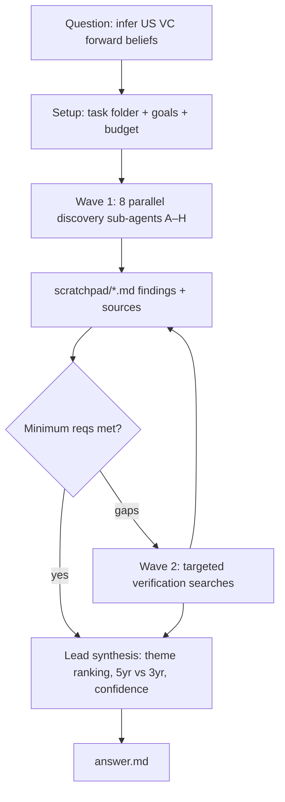

# Workflow — US VC High-Conviction Bets (2021–2026)

## Question (verbatim intent)
Research US startup & venture investment June 2021–June 2026 (heavier weight June 2023–June 2026) to infer what US investors believe the future looks like, based on where they place high-conviction bets. Cover pre-seed → late/growth stage. Use primary US-market sources. Do NOT assume sectors — discover them from capital concentration, deal volume, round sizes, follow-on, investor quality, repeat patterns, adoption signals, policy tailwinds, infra buildout, strategic participation, and post-2022–2023-correction persistence. Compare full 5yr vs recent 3yr to separate ZIRP/pandemic hype from durable momentum. Per theme: representative startups, notable rounds, leading funds/strategics, implied thesis, future assumptions underwritten, confidence (source quality, deal transparency, cross-source consistency). Preserve original market terms in parentheses. Infer forward-looking beliefs, not just biggest rounds.

## Goals
1. **End goal:** A sourced, theme-structured answer that infers the forward-looking beliefs embedded in US VC allocation 2023–2026, distinguishing durable momentum from ZIRP-era hype.
2. **Minimum requirements:**
   - Macro picture of US VC 2021–2026 (totals, the 2022–23 correction, AI concentration) backed by ≥1 primary tracker (PitchBook-NVCA / CB Insights / Crunchbase / Carta).
   - ≥5 distinct themes discovered from the data, each with: representative startups, ≥2 notable rounds, leading investors, implied thesis, future assumption, confidence rating.
   - Explicit 5yr-vs-3yr comparison per theme where data allows.
3. **Target requirements:** Primary sources (SEC/EDGAR, fund/company announcements, NVCA/PitchBook) over secondary; cross-source corroboration of each major round; quantified concentration (AI % of deal value); a "what investors are underwriting" synthesis; calibrated confidence per theme.
4. **Budget:** Complex, multi-strand. ~36 rounds = 8 strands × ~4 rounds + ~4 synthesis/verification. Extend in +5 increments only if a specific minimum requirement is unmet.

## Plan
Parallel sub-agents, each scratchpad-only, one file each:
- A: Macro/overview & data trends (correction, recovery, concentration)
- B: AI infrastructure & compute (foundation models, data centers, chips, energy-for-AI)
- C: AI applications & agents (enterprise, vertical AI, coding, AI-native consumer)
- D: Defense / national security / space
- E: Energy / climate / nuclear / fusion
- F: Biotech / healthcare / AI-for-bio
- G: Fintech / crypto / stablecoins
- H: Robotics / autonomy / reshoring / advanced manufacturing
Then lead synthesizes scratchpad → answer.md.

## Process flowchart

## Log
- 2026-06-22: Folder created. Workflow defined. Launching Wave 1 (8 sub-agents A–H).
- 2026-06-22: All 8 sub-agents returned. Each wrote a sourced scratchpad file (macro_overview, ai_infrastructure, ai_applications, defense_space, energy_climate, biotech_health, fintech_crypto, robotics_autonomy). Findings cross-consistent and densely cited (PitchBook-NVCA, Carta, CB Insights, Crunchbase, SEC filings, company/fund announcements, Tier-1 press).
- 2026-06-22: Lead read all 8 scratchpads to extract citation URLs. **Minimum requirements assessment:** macro picture (PitchBook-NVCA/Carta) ✅; ≥5 themes discovered from data (found 8) each with startups/rounds/investors/thesis/assumption/confidence ✅; 5yr-vs-3yr contrast per theme ✅. Target requirements substantially met (primary sources, cross-corroboration, quantified AI concentration, calibrated confidence). **No Wave 2 needed** — no specific minimum requirement is unmet and the contested questions (bubble vs durable) are genuinely unresolvable by more search. Budget used: ~1 setup round + 8 parallel strands (each ~13–21 tool calls) ≈ well within the ~36-round budget. Proceeding to synthesis.
- 2026-06-22: Wrote answer.md (theme-ranked synthesis, 5yr-vs-3yr, confidence per theme, cross-cutting meta-beliefs, risks). Task complete.
