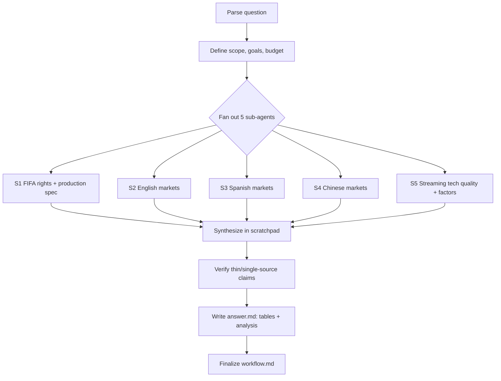

# Workflow — FIFA World Cup 2026 Live Streaming & Quality Analysis

## Original question
"World cup 2026 live stream in major English and Spanish, Chinese countries and streaming quality analysis, compare bitrate, language, picture quality, frame rates, pricing, and the factors play in each distribution. Official streaming contracts details with FIFA, why is the streaming quality what it is."

## Interpretation / scope
A research report covering how FIFA World Cup 2026 (June 11 – July 19, 2026, hosted by USA/Canada/Mexico) is live-streamed across major English-, Spanish-, and Chinese-speaking markets. For each market: rights holder / streaming platform, language coverage, and the consumer-facing technical quality (resolution, frame rate, bitrate, HDR), plus pricing. Then a cross-cutting analysis: FIFA's official media-rights/contract structure, the FIFA host-broadcast production spec (what FIFA delivers to broadcasters), and the technical/commercial/regulatory factors that explain why end-user streaming quality differs by market.

Assumptions recorded as discovered are noted inline below.

## Goals & success requirements
1. **End goal:** A cited report comparing WC2026 live-stream offerings (platform, language, resolution/fps/bitrate/HDR, price) across major EN/ES/ZH markets, plus FIFA contract structure and an explanation of the quality differences.
2. **Minimum requirements:**
   - ≥2 English markets, ≥2 Spanish markets, ≥2 Chinese-language markets covered with platform + price + best-available quality.
   - FIFA host-broadcast production spec stated (resolution/fps/HDR) with source.
   - FIFA media-rights/contract structure described with source.
   - Each market claim backed by a credible source, cited inline.
3. **Target requirements:**
   - All major markets (US EN+ES, UK, Canada, Australia; Mexico, Spain, Argentina/LatAm; China, Hong Kong, Taiwan) covered.
   - Bitrate/frame-rate figures where publicly available; clear flagging where they are estimates or unavailable.
   - Cross-market comparison table + analysis of distribution factors (rights cost, infrastructure/CDN, device, regulation, ad-funded vs paid).
   - Primary sources (FIFA, broadcaster pressrooms, regulator filings) preferred over secondary.
4. **Budget:** ~40 rounds (5 Moderate strands × ~8). 80% gather / 20% verify+write.

## Plan
Parallel sub-agent strands, each writing to `scratchpad/<strand>.md`:
- S1: FIFA media-rights structure + host-broadcast production spec (4K/HDR/HFR, FIFA Max feed).
- S2: English markets — US (Fox/Telemundo apps, Tubi, Peacock), UK (BBC/ITV), Canada, Australia.
- S3: Spanish markets — US (Telemundo/Peacock), Mexico, Spain, Argentina/LatAm.
- S4: Chinese-language markets — Mainland China (CCTV/Migu), Hong Kong, Taiwan.
- S5: Streaming technical quality — bitrate/fps/resolution/HDR by platform, and the factors (CDN, codec, ad-funded vs paid, device) driving differences.

## Process flowchart

## Status
- [in progress] Fan-out research launched.
