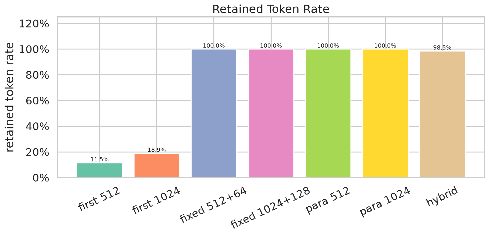
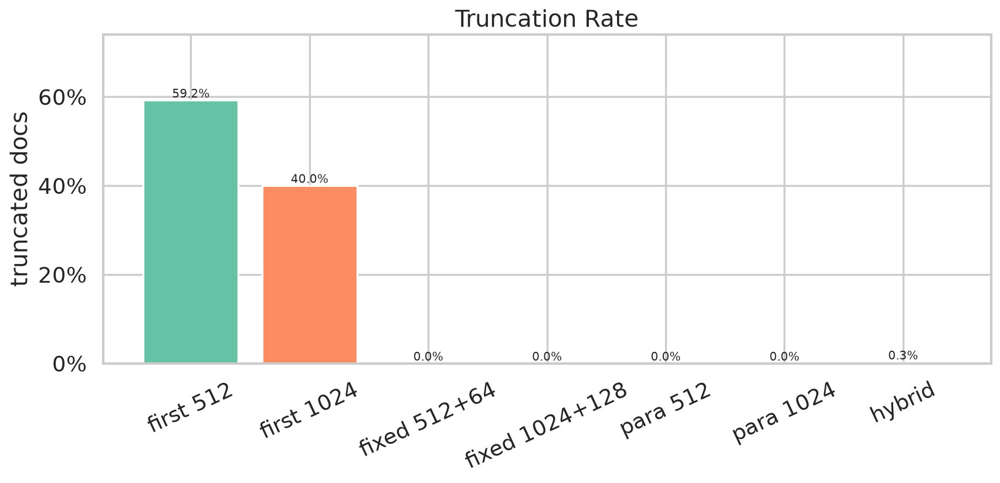
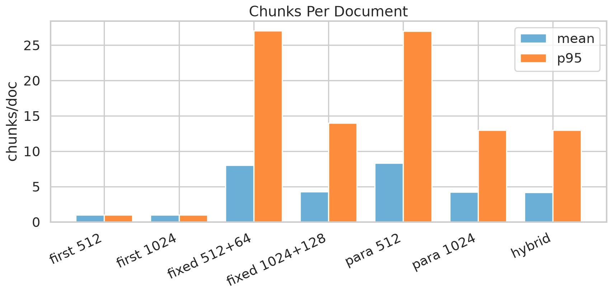
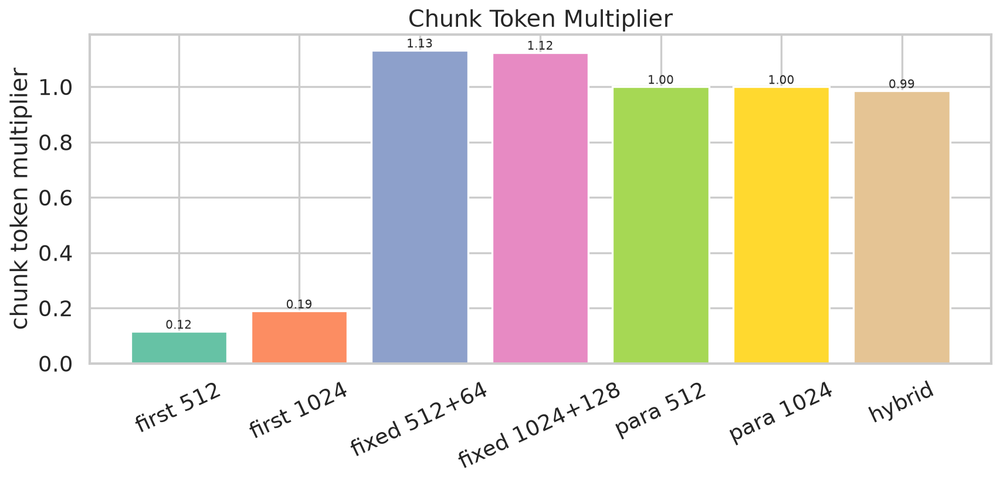
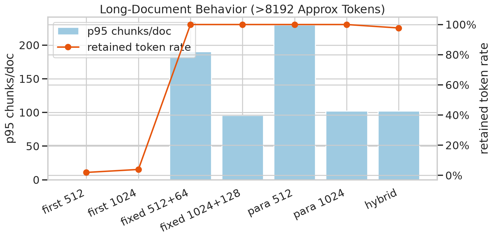

# ClimbMix Chunking Comparison

## Executive Summary

- Run ID: `sample`.
- Input docs: `5,000`; processed docs: `5,000`.
- Processed shards: `66`.
- Sample mode: `sample`; seed: `20260703`.
- Errors: `0`.

## Strategy Summary

| strategy | chunks/doc mean | chunks/doc p95 | chunk tokens p50 | chunk tokens p95 | retained tokens | truncated docs | token multiplier | overlap overhead | tiny chunk rate |
|---|---:|---:|---:|---:|---:|---:|---:|---:|---:|
| `first_512` | 1.00 | 1.00 | 512.0 | 512.0 | 11.53% | 59.20% | 0.12 | 0.00% | 0.62% |
| `first_1024` | 1.00 | 1.00 | 743.5 | 1,024.0 | 18.89% | 40.00% | 0.19 | 0.00% | 0.62% |
| `fixed_512_overlap_64` | 8.04 | 27.05 | 512.0 | 512.0 | 100.00% | 0.00% | 1.13 | 13.21% | 0.08% |
| `fixed_1024_overlap_128` | 4.31 | 14.00 | 1,024.0 | 1,024.0 | 100.00% | 0.00% | 1.12 | 12.42% | 0.14% |
| `paragraph_aware_512` | 8.31 | 27.00 | 483.0 | 512.0 | 100.00% | 0.00% | 1.00 | 0.05% | 0.73% |
| `paragraph_aware_1024` | 4.26 | 13.00 | 958.0 | 1,024.0 | 100.00% | 0.00% | 1.00 | 0.02% | 0.64% |
| `hybrid_short_whole_long_chunk` | 4.19 | 13.00 | 959.0 | 1,024.0 | 98.49% | 0.26% | 0.99 | 0.02% | 0.65% |

## Figures

## Long-Document Behavior

| strategy | long-doc chunks/doc p95 | retained tokens | truncated docs | token multiplier |
|---|---:|---:|---:|---:|
| `first_512` | 1.00 | 1.97% | 100.00% | 0.02 |
| `first_1024` | 1.00 | 3.93% | 100.00% | 0.04 |
| `fixed_512_overlap_64` | 190.4 | 100.00% | 0.00% | 1.14 |
| `fixed_1024_overlap_128` | 95.70 | 100.00% | 0.00% | 1.14 |
| `paragraph_aware_512` | 230.0 | 100.00% | 0.00% | 1.00 |
| `paragraph_aware_1024` | 102.3 | 100.00% | 0.00% | 1.00 |
| `hybrid_short_whole_long_chunk` | 102.3 | 97.71% | 3.00% | 0.98 |

## Notes

- Token counts use the same approximate convention as corpus profiling: `ceil(chars / 4)`.
- Prefix strategies are baselines, not recommended final systems.
- Retrieval quality still needs a later embedding/index experiment after the chunking choice is narrowed.

## Takeaways

- Prefix-only baselines are too lossy: `first_512` truncates 59.20% of docs and retains only 11.53% of tokens.
- `paragraph_aware_1024` is the strongest no-truncation baseline: 100% retained tokens, near-zero overhead, and 4.26 mean chunks/doc.
- `hybrid_short_whole_long_chunk` is the best production candidate so far: 98.49% retained tokens, 0.26% truncated docs, 4.19 mean chunks/doc, and extreme long docs capped at 128 chunks.
