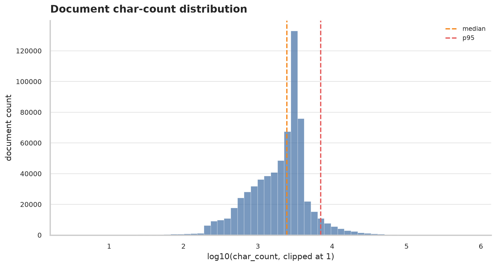
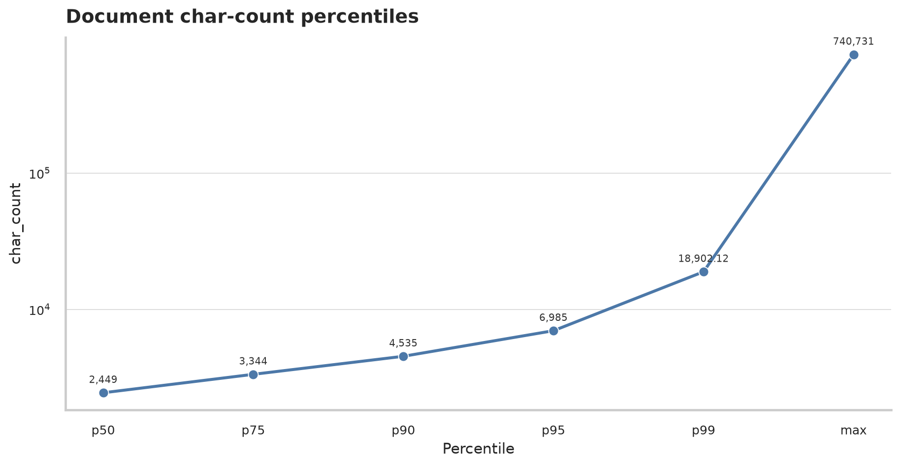
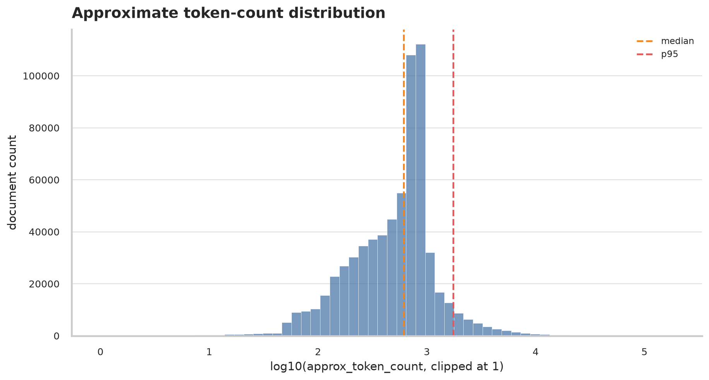
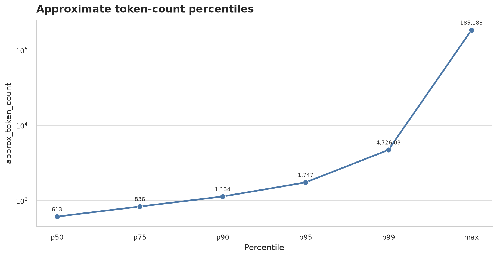
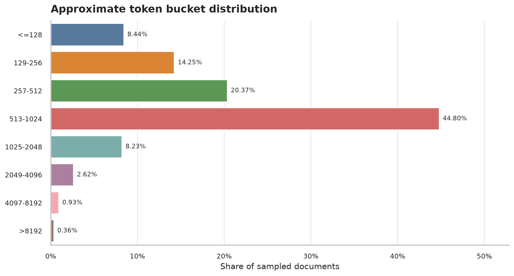
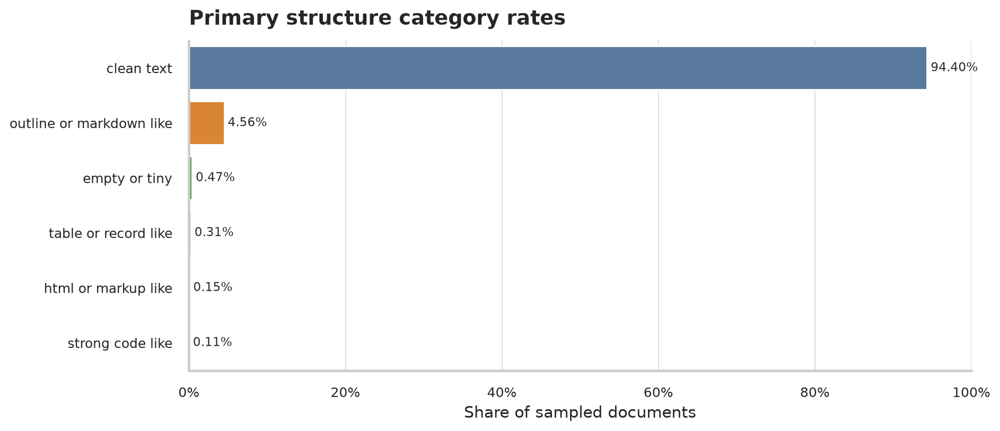
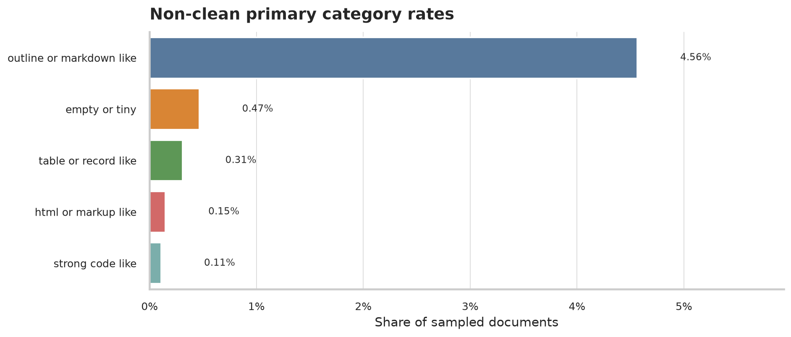

# ClimbMix Corpus Profiling Report

## Executive Summary

- Run ID: `onepct`.
- Processed `660,000` documents from `66` parquet shards.
- Download availability: `66` available, `0` failed.
- Structure rule set: `tightened-primary`.
- Length profile: p50 `613`, p95 `1,747`, p99 `4,726.03`, max `185,183` approximate tokens.
- Median documents exceed 512 approximate tokens; full-document embedding may dilute topics or hit encoder truncation.
- Markup, URL-heavy, and boilerplate signals are not dominant in this sample, but examples should still be inspected.

## Sample Design

| field | value |
|---|---:|
| `profile_run` | `onepct` |
| `seed` | `20260703` |
| `total_shards` | `6543` |
| `sample_shards` | `66` |
| `max_docs_per_shard` | `10000` |
| `repo_id` | `karpathy/climbmix-400b-shuffle` |

### Limitations

- This is a pilot sample for corpus understanding, not a final full-corpus estimate.
- Sampling is shard-level uniform sampling, with a per-shard document cap.
- Token counts are approximate (`ceil(char_count / 4)`) and should be replaced with model-tokenizer counts before final context-budget decisions.
- Structure labels are heuristic signals for corpus profiling, not gold document-type labels.
- Primary structure categories are mutually exclusive; noise flags are non-exclusive.
- Representative examples use per-category reservoir sampling.

## Document Length Distribution

### Character Count

| statistic | value |
|---|---:|
| `mean` | 2,971.29 |
| `p50` | 2,449 |
| `p75` | 3,344 |
| `p90` | 4,535 |
| `p95` | 6,985 |
| `p99` | 18,902.12 |
| `max` | 740,731 |

### Approximate Token Count

Approximate tokens use `ceil(char_count / 4)`. Treat these as profiling estimates, not exact tokenizer counts.

| statistic | value |
|---|---:|
| `mean` | 743.20 |
| `p50` | 613 |
| `p75` | 836 |
| `p90` | 1,134 |
| `p95` | 1,747 |
| `p99` | 4,726.03 |
| `max` | 185,183 |

### Approximate Token Buckets

| bucket | count | rate |
|---|---:|---:|
| `<=128` | 55,691 | 8.44% |
| `129-256` | 94,056 | 14.25% |
| `257-512` | 134,417 | 20.37% |
| `513-1024` | 295,686 | 44.80% |
| `1025-2048` | 54,315 | 8.23% |
| `2049-4096` | 17,319 | 2.62% |
| `4097-8192` | 6,155 | 0.93% |
| `>8192` | 2,361 | 0.36% |

### Long-Tail Outliers

The longest documents are important because they can dominate embedding truncation and chunking behavior.

| rank | docid | category | chars | approx tokens |
|---:|---|---|---:|---:|
| 1 | `shard_01944_2375` | `clean_text` | 740,731 | 185,183 |
| 2 | `shard_01010_3895` | `clean_text` | 643,855 | 160,964 |
| 3 | `shard_05250_8273` | `clean_text` | 578,481 | 144,621 |
| 4 | `shard_03736_7782` | `clean_text` | 538,290 | 134,573 |
| 5 | `shard_06516_7915` | `clean_text` | 522,674 | 130,669 |
| 6 | `shard_04642_960` | `clean_text` | 496,207 | 124,052 |
| 7 | `shard_04226_2791` | `clean_text` | 480,563 | 120,141 |
| 8 | `shard_04891_4822` | `html_or_markup_like` | 476,185 | 119,047 |
| 9 | `shard_00764_6337` | `clean_text` | 475,835 | 118,959 |
| 10 | `shard_02539_6609` | `clean_text` | 448,042 | 112,011 |
| 11 | `shard_02539_5954` | `clean_text` | 427,079 | 106,770 |
| 12 | `shard_03768_5140` | `clean_text` | 415,823 | 103,956 |
| 13 | `shard_02094_2912` | `clean_text` | 414,539 | 103,635 |
| 14 | `shard_03768_7208` | `clean_text` | 411,638 | 102,910 |
| 15 | `shard_04280_6144` | `clean_text` | 403,619 | 100,905 |

## Structure And Format

Primary categories are mutually exclusive. URL-heavy and boilerplate signals are reported below as non-exclusive flags, not as primary document types.

| primary category | count | rate |
|---|---:|---:|
| `clean_text` | 623,058 | 94.40% |
| `outline_or_markdown_like` | 30,128 | 4.56% |
| `empty_or_tiny` | 3,073 | 0.47% |
| `table_or_record_like` | 2,034 | 0.31% |
| `html_or_markup_like` | 985 | 0.15% |
| `strong_code_like` | 722 | 0.11% |

The overall chart is dominated by `clean_text`; the next figure zooms in on non-clean categories for slide readability.

## Noise Flags

Flags are non-exclusive; one document can count toward multiple rows. They should be interpreted as signals, not document types.

| flag | count | rate |
|---|---:|---:|
| `outline_or_markdown_like` | 30,621 | 4.64% |
| `empty_or_tiny` | 3,073 | 0.47% |
| `long_tail_outlier` | 2,360 | 0.36% |
| `table_or_record_like` | 2,069 | 0.31% |
| `boilerplate_signal` | 1,975 | 0.30% |
| `html_or_markup_like` | 985 | 0.15% |
| `strong_code_like` | 736 | 0.11% |
| `url_heavy` | 596 | 0.09% |

## Representative Examples

Examples are clipped and stored as text files with JSON headers containing metrics, heuristic features, and sampling metadata.
For manual auditing, inspect first/middle/last saved examples per primary category. These files come from a per-category reservoir sample.

| category | suggested spot-check files |
|---|---|
| `empty_or_tiny` | [001_shard_00032_9201.txt](../../../data/climbmix-profile-sample/examples/onepct/empty_or_tiny/001_shard_00032_9201.txt) [043_shard_03345_9357.txt](../../../data/climbmix-profile-sample/examples/onepct/empty_or_tiny/043_shard_03345_9357.txt) [085_shard_06516_9991.txt](../../../data/climbmix-profile-sample/examples/onepct/empty_or_tiny/085_shard_06516_9991.txt) |
| `html_or_markup_like` | [001_shard_00081_7827.txt](../../../data/climbmix-profile-sample/examples/onepct/html_or_markup_like/001_shard_00081_7827.txt) [043_shard_03573_2504.txt](../../../data/climbmix-profile-sample/examples/onepct/html_or_markup_like/043_shard_03573_2504.txt) [085_shard_06516_8281.txt](../../../data/climbmix-profile-sample/examples/onepct/html_or_markup_like/085_shard_06516_8281.txt) |
| `strong_code_like` | [001_shard_00032_2538.txt](../../../data/climbmix-profile-sample/examples/onepct/strong_code_like/001_shard_00032_2538.txt) [043_shard_03573_6166.txt](../../../data/climbmix-profile-sample/examples/onepct/strong_code_like/043_shard_03573_6166.txt) [085_shard_06516_5013.txt](../../../data/climbmix-profile-sample/examples/onepct/strong_code_like/085_shard_06516_5013.txt) |
| `table_or_record_like` | [001_shard_00032_6060.txt](../../../data/climbmix-profile-sample/examples/onepct/table_or_record_like/001_shard_00032_6060.txt) [043_shard_03768_7532.txt](../../../data/climbmix-profile-sample/examples/onepct/table_or_record_like/043_shard_03768_7532.txt) [085_shard_06440_6759.txt](../../../data/climbmix-profile-sample/examples/onepct/table_or_record_like/085_shard_06440_6759.txt) |
| `outline_or_markdown_like` | [001_shard_00081_6613.txt](../../../data/climbmix-profile-sample/examples/onepct/outline_or_markdown_like/001_shard_00081_6613.txt) [043_shard_03736_9915.txt](../../../data/climbmix-profile-sample/examples/onepct/outline_or_markdown_like/043_shard_03736_9915.txt) [085_shard_06440_5945.txt](../../../data/climbmix-profile-sample/examples/onepct/outline_or_markdown_like/085_shard_06440_5945.txt) |
| `clean_text` | [001_shard_00032_8824.txt](../../../data/climbmix-profile-sample/examples/onepct/clean_text/001_shard_00032_8824.txt) [043_shard_03054_3180.txt](../../../data/climbmix-profile-sample/examples/onepct/clean_text/043_shard_03054_3180.txt) [085_shard_06516_9174.txt](../../../data/climbmix-profile-sample/examples/onepct/clean_text/085_shard_06516_9174.txt) |

### `empty_or_tiny`

- [001_shard_00032_9201.txt](../../../data/climbmix-profile-sample/examples/onepct/empty_or_tiny/001_shard_00032_9201.txt)
- [002_shard_00105_1866.txt](../../../data/climbmix-profile-sample/examples/onepct/empty_or_tiny/002_shard_00105_1866.txt)
- [003_shard_00365_56.txt](../../../data/climbmix-profile-sample/examples/onepct/empty_or_tiny/003_shard_00365_56.txt)
- [004_shard_00365_426.txt](../../../data/climbmix-profile-sample/examples/onepct/empty_or_tiny/004_shard_00365_426.txt)
- [005_shard_00365_3832.txt](../../../data/climbmix-profile-sample/examples/onepct/empty_or_tiny/005_shard_00365_3832.txt)

### `html_or_markup_like`

- [001_shard_00081_7827.txt](../../../data/climbmix-profile-sample/examples/onepct/html_or_markup_like/001_shard_00081_7827.txt)
- [002_shard_00105_1354.txt](../../../data/climbmix-profile-sample/examples/onepct/html_or_markup_like/002_shard_00105_1354.txt)
- [003_shard_00365_5175.txt](../../../data/climbmix-profile-sample/examples/onepct/html_or_markup_like/003_shard_00365_5175.txt)
- [004_shard_00488_7599.txt](../../../data/climbmix-profile-sample/examples/onepct/html_or_markup_like/004_shard_00488_7599.txt)
- [005_shard_00972_118.txt](../../../data/climbmix-profile-sample/examples/onepct/html_or_markup_like/005_shard_00972_118.txt)

### `strong_code_like`

- [001_shard_00032_2538.txt](../../../data/climbmix-profile-sample/examples/onepct/strong_code_like/001_shard_00032_2538.txt)
- [002_shard_00032_6653.txt](../../../data/climbmix-profile-sample/examples/onepct/strong_code_like/002_shard_00032_6653.txt)
- [003_shard_00365_7193.txt](../../../data/climbmix-profile-sample/examples/onepct/strong_code_like/003_shard_00365_7193.txt)
- [004_shard_00488_1823.txt](../../../data/climbmix-profile-sample/examples/onepct/strong_code_like/004_shard_00488_1823.txt)
- [005_shard_00488_3914.txt](../../../data/climbmix-profile-sample/examples/onepct/strong_code_like/005_shard_00488_3914.txt)

### `table_or_record_like`

- [001_shard_00032_6060.txt](../../../data/climbmix-profile-sample/examples/onepct/table_or_record_like/001_shard_00032_6060.txt)
- [002_shard_00032_6188.txt](../../../data/climbmix-profile-sample/examples/onepct/table_or_record_like/002_shard_00032_6188.txt)
- [003_shard_00365_2366.txt](../../../data/climbmix-profile-sample/examples/onepct/table_or_record_like/003_shard_00365_2366.txt)
- [004_shard_00764_9591.txt](../../../data/climbmix-profile-sample/examples/onepct/table_or_record_like/004_shard_00764_9591.txt)
- [005_shard_00972_443.txt](../../../data/climbmix-profile-sample/examples/onepct/table_or_record_like/005_shard_00972_443.txt)

### `outline_or_markdown_like`

- [001_shard_00081_6613.txt](../../../data/climbmix-profile-sample/examples/onepct/outline_or_markdown_like/001_shard_00081_6613.txt)
- [002_shard_00105_797.txt](../../../data/climbmix-profile-sample/examples/onepct/outline_or_markdown_like/002_shard_00105_797.txt)
- [003_shard_00105_1967.txt](../../../data/climbmix-profile-sample/examples/onepct/outline_or_markdown_like/003_shard_00105_1967.txt)
- [004_shard_00105_8778.txt](../../../data/climbmix-profile-sample/examples/onepct/outline_or_markdown_like/004_shard_00105_8778.txt)
- [005_shard_00365_7201.txt](../../../data/climbmix-profile-sample/examples/onepct/outline_or_markdown_like/005_shard_00365_7201.txt)

### `clean_text`

- [001_shard_00032_8824.txt](../../../data/climbmix-profile-sample/examples/onepct/clean_text/001_shard_00032_8824.txt)
- [002_shard_00488_8793.txt](../../../data/climbmix-profile-sample/examples/onepct/clean_text/002_shard_00488_8793.txt)
- [003_shard_00972_513.txt](../../../data/climbmix-profile-sample/examples/onepct/clean_text/003_shard_00972_513.txt)
- [004_shard_00972_5514.txt](../../../data/climbmix-profile-sample/examples/onepct/clean_text/004_shard_00972_5514.txt)
- [005_shard_00972_7494.txt](../../../data/climbmix-profile-sample/examples/onepct/clean_text/005_shard_00972_7494.txt)

## Implications For Chunking

- Median documents exceed 512 approximate tokens; full-document embedding may dilute topics or hit encoder truncation.
- Markup, URL-heavy, and boilerplate signals are not dominant in this sample, but examples should still be inspected.
- A single first-500-token strategy would truncate or ignore meaningful later content for a large fraction of documents.
- The small but extreme long tail should be handled with a separate long-document path rather than by tuning around the median.

Recommended next chunking comparisons:

- Full-document embedding for short documents, especially documents under 512 approximate tokens.
- First 512 approximate tokens as a cheap baseline, with explicit inspection of missed later evidence.
- Fixed 512-token chunks with 64-token overlap.
- Fixed 1024-token chunks with 128-token overlap.
- Paragraph-aware chunks capped at 512 or 1024 approximate tokens.
- Long-document fallback: cap max chunks per parent document and preserve parent ClimbMix docid for final citations.

## Slide-Ready Assets

- Overall structure rates: `figures/onepct/structure_category_rates.png`
- Non-clean category rates: `figures/onepct/non_clean_structure_category_rates.png`
- Approximate token distribution: `figures/onepct/approx_token_log_histogram.png`
- Approximate token bucket rates: `figures/onepct/approx_token_bucket_rates.png`
- Approximate token percentiles: `figures/onepct/approx_token_percentiles.png`

## Reproducibility

- Run config: `data/climbmix-profile-sample/manifests/onepct/run_config.json`
- Aggregate stats: `data/climbmix-profile-sample/stats/onepct/corpus_stats.json`
- Examples: `data/climbmix-profile-sample/examples/onepct`
